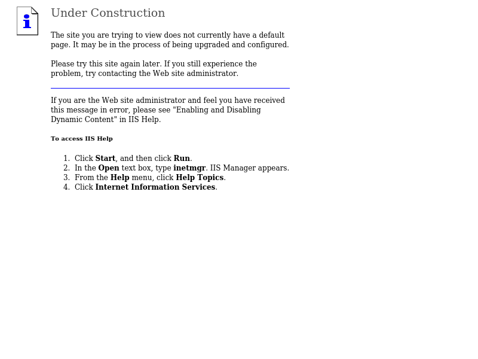
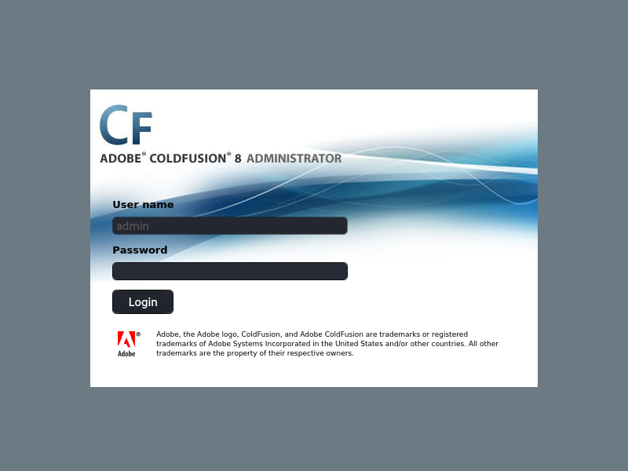
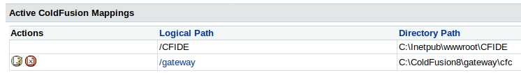
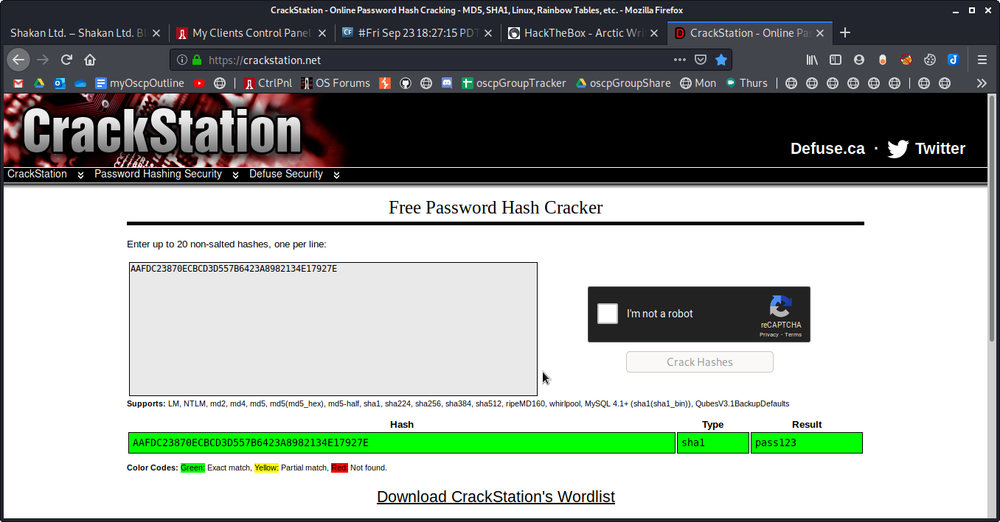

Browser Screenshots

Browser Screenshots

# Port 80
http://10.11.1.10

# Cold Fusion
http://10.11.1.10/cfdocs

http://10.11.1.10/cfide

http://10.11.1.10/CFIDE/administrator/index.cfm

Successful login using admin:pass123
Notice there is a scheduled tasks feature

Take note of the CFIDE directory where a webshell can be added

# Crackstation

# WordPress
# Other

