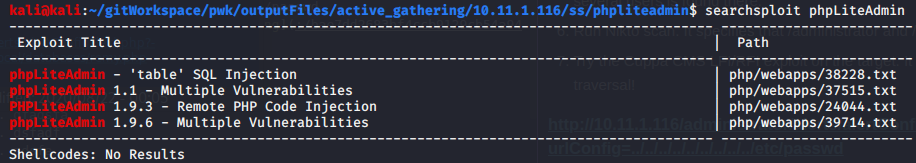
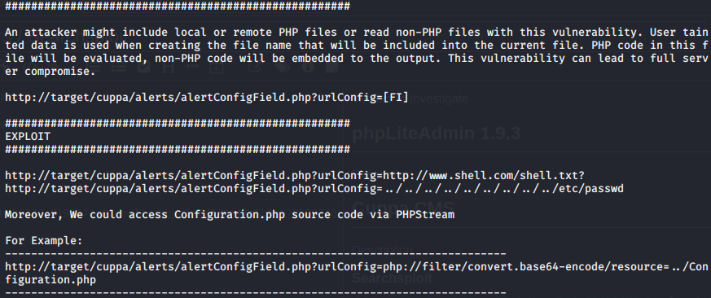

Attack Vectors / Searchsploit

Vectors to Investigate

# phpLiteAdmin 1.9.3
### searchsploit phpLiteAdmin

### 24044.txt is a Remote PHP Code Injection Vulnerability

# Cuppa CMS
Description
### searchsploit cuppa cms

### 25971.txt is an LFI/RFI exploit

# Ubuntu 4.4.0-16

### 44298 is a Local Privilege Escalation exploit

