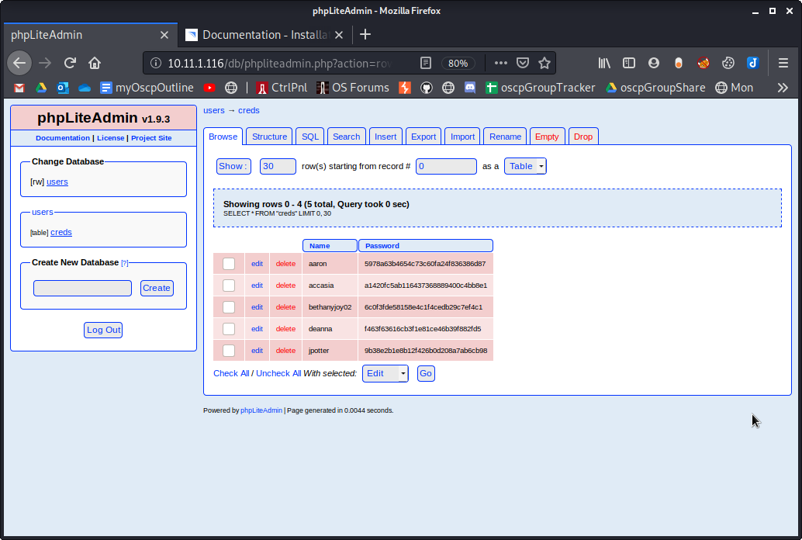

Browser Screenshots

Browser Screenshots

# Ports
## 80/tcp
### cutycapt --url=10.11.1.116 --out=80.png

## Cuppa CMS Login Page

### Default login page
cutycapt --url=10.11.1.116/administrator --out=administrator.png

### Successful login using admin:admin

### General Configuration

### Note that the creds for the cuppa database are shown

## phpLiteAdmin

### http://10.11.1.116/db/

### http://10.11.1.116/db/phpliteadmin.php

### creds table from 'users' Database

### Notice we get hashes for several users

# Crackstation
Cracked hashes from phpLiteAdmin 'creds' table from 'user' db

# WordPress
# Other service

