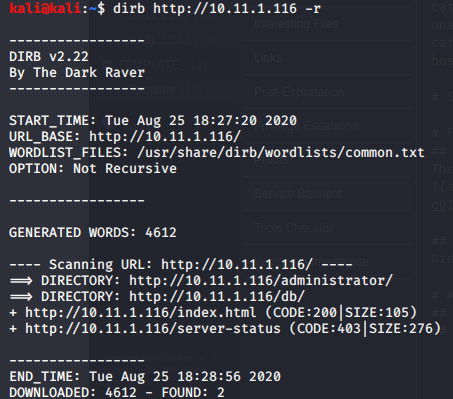

Enumeration

Enumeration

# NMAP
## TCP Ports
TCP SYN Stealth, No Ping

TCP Connect Scan
### sudo nmap -sV -sT -p- 10.11.1.116

# dirb
Non-recursive scan
### dirb http://10.11.1.116 -r

### dirb http://10.11.1.116/administrator/

### dirb http://10.11.1.116/db

# Nikto
### nikto -h 10.11.1.116

# Other Tools
