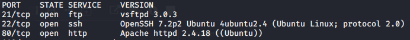

Service Banners

Service Banners

# Operating system
cat /etc/issue
cat /etc/*-release
uname -a
cat /proc/version
hostname

# Server

# Ports
## TCP
There are more ports but we don't have the banner

## UDP
Didn't scan

# Applications / Services
## phpLiteAdmin v1.9.3
## Service 2