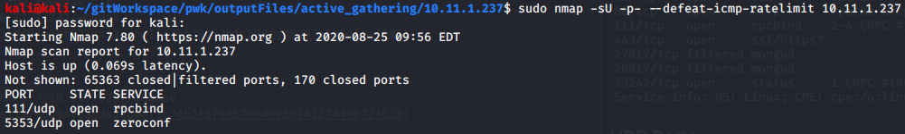
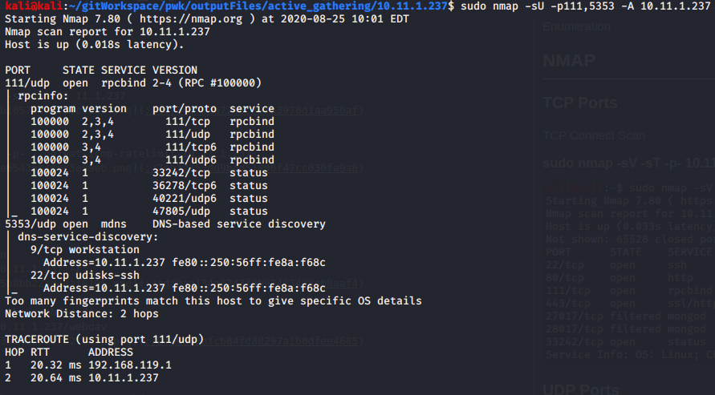
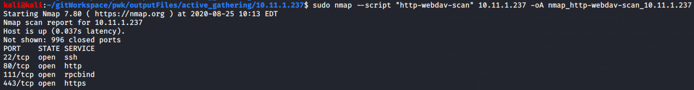
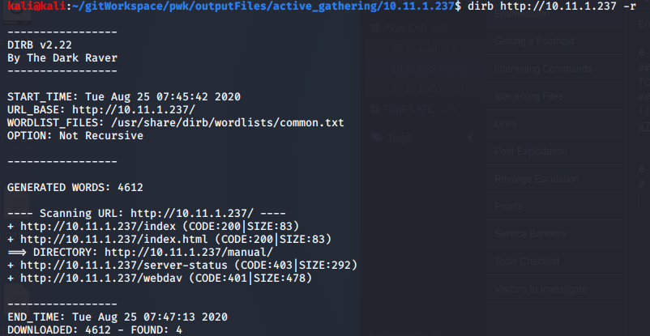
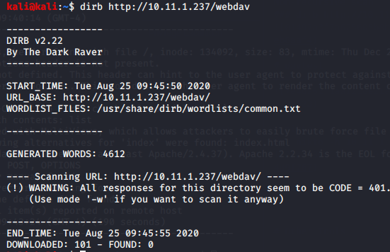
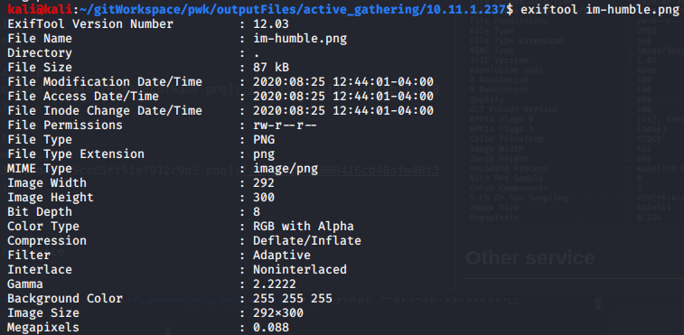

Enumeration

Enumeration

# NMAP
## Ports
TCP Connect Scan
### sudo nmap -sV -sT -p- 10.11.1.237

### sudo nmap -sU -p- --defeat-icmp-ratelimit 10.11.1.237

### sudo nmap -sU -p111,5353 -A 10.11.1.237

## Scan for webdav
### sudo nmap --script "http-webdav-scan" 10.11.1.237

### sudo nmap --script "http-iis-webdav-vuln" 10.11.1.237

# dirb
Non-recursive scan
### dirb http://10.11.1.237 -r

Recursive scan on the /webdav dir
### dirb http://10.11.1.237/webdav

# davtest
### davtest -url http://10.11.1.237/webdav

# nikto
### nikto -h 10.11.1.237

# exiftool
Stay-Humble.png

im-humble.png

# Other Tools
