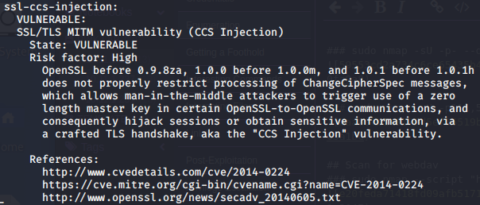

Vectors to Investigate

Vectors to Investigate

# WORKS

## Heartbleed Bug
-random memory leak. Works but did not leak interesting info via Metasploit

# TRYING

## Apache 2.2.22
-is outdated

## Apache mod_negotiation is enabled
-allows attackers to easily brute force file names. See http://www.wisec.it/sectou.php?id=4698ebdc59d15

## SSL/TLM MITM vulnerability (CCS Injection)

## Diffie-Hellman Key Exchange Insufficient Group Strength

## SSL POODLE information leak

## Slowloris DOS attack

# FAILED

