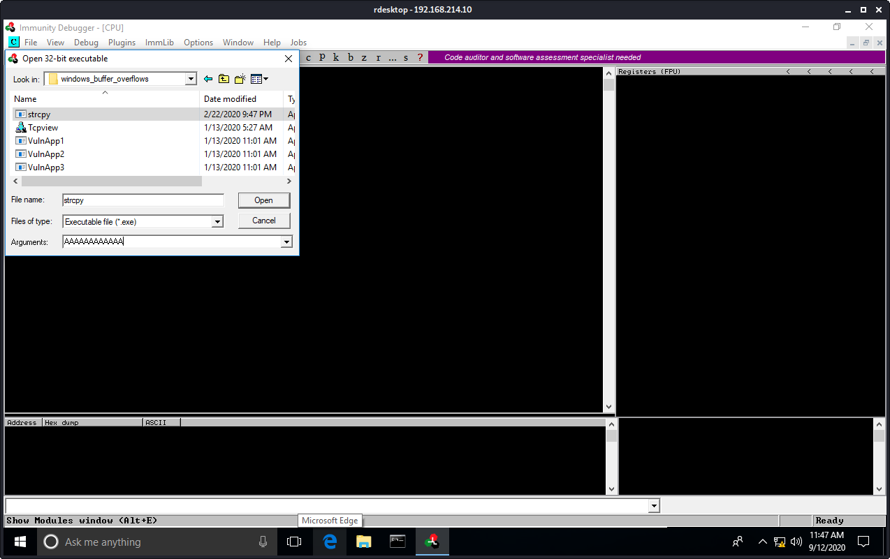
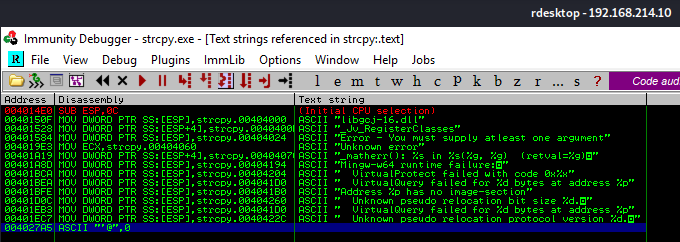
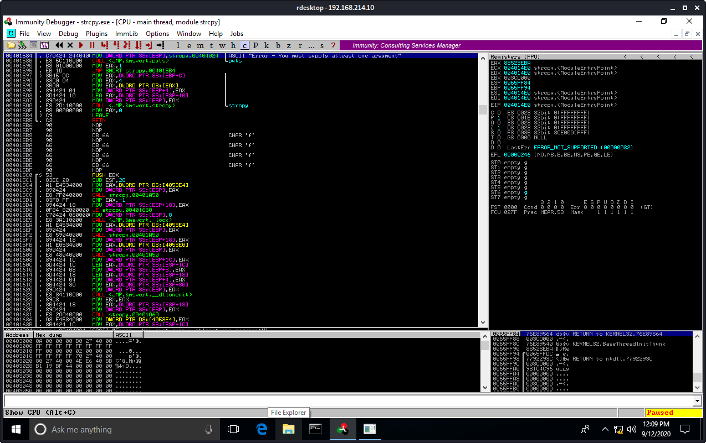
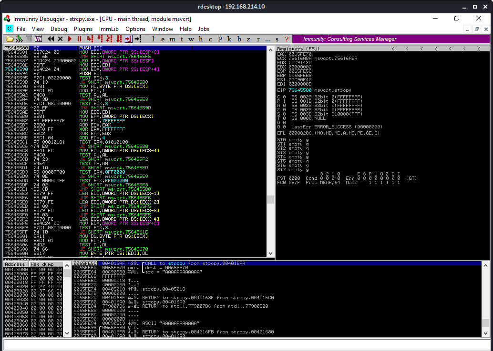
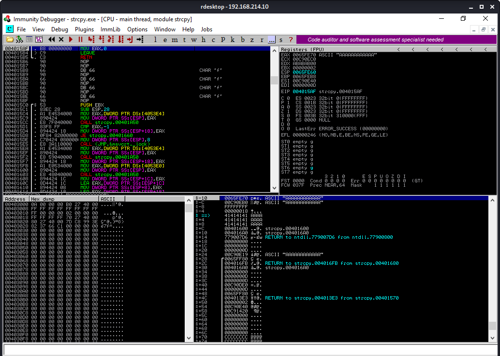
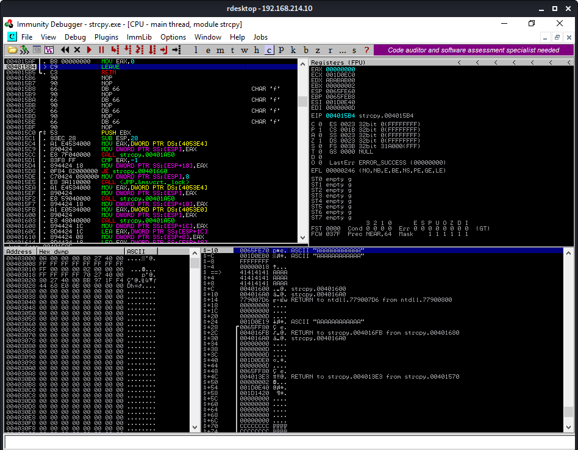
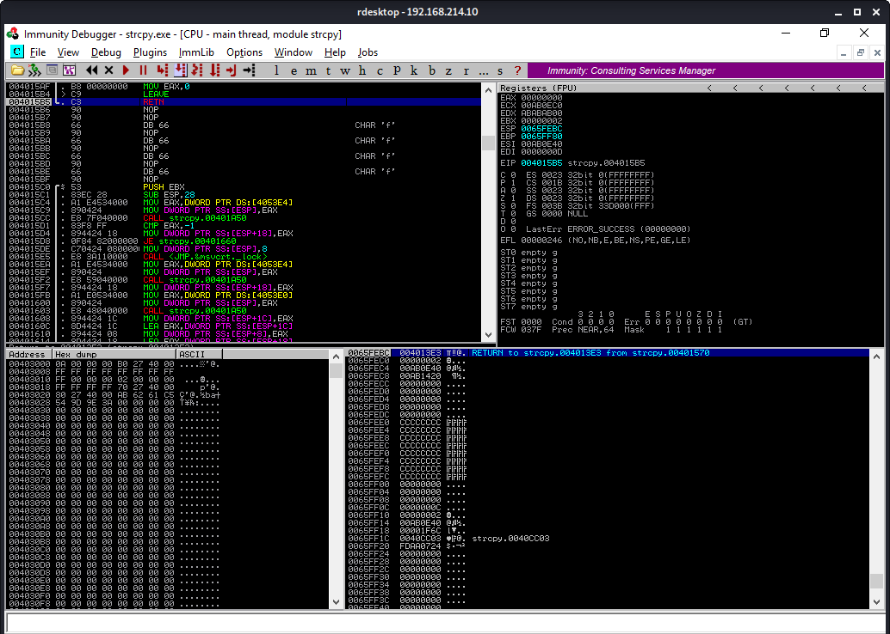
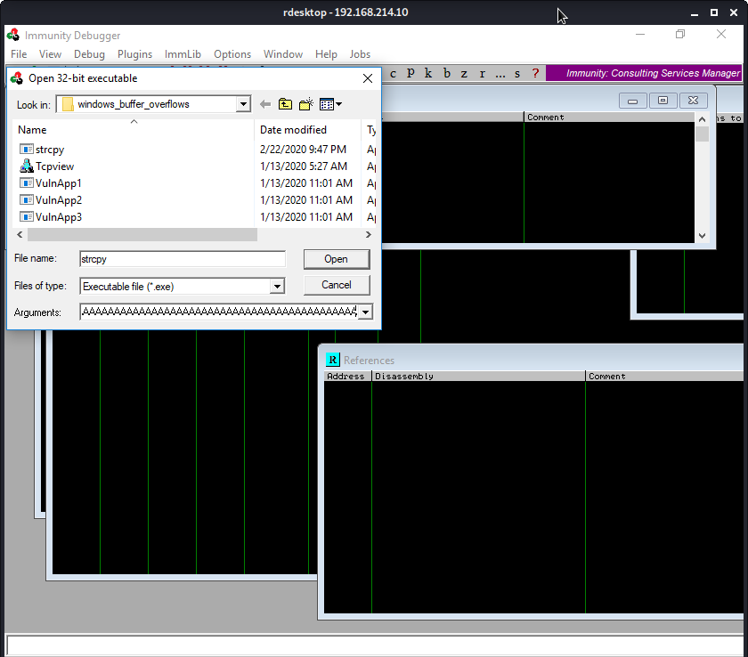
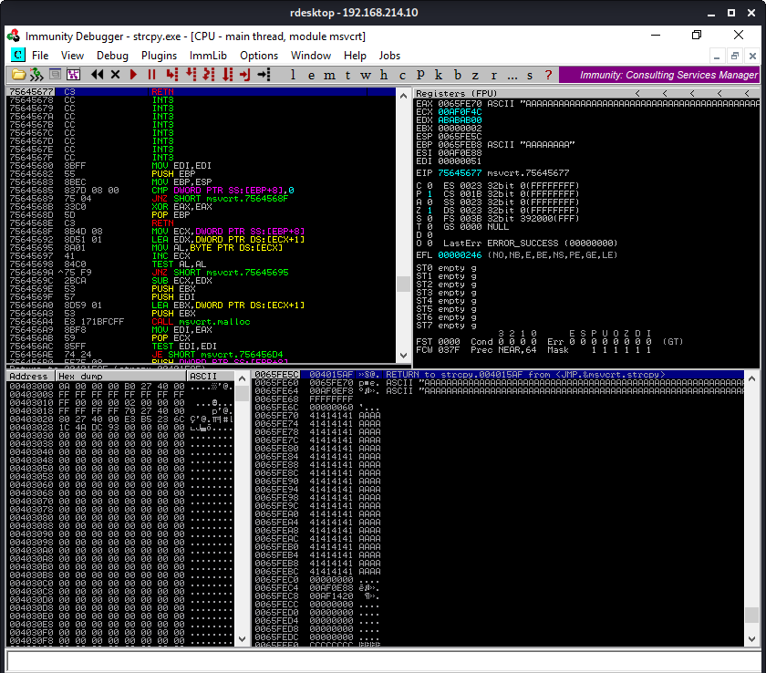

Exercises

# 10.2.5
## 1. Repeat the steps shown in this section to see the 12 A's copied onto the stack.
### Open Immunity Debugger

### Open the strcpy.exe file and 12 A's as an argument

### Immunity Debugger launches and stops at the program entry point

### Right-click on the disassembly window -> Search for -> All referenced text strings

### The result window. Double click on the "Error - You must supply at least one argument"

### We are returned to the disassembly windows, but this time inside the main function

### Set a breakpoint on the strcpy line by pressing F2. The address will turn light blue.

### Continue the exection flow by pressing F9

### Notice that execution stopped at the breakpoint just before the call to the strcpy function (address 0x004015AA). EIP is set to this address as well.

### Press F7 once

### Then press F7 a second time and now we’re in the strcpy function. Notice the address change.

### Double-click the strcpy destination address (0x0065EFE70) in the stack pane.

### Notice that now we see relative (positive and negative) offsets. The arrow indicator (==>) refers to address 0x0065FE70. Also notice that 0x004015AF is at the top of the stack and is where we will return once strcpy has completed.

### Press CTRL+F9 to continue to the end of the strcpy function. The 12 A’s are now written into the buffer, and we are within the 64-byte buffer limit. Take note of theaddress at +4c (0x004013E3)

### Press F7 to arrive back to the main function as indicated by the (-14) address. The MOV EAX,0 instruction sends the exit status 0 to the operating system

### At this point, we have left our main function. Press F7 again, and you’ll be at the LEAVE function 

### Press F7 again to return to pop the main function return address from the top of the stack and execute the code there.

### Press F9 to run until the program is terminated.

## 2. Supply at least 80 A's and verify that EIP after the *strcpy* will ontain the value 41414141.
### Supply the 80 A's as an argument

### The stack layout showing the 80 A's

### EIP points to 41414141, which is address 0x4c

