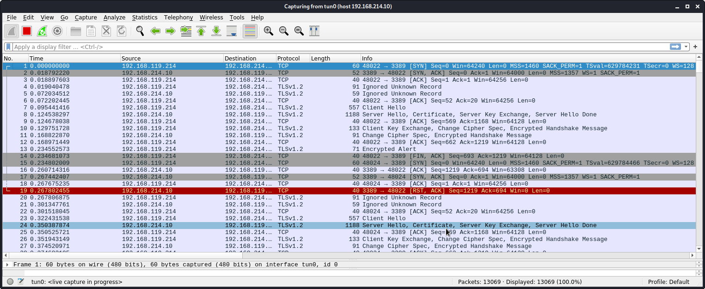

15.1.4.1

# 15.1.4.1
## 15.1.4.1.1. Modify the connection information in the exploit in order to target the SyncBreeze installation on your Windows client. 

Modify 42341.c by changing the target IP and port. Here is the changed code.


## 15.1.4.1.2. Recompile the exploit and use Wireshark to confirm that the code successfully initiates a socket connection to your dedicated Windows client.

Compile the modified 42341.c. We see that there are no errors
```plaintext
kali@kali:~/gitWorkspace/pwk/oscpExercises/15_fixingExploits$ i686-w64-mingw32-gcc 42341.c -o syncbreeze_exploit.exe -lws2_32
```

Start SyncBreeze on the Windows Client


Start Wireshark -> interface tun0 -> display filter 192.168.214.10


Run the exploit
```plaintext
kali@kali:~/gitWorkspace/pwk/oscpExercises/15_fixingExploits$ wine syncbreeze_exploit.exe 
000f:err:service:process_send_command receiving command result timed out

[>] Initialising Winsock...
[>] Initialised.
[>] Socket created.
[>] Connected

[>] Request sent
```

Review Wireshark
Here is the output. 

Take a closer look at the first 3 packets. It is the 3-way handshake SYN-SYN/ACK-ACK. This confirms the exploit initiates a successful socket connection to the Windows client.


