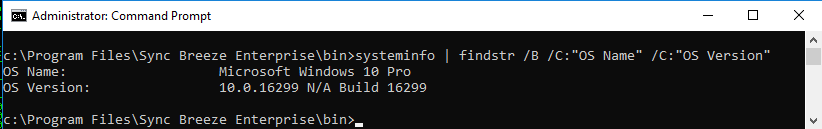

15.1.5.1

# 15.1.5.1
## 15.1.5.1.1. Find any valid return address instruction and alter the one present in the original exploit.

From a previous module, we already have a working exploit with a valid return address 0x10090c83.

We could also:

- List itemSearch for online exploits that match our target environment (Windows 10). Since we do have creds to the Windows client, run the following command:
`systeminfo | findstr /B /C:"OS Name" /C:"OS Version"`

- use msfpescan to see if Metasploit will tell us the same return address for the libspp.dll.

Anyway, we'll use 0x10090c83 from our previous working exploit. The file 42341.c is updated with that address.
