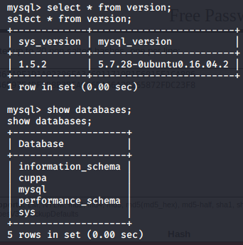

Interesting Commands

Interesting Commands

# Getting hostname
`hostname`

# Slight upgrade to shell
`script /dev/null`
`screen`

# mySQL commands
## Show the database
`mysql -u root -p -D cuppa -e "show databases"`   
Password: 99bbVDdorGzfZJun

## Show the tables in mysql database
`mysql -u root -p -D mysql -e "show tables"`

                            