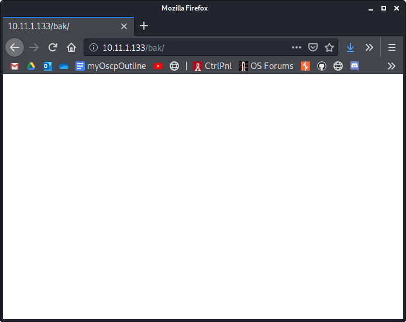
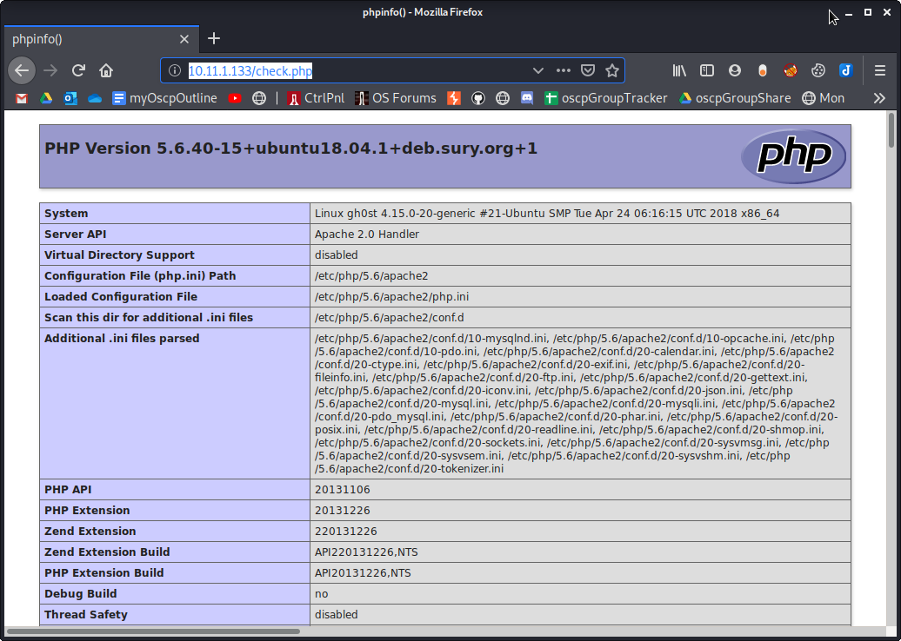
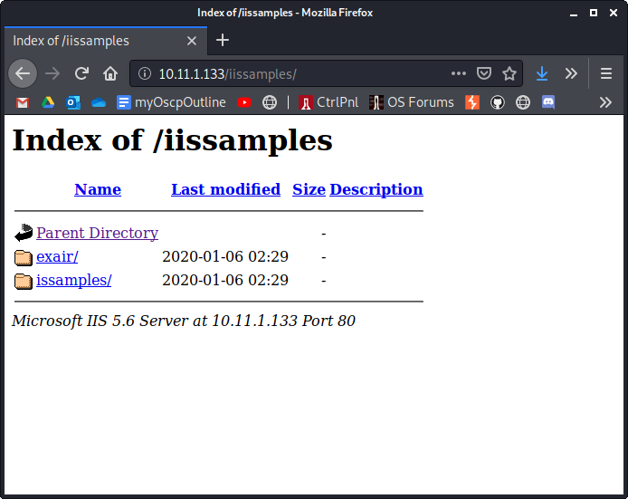
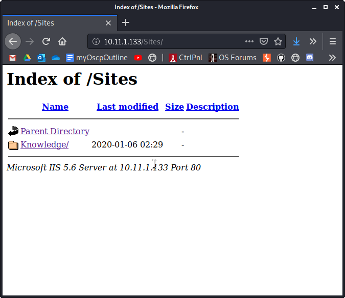
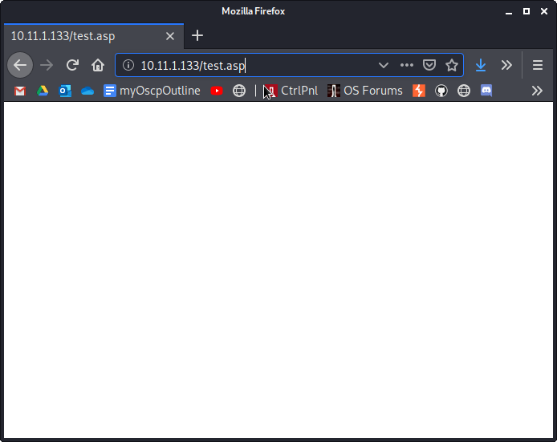

Browser Screenshots

Browser Screenshots

# Port 80
`10.11.1.133`

Source code:

`10.11.1.133/_vti_*`
None showed any output

`10.11.1.133/bak`

`10.11.1.133/cgi-bin`

`http://10.11.1.133/check.php`
See the sub-notebook named phpinfo()

`10.11.1.133/iissamples`

`10.11.1.133/login.asp`

`10.11.1.133/robots.txt`

`10.11.1.133/Sites`

`10.11.1.133/test.asp`

# The hidden script
`http://10.11.1.133/1f2e73705207bdd6467e109c1606ed29-21213/`

`http://10.11.1.133/1f2e73705207bdd6467e109c1606ed29-21213/offsecphun1.gif`

`http://10.11.1.133/1f2e73705207bdd6467e109c1606ed29-21213/offsecphun2.png`

# Other service

