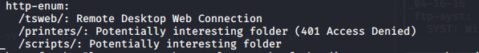
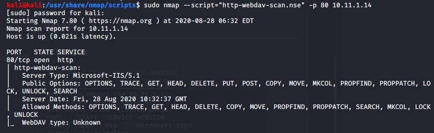
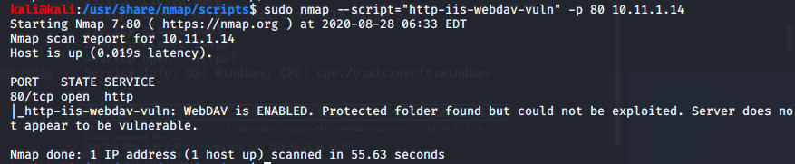
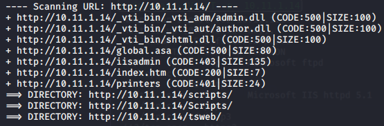
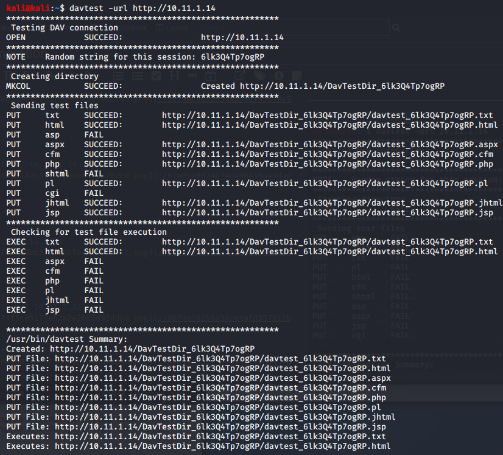
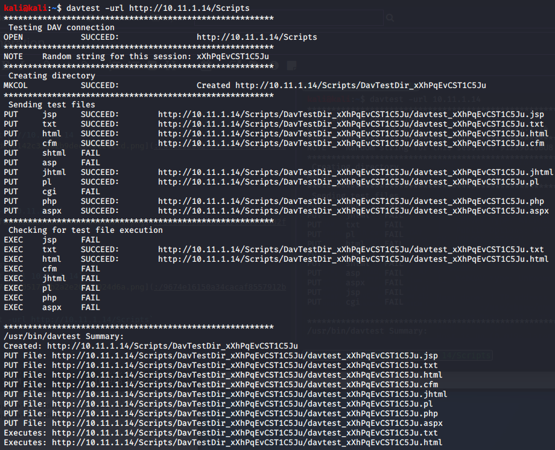

Enumeration

# NMAP
## TCP Ports
TCP Connect Scan with service detection
`sudo nmap -sV -sT -p- 10.11.1.14`

# Run nmap scripts
`sudo nmap -Pn -A -p- -sV --script default,safe,auth,vuln --max-retries 4 10.11.1.14`

Interesting results from ftp scan

Interesting results from http enumeration scan

`sudo nmap --script="http-webdav-scan.nse" -p 80 10.11.1.14`

`sudo nmap --script="http-iis-webdav-vuln" -p 80 10.11.1.14`

# dirb
`dirb http://10.11.1.14 -r`

# Nikto
`nikto -h 10.11.1.14`

# davtest
`davtest -url http://10.11.1.14`

`davtest -url http://10.11.1.14/Scripts`

