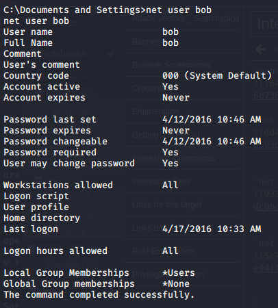
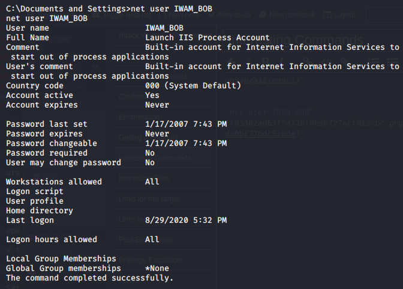
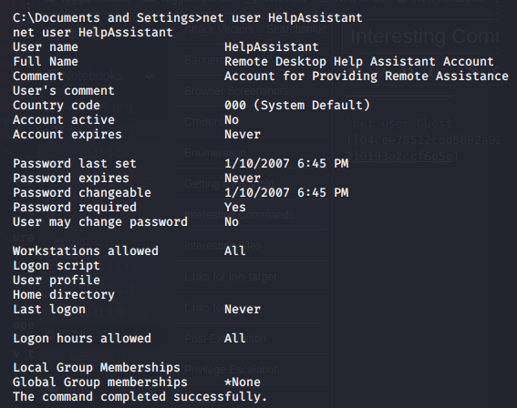
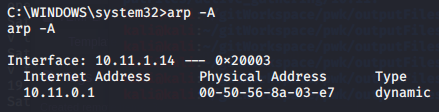
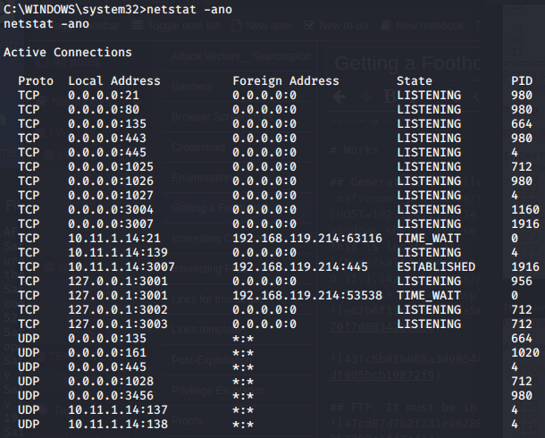
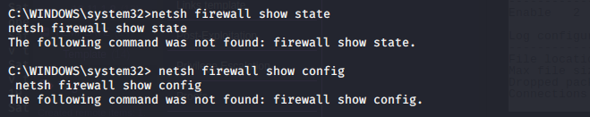
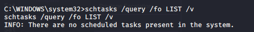
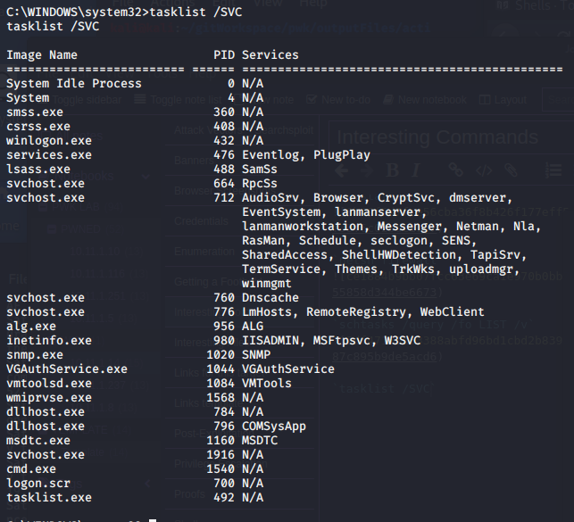

Interesting Commands

Interesting Commands

# Initial Information Gathering
`ipconfig /all`

`systeminfo | findstr /B /C:"OS Name" /C:"OS Version"`

`hostname`

`echo %username%`

`net Administrator`

`net users`

`net user bob`

`net user IUSR_BOB`

`net user IWAM_BOB`

`net user Guest`

`net user HelpAssistant`

`net user SUPPORT_388945a0`

`ipconfig /all`

`route print`

`arp -A`

`netstat -ano`

`netsh firewall`

`schtasks /query /fo LIST /v`

`tasklist /SVC`

`net start`

`DRIVERQUERY`
DRIVERQUC:\WINDOWS\system32>DRIVERQUERY
DRIVERQUERY                                                                           
                                                                                      
Module Name  Display Name           Driver Type   Link Date                           
============ ====================== ============= ======================              
ACPI         Microsoft ACPI Driver  Kernel        8/29/2002 9:09:03 AM                
ACPIEC       ACPIEC                 Kernel        8/17/2001 9:57:55 PM                
AFD          AFD Networking Support Kernel        8/17/2011 2:49:53 PM                
agp440       Intel AGP Bus Filter   Kernel        8/17/2001 9:57:59 PM                
AsyncMac     RAS Asynchronous Media Kernel        8/17/2001 9:55:29 PM                
atapi        Standard IDE/ESDI Hard Kernel        8/29/2002 9:27:48 AM                
Atmarpc      ATM ARP Client Protoco Kernel        8/17/2001 9:46:40 PM                
audstub      Audio Stub Driver      Kernel        8/17/2001 9:59:40 PM  
Beep         Beep                   Kernel        8/17/2001 9:47:33 PM  
cbidf2k      cbidf2k                Kernel        8/17/2001 9:52:06 PM  
Cdaudio      Cdaudio                Kernel        8/17/2001 9:52:26 PM  
Cdfs         Cdfs                   File System   8/29/2002 9:58:50 AM  
Cdrom        CD-ROM Driver          Kernel        8/29/2002 9:27:55 AM  
CmBatt       Microsoft AC Adapter D Kernel        8/29/2002 9:09:04 AM  
Compbatt     Microsoft Composite Ba Kernel        8/17/2001 9:57:58 PM  
Disk         Disk Driver            Kernel        8/29/2002 9:27:56 AM  
dmboot       dmboot                 Kernel        8/17/2001 9:58:34 PM  
dmio         Logical Disk Manager D Kernel        8/17/2001 9:58:27 PM  
dmload       dmload                 Kernel        8/17/2001 9:58:15 PM  
Fastfat      Fastfat                File System   8/29/2002 10:12:45 AM 
Fdc          Floppy Disk Controller Kernel        8/17/2001 9:51:22 PM  
Fips         Fips                   Kernel        8/18/2001 2:31:49 AM  
Flpydisk     Floppy Disk Driver     Kernel        8/29/2002 9:27:43 AM  
Ftdisk       Volume Manager Driver  Kernel        8/17/2001 9:52:41 PM  
Gpc          Generic Packet Classif Kernel        8/17/2001 9:54:19 PM  
i8042prt     i8042 Keyboard and PS/ Kernel        8/29/2002 10:06:37 AM 
Imapi        CD-Burning Filter Driv Kernel        8/29/2002 9:28:05 AM  
IntelIde     IntelIde               Kernel        8/29/2002 9:27:47 AM  
IpFilterDriv IP Traffic Filter Driv Kernel        8/17/2001 9:55:07 PM  
IpInIp       IP in IP Tunnel Driver Kernel        8/17/2001 9:55:10 PM  
IpNat        IP Network Address Tra Kernel        8/29/2002 9:36:12 AM  
IPSec        IPSEC driver           Kernel        8/29/2002 10:07:19 AM 
IRENUM       IR Enumerator Service  Kernel        8/17/2001 9:51:19 PM  
isapnp       PnP ISA/EISA Bus Drive Kernel        8/17/2001 9:58:01 PM  
Kbdclass     Keyboard Class Driver  Kernel        8/29/2002 9:26:59 AM  
KSecDD       KSecDD                 Kernel        8/17/2001 9:50:01 PM  
mnmdd        mnmdd                  Kernel        8/17/2001 9:57:28 PM  
Modem        Modem                  Kernel        8/17/2001 9:57:35 PM  
Mouclass     Mouse Class Driver     Kernel        8/29/2002 9:27:00 AM  
MountMgr     MountMgr               Kernel        8/17/2001 9:47:36 PM  
MRxDAV       WebDav Client Redirect File System   8/17/2001 9:50:20 PM  
MRxSmb       MRXSMB                 File System   8/29/2002 9:59:51 AM  
Msfs         Msfs                   File System   8/17/2001 9:50:02 PM  
Mup          Mup                    File System   8/29/2002 10:12:53 AM 
NDIS         NDIS System Driver     Kernel        8/29/2002 10:09:23 AM 
NdisTapi     Remote Access NDIS TAP Kernel        8/17/2001 9:55:29 PM  
Ndisuio      NDIS Usermode I/O Prot Kernel        8/29/2002 9:35:40 AM  
NdisWan      Remote Access NDIS WAN Kernel        8/29/2002 9:58:38 AM  
NDProxy      NDIS Proxy             Kernel        8/17/2001 9:55:30 PM  
NetBIOS      NetBIOS Interface      File System   8/29/2002 9:35:45 AM  
NetBT        NetBios over Tcpip     Kernel        8/29/2002 10:01:56 AM 
nm           Network Monitor Driver Kernel        8/29/2002 9:34:32 AM  
Npfs         Npfs                   File System   8/17/2001 9:50:03 PM  
Ntfs         Ntfs                   File System   8/29/2002 10:13:37 AM 
Null         Null                   Kernel        8/17/2001 9:47:39 PM  
NwlnkFlt     IPX Traffic Filter Dri Kernel        8/17/2001 9:54:05 PM  
NwlnkFwd     IPX Traffic Forwarder  Kernel        8/17/2001 9:54:08 PM  
Parport      Parallel port driver   Kernel        8/29/2002 9:27:29 AM  
PartMgr      PartMgr                Kernel        8/18/2001 2:32:23 AM  
ParVdm       ParVdm                 Kernel        8/17/2001 9:49:49 PM  
PCI          PCI Bus Driver         Kernel        8/29/2002 9:09:10 AM  
Pcmcia       Pcmcia                 Kernel        8/29/2002 9:09:09 AM  
PCnet        AMD PCNET Compatable A Kernel        6/5/2001 8:54:43 PM   
PptpMiniport WAN Miniport (PPTP)    Kernel        8/29/2002 10:12:46 AM 
Processor    Processor Driver       Kernel        8/29/2002 9:05:03 AM  
Ptilink      Direct Parallel Link D Kernel        8/17/2001 9:49:53 PM  
RasAcd       Remote Access Auto Con Kernel        8/17/2001 9:55:39 PM  
Rasl2tp      WAN Miniport (L2TP)    Kernel        8/29/2002 10:06:36 AM 
RasPppoe     Remote Access PPPOE Dr Kernel        8/17/2001 9:55:33 PM  
Raspti       Direct Parallel        Kernel        8/17/2001 9:55:32 PM  
Rdbss        Rdbss                  File System   8/29/2002 9:58:48 AM  
RDPCDD       RDPCDD                 Kernel        8/17/2001 9:46:56 PM  
rdpdr        Terminal Server Device Kernel        8/29/2002 9:06:34 AM  
RDPWD        RDPWD                  Kernel        8/29/2002 9:40:38 AM  
redbook      Digital CD Audio Playb Kernel        8/29/2002 9:27:45 AM  
serenum      Serenum Filter Driver  Kernel        8/17/2001 9:50:13 PM  
Serial       Serial port driver     Kernel        8/29/2002 10:08:27 AM 
Sfloppy      Sfloppy                Kernel        8/29/2002 9:27:56 AM  
sr           System Restore Filter  File System   8/29/2002 9:17:56 AM  
Srv          Srv                    File System   8/18/2001 2:32:06 AM  
swenum       Software Bus Driver    Kernel        8/17/2001 9:48:47 PM  
Tcpip        TCP/IP Protocol Driver Kernel        8/29/2002 9:58:10 AM  
TDPIPE       TDPIPE                 Kernel        8/17/2001 9:46:49 PM  
TDTCP        TDTCP                  Kernel        8/17/2001 9:46:43 PM  
TermDD       Terminal Device Driver Kernel        8/29/2002 9:40:32 AM  
Udfs         Udfs                   File System   8/29/2002 9:06:18 AM  
Update       Microcode Update Drive Kernel        8/18/2001 4:53:56 AM  
VgaSave      VgaSave                Kernel        8/29/2002 9:32:03 AM  
vmci         VMware VMCI Bus Driver Kernel        5/18/2013 2:17:35 AM  
vmmouse      VMware Pointing Device Kernel        6/4/2012 10:15:28 AM  
vmscsi       VMware Storage Control Kernel        5/31/2012 10:17:07 AM 
vmxnet       VMware Ethernet Adapte Kernel        5/8/2012 10:38:41 AM  
vmxnet3ndis5 vmxnet3 NDIS 5 Etherne Kernel        9/27/2013 10:19:01 AM 
vmx_svga     vmx_svga               Kernel        11/18/2014 3:12:59 AM 
VolSnap      VolSnap                Kernel        8/17/2001 9:53:19 PM  
vsock        vSockets Driver        Kernel        8/1/2013 3:44:46 AM   
Wanarp       Remote Access IP ARP D Kernel        8/17/2001 9:55:23 PM  
WS2IFSL      Windows Socket 2.0 Non Kernel        8/17/2001 9:55:58 PM ERY`

`wmic /?`

