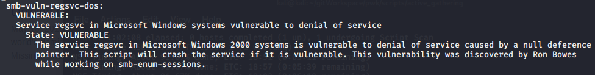

Attack Vectors

Vector and Searchsploit Results

# 1. OpenSSH 7.4p1
# 2. netbios-sssn
# 3. smbd 3.X - 4.X
# 4. Service regsvc in Microsoft Windows systems vulnerable to denial of service

# 5. Windows 6.1 (Samba 4.5.4-Ubuntu)

# 6. a
# 7. a
# 8. a
# 9. a
# 10. a
# 11. a
# 12. a
# 13. a
# 14. a
# 15. a
# 16. a
# 17. a
# 18. a
# 19. a
# 20. a