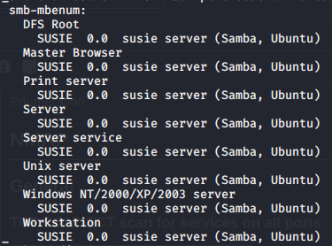
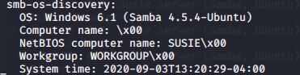
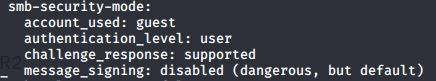
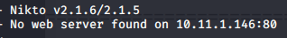

Enumeration

Enumeration

# NMAP
## General

### No ping scan on all ports
`sudo nmap -v -Pn -p- -O 10.11.1.146`
PORT    STATE SERVICE
22/tcp  open  ssh
139/tcp open  netbios-ssn
445/tcp open  microsoft-ds
Warning: OSScan results may be unreliable because we could not find at least 1 open and 1 closed port

### TCP CONNECT scan for services on all ports
`sudo nmap -sV -sT -p- 10.11.1.146`
PORT    STATE SERVICE     VERSION
22/tcp  open  ssh         OpenSSH 7.4p1 Ubuntu 10 (Ubuntu Linux; protocol 2.0)
139/tcp open  netbios-ssn Samba smbd 3.X - 4.X (workgroup: WORKGROUP)
445/tcp open  netbios-ssn Samba smbd 3.X - 4.X (workgroup: WORKGROUP)
Service Info: Host: SUSIE; OS: Linux; CPE: cpe:/o:linux:linux_kernel

### Fast UDP Scan
All 65535 scanned ports on 10.11.1.146 are closed|filtered

## Samba Enumeration
A general scan included some smb enumeration
`sudo nmap -Pn -A -p- -sV --script default,safe,auth,vuln --max-retries 4 10.11.1.146`

### smb-enum

### smb-os-discovery

### smb-security-mode

# dirb
Non-recursive scan could not connect to host
`dirb http://10.11.1.146 -r`

# Nessus
Basic scan:
[Full Report](file:///home/kali/gitWorkspace/pwk/outputFiles/active_gathering/10.11.1.146/10_11_1_146_-_Basic_wokp2e.html)

Critical - OS is out of date
[https://www.tenable.com/plugins/nessus/33850](https://www.tenable.com/plugins/nessus/33850)

High - SMB Shares Unprivileged Access
[https://www.tenable.com/plugins/nessus/42411](https://www.tenable.com/plugins/nessus/42411)

# Nikto
General scan could not find the server
`nikto -Display V -host 10.11.1.146`

# Other Tools
