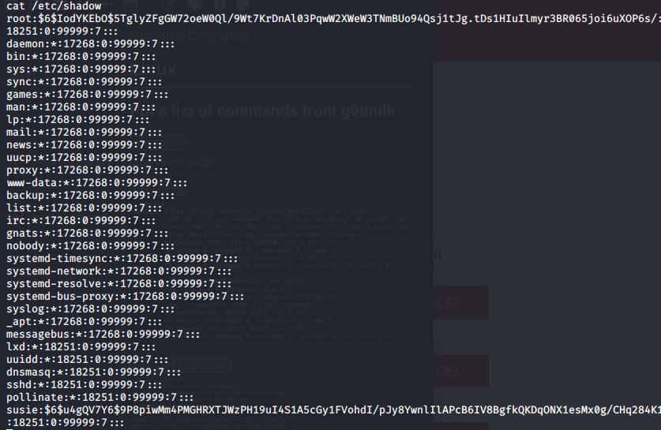
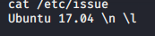
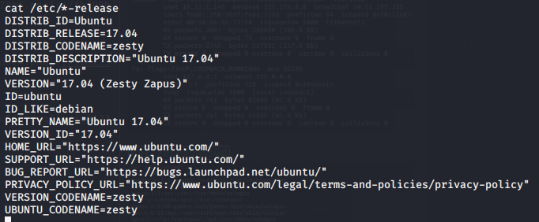
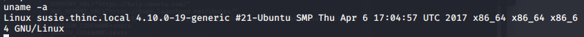
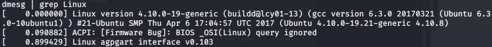
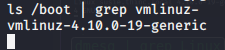
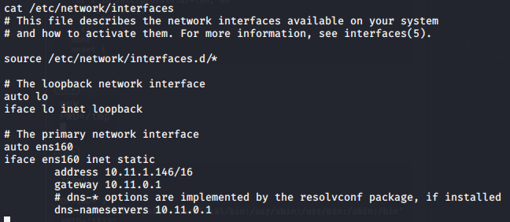
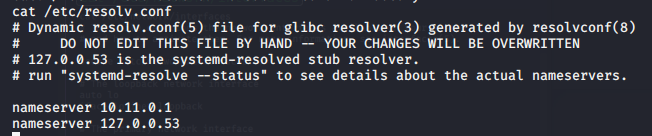
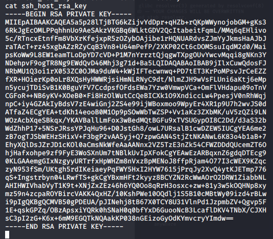
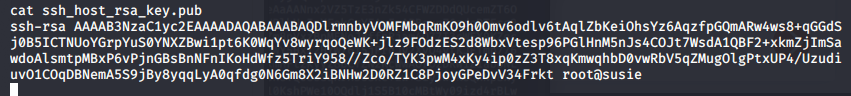

Interesting Commands

Interesting Commands

# Linux
## Put a list of commands from g0tmilk

`hostname`
susie.thinc.local

`ifconfig`

`cat /etc/passwd`

`cat /etc/shadow`

`cat /etc/issue`

`cat /etc/*-release`

`cat /proc/version`

`uname -a`

`dmesg | grep Linux`

`ls /boot | grep vmlinuz-`

`cat /etc/profile`

`env`

`set`

`cat /etc/network/interfaces`

`cat /etc/resolv.conf`

`cat /etc/networks`

`iptables -L`

`hostname`

`cat ssh_host_rsa_key`

`cat ssh_host_rsa_key,pub`

`mount`

`df -h`

`cat /etc/fstab`

`find / -perm -1000 -type d 2>/dev/null`

`find / -perm -g=s -type f 2>/dev/null`

`find / -perm -u=s -type f 2>/dev/null`

`cd /home/susie`
`ls -la` 

`cd susieshare`
`ls -la`
`cat FsSRC.txt`

