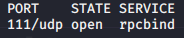
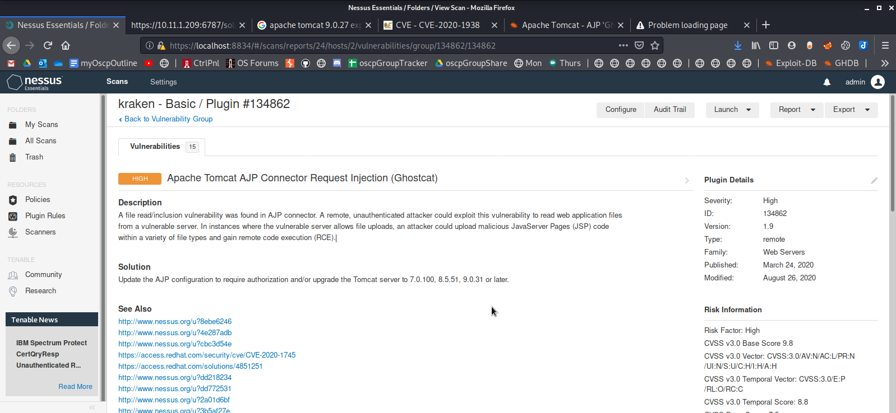

Enumeration

Enumeration

# NMAP
TCP Connect Scan with service detection on all ports
`sudo nmap -sV -sT -p- 10.11.1.209`

UDP Fast scan on all ports
`sudo nmap -sU -p- --defeat-icmp-ratelimit 10.11.1.209`

No Ping scan with service detection, and run different scripts
`sudo nmap -Pn -A -p- -sV --script default,safe,auth,vuln --max-retries 4 10.11.1.209`

# dirb
Recursive scan on port 6787
`dirb https://10.11.1.209:6787/`

Recursive scan on port 8009
`dirb http://10.11.1.209:8009/`

Recursive scan on port 8080
`dirb http://10.11.1.209:8080/`

# Nessus
[nessus_kraken_Basicj.html](../../../_resources/bcf596abfe654ec1b6926ef0a9e69699.html)

# Nikto
`nikto -h http://10.11.1.209:6787`

`nikto -h https://10.11.1.209:8009`

`nikto -h http://10.11.1.209:8080`

# Other Tools
