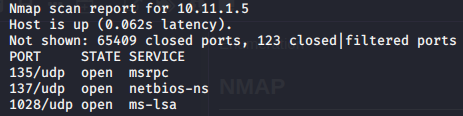
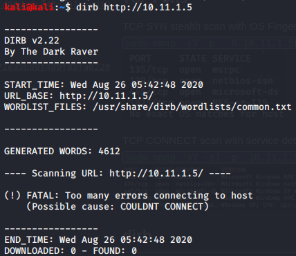
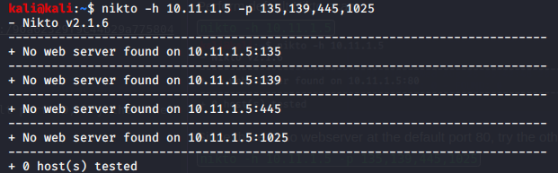

Enumeration

Enumeration

# NMAP
## TCP Ports
TCP SYN stealth scan with OS Fingerprint
`sudo nmap -sS -p- -O 10.11.1.5`

TCP CONNECT scan with service detection
`sudo nmap -sV -sT -p- 10.11.1.5`

## UDP Ports
Fast UDP scan
`sudo nmap -sU -p- --defeat-icmp-ratelimit 10.11.1.5`

Normal UDP Scan for ports listed in fast UDP scan
`sudo nmap -sU -p 135,137,1028 10.11.1.5`

# dirb
Non-recursive scan found nothing
`dirb http://10.11.1.5`

# Nikto
Default Nikto scan
`nikto -h 10.11.1.5`

Since there is no webserver at the default port 80, try the other ports
`nikto -h 10.11.1.5 -p 135,139,445,1025`

# Other Tools
