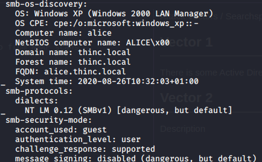

Attack Vectors & Searchsploit

Attack Vectors / Searchsploit

# Vector 1
There is some Active Directory info from NMAP scans

# Microsoft Windows system vulnerable to remote code execution (MS08-067)

# Remote Code Execution vulnerability in Microsoft SMBv1 servers (ms17-010)

`searchsploit ms17-010`
Note: There are none listed for Windows XP

