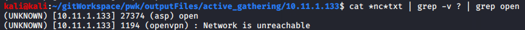
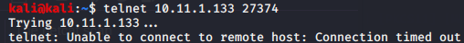

Attack Vector 13 - UDP port 27374 (asp)

The netcat scan showed one open port 27374. **I forget exactly what command was used.** The network was unreachable starting at 22356 and lower. May need to run this again. 
`sudo nc -nv -u -z -w 1 10.11.1.115 1-65535`

[2020-08-30_230322_nc_UDP_allPorts__10.11.1.133.txt](../../../_resources/6c5a7011f3c64f24bee912d8bc63ed75.txt)

Ran nc on the remaining ports 
`sudo nc -nv -u -z -w 1 10.11.1.133 1-22356 > nc_1-22356.txt 2>&1`
**Still need the output for this**

Netcat for just UDP port 27374 is open (asp)

NMAP scan for UDP all ports show all are open/filtered if using source port 53.

Socat connection didn't reveal any new info

Telnet to that port. Won't work! Telnet only uses TCP!
`telnet 10.11.1.133 27374`

