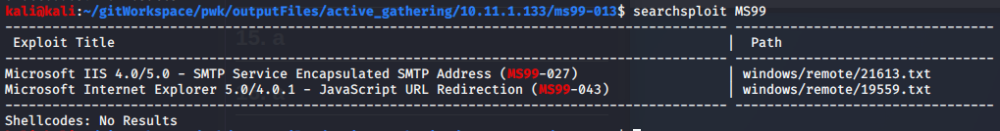

Attack Vector 7 - MS99-013

# Description
`GET /Sites/Knowledge/Membership/Inspired/ViewCode.asp`

# Searchsploit
The specific vuln could not be found
`searchsploit MS99-013`

`searchsploit MS99`

# Metasploit
The specific vuln could not be found
`search ms99-013`
`search ms99`

# Microsoft IIS default files
[Check for dangerous IIS default files](http://www.securityspace.com/smysecure/catid.html?id=1.3.6.1.4.1.25623.1.0.10576)

Initally thought the target is vulnerable but it may be false positives.

[Microsoft 4.0 Viewcode.asp Privilege Escalation ](https://vuldb.com/?id.14638)

# How to use dotdotpwn
[How to use dotdotpwn](https://www.hacking.reviews/2017/04/dotdotpwn-directory-traversal-fuzzer.html?m=0)

[dotdotpwn Examples](https://github.com/wireghoul/dotdotpwn/blob/master/EXAMPLES.txt)