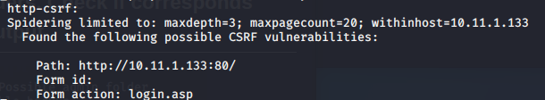
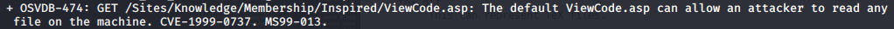

Attack Vectors

Vector and Searchsploit Results

# 1. SQL Injection on login page

# 2. Microsoft IIS 5.6

# 3. port 80 is login.asp and is a possible CSRF vulnerability

# 4. NMAP http-enum script output shows various folders. Check if corresponds with dirb output

# 5. What are the /_vti_* folders for?

# 6. Search for the 'offsec team'?

# 7. MS99-013 from Nikto Scan

# 8. Linux 2.6 Kernel

# 9. port 80/test.asp

# 10. phpinfo() According to phpinfo(), there should be a mysql database. Is there a port that's closed that we can check? 

# 11. download the sourcecode for every page using curl

# 12. Re-run again the nmap http and sql scripts and php scripts

# 13. UDP Ports
# 14. Bad Ph33r
# 15. a
# 16. a
# 17. a
# 18. a
# 19. a