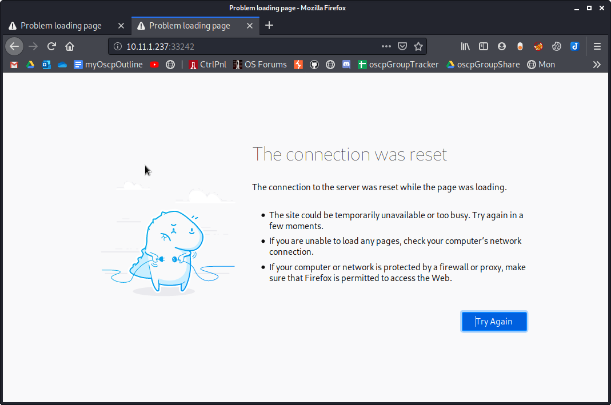

Browser Screenshots

Browser Screenshots

# Ports
## 22/tcp

## 80/tcp
cutycapt --url=10.11.1.237 --out=80.png

cutycapt --url=10.11.1.237/manual --out=manual.png

cutycapt --url=10.11.1.237/server-status --out=server-status.png

cutycapt --url=10.11.1.237/webdav --out=webdav.png

## 111/tcp

## 443/tcp
cutycapt --url=https://10.11.1.237:443/ --out=443.png

## 27017/tcp
Timed out

## 28017/tcp
Timed out

## 33242/tcp

https version

# Other service

